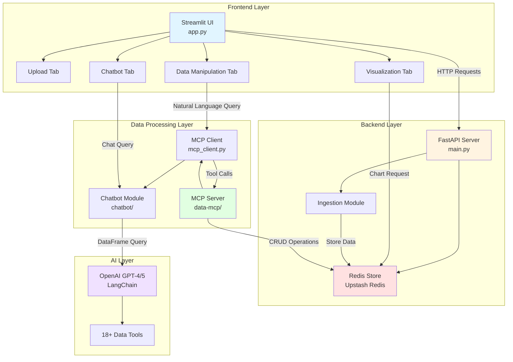

# Data Assistant Platform

A powerful, multi-modal data analysis platform that lets you upload messy real-world files, clean and transform data with natural language queries, and analyze data — all through an intuitive web interface powered by AI.

## 📋 Table of Contents

- [Overview](#overview)
- [Architecture](#architecture)
- [Features](#features)
- [Installation](#installation)
- [Configuration](#configuration)
  - [Secrets Setup Guide](SECRETS_SETUP.md) 🔐
- [Usage](#usage)
- [API Documentation](#api-documentation)
- [Project Structure](#project-structure)
- [Components](#components)
- [Development](#development)
- [Troubleshooting](#troubleshooting)

## 🎯 Overview

The Data Assistant Platform is a comprehensive data analysis solution that combines:

- **Smart File Ingestion**: Automatically extracts tables from CSV, Excel, and images
- **Natural Language Data Manipulation**: Transform data using plain English queries powered by LLM
- **Session Management**: Persistent data storage with automatic TTL expiration
- **MCP Integration**: Model Context Protocol server for safe, tool-based data operations
- **Modern UI**: Streamlit-based interface with real-time feedback

### Key Technologies

- **Backend**: FastAPI (REST API)
- **Frontend**: Streamlit (Web UI)
- **Data Storage**: Upstash Redis (Cloud Redis with TTL management)
- **AI/ML**: 
  - LangChain (Agent framework, tool integration)
  - LangGraph (Stateful conversation flow, MemorySaver checkpointing)
  - OpenAI GPT-4o/GPT-5 (Intent classification, code generation, summarization)
  - LangChain Experimental (pandas dataframe agent)
- **Data Processing**: Pandas, NumPy
- **Visualization**: Plotly (interactive charts), Kaleido (PNG/SVG export)
- **MCP Server**: FastMCP for tool-based data operations

### 🌐 Production Deployment

**Live Services:**

| Service | URL | Platform | Status |
|---------|-----|----------|--------|
| **Streamlit UI** | https://data-assistant-mu6xtnwivdpi8umtp94wuh.streamlit.app/ | Streamlit Cloud | ✅ Live |
| **FastAPI Backend** | https://data-assistant-m4kl.onrender.com | Render | ✅ Live |
| **MCP Server** | https://data-analyst-mcp-server.onrender.com | Render | ✅ Live |


### **Quick Start - Use Live Deployment:**

🌐 **Access the live app instantly (no setup required):**

👉 **https://data-assistant-mu6xtnwivdpi8umtp94wuh.streamlit.app/**

All backend services are already running in production!

**For Local Development:**
```bash
# 1. Clone repo
git clone <repository-url>
cd Data-Assistant

# 2. Install dependencies
pip install -r requirements.txt

# 3. Set up secrets (see Configuration section)
cp .streamlit/secrets.toml.template .streamlit/secrets.toml
# Edit secrets.toml with your OpenAI API key

# 4. Run Streamlit locally (connects to production backend automatically)
streamlit run app.py
```

**Benefits:**
- ✅ **Fully deployed UI** - Access from anywhere
- ✅ No need to run MCP server locally
- ✅ No need to run FastAPI backend locally  
- ✅ Always-on data processing services
- ✅ Faster setup for new users
- ✅ Consistent environment across team

## 🏗 Architecture

### System Architecture Overview




### Component Interaction Map


## ✨ Features

### 1. Multi-Format File Upload
- **CSV/TSV**: Automatic delimiter detection
- **Excel**: Multi-sheet support (.xlsx, .xls, .xlsm)
- **Images**: OCR-based table extraction (PNG, JPEG, TIFF, BMP)

#### File Ingestion Pipeline


### 2. Data Manipulation Tab
- **Natural Language Queries**: Describe operations in plain English
- **Operation History**: Track all operations with timestamps
- **Real-time Preview**: See data changes immediately
- **Session Persistence**: Data persists across page reloads

### 3. Visualization Centre Tab
- **Zero-Latency Charts**: Instant chart generation using Plotly
- **8 Chart Types**: Bar, Line, Scatter, Area, Box, Histogram, Pie, Heatmap
- **Interactive Visualizations**: Zoom, pan, hover tooltips
- **Column Mapping**: Easy X/Y axis and color grouping selection
- **Aggregations**: Sum, mean, count, min, max for grouped data
- **One-Click Exports**: PNG, SVG, and interactive HTML formats
- **Theme-Aware**: Automatically adapts to light/dark mode

#### Visualization Generation Pipeline


### 4. InsightBot — Intelligent Chatbot Tab
- **🤖 LangGraph architecture**: State graph with router, analyzer, planner, insight, viz, responder, clarification, and suggestion nodes; persistent memory via MemorySaver.
- **💬 Multi-turn conversations**: Context-aware follow-ups (e.g. “What about the maximum?” resolved into full questions); conversation context tracks last columns, aggregation, and filters.
- **🔍 Column clarification**: When multiple columns match a term (e.g. “sales”), asks “Did you mean X or Y?” and resolves on the next turn.
- **💡 Suggestion engine**: After each response, three contextual follow-up questions as clickable chips.
- **📊 Per-turn visualizations**: Each AI message keeps its own chart/table/code; previous visualizations stay visible (response_snapshots).
- **📋 Report & summarize**: “Give me a report on X” and “summarize that” / “what does that show?” using the last result.
- **🔧 Function calling**: Analyzer selects tools (insight_tool, bar_chart, line_chart, scatter_chart, histogram, heatmap_chart, correlation_matrix, etc.) via LLM.
- **🎯 Intent classification**: Routes to data_query, visualization_request, small_talk, report, summarize_last; triggers clarification when needed.
- **⚡ Safe code execution**: LLM-generated pandas code runs in a sandbox with timeout and guardrails; correlation uses numeric columns only; rule-based fallback for simple queries.
- **📈 Charts in chat**: Plotly charts and tables per response; heatmap for correlation queries; fallback to table when chart fails (e.g. too many categories).
- **📝 Query types**: Statistical (mean, sum, count), comparative (compare X by Y), filtering & sorting, visualization (bar/line/scatter/histogram/heatmap), correlation (two-column or full matrix), report, summarize_last, and follow-ups.


#### InsightBot LangGraph Architecture

```mermaid
flowchart TD
    START([User Query]) --> ROUTER[Router Node<br/>Intent + Context + Clarification]
    
    ROUTER --> ROUTE{Route}
    ROUTE -->|needs_clarification| CLARIFY[Clarification Node<br/>"Did you mean X or Y?"]
    ROUTE -->|small_talk| RESPONDER[Responder Node]
    ROUTE -->|summarize_last| INSIGHT[Insight Node]
    ROUTE -->|data_query / viz / report| ANALYZER[Analyzer Node<br/>Tool Selection]
    
    CLARIFY --> END1([END])
    
    ANALYZER --> INSIGHT
    ANALYZER --> VIZ[Viz Node]
    ANALYZER --> RESPONDER
    
    INSIGHT --> GEN[Code Gen + Safe Execute<br/>Summarize]
    GEN --> VIZ_OR_RESP{Viz in tools?}
    VIZ_OR_RESP -->|Yes| VIZ
    VIZ_OR_RESP -->|No| RESPONDER
    
    VIZ --> LOAD[Load Data from Redis<br/>Validate Config]
    LOAD --> CHART[Plotly Chart or Fallback]
    CHART --> RESPONDER
    
    RESPONDER --> FORMAT[Format Response<br/>Append Snapshot]
    FORMAT --> SUGGEST[Suggestion Node<br/>3 Follow-up Chips]
    SUGGEST --> MEMORY[MemorySaver Checkpoint]
    MEMORY --> END2([Display to User])
    
    style START fill:#4CAF50
    style ROUTER fill:#9C27B0
    style CLARIFY fill:#E91E63
    style ANALYZER fill:#FF9800
    style INSIGHT fill:#2196F3
    style VIZ fill:#00BCD4
    style RESPONDER fill:#4CAF50
    style SUGGEST fill:#8BC34A
    style END2 fill:#4CAF50
```


### 5. Session Management & Version Control
- **Automatic TTL**: Sessions expire after 30 minutes of inactivity
- **TTL Extension**: Sessions auto-extend on access
- **Metadata Tracking**: File names, table counts, timestamps
- **Multi-table Support**: Handle multiple tables per session
- **Version History**: Git-like version control for data transformations
- **Branching**: Try multiple analysis paths without losing work
- **Graph Visualization**: Visual representation of transformation lineage

#### Data Git History - Version Graph


### 6. MCP Integration
- **18+ Data Tools**: Filter, sort, clean, transform operations
- **Safe Execution**: Tool-based approach prevents code injection
- **Tool Tracking**: See which tools are used for each operation
- **Error Handling**: Graceful error recovery

#### MCP Tool Execution Flow


#### Available MCP Tools Categories


## 🌐 Deployment Architecture


## 🚀 Installation

### Option 1: Use Live Deployment (Recommended) ⚡

**No installation needed!** Access the fully deployed platform:

🌐 **https://data-assistant-mu6xtnwivdpi8umtp94wuh.streamlit.app/**

**Features:**
- ✅ Instant access from any device
- ✅ All backend services running
- ✅ No setup or configuration required
- ✅ Always up-to-date with latest features

**Just bring your data and start analyzing!**

---

### Option 2: Local Development Setup

For customization or local development:

#### Prerequisites

- Python 3.8+
- OpenAI API key (for data manipulation)
- Git

### Step 1: Clone Repository

```bash
git clone <repository-url>
cd Data-Assistant
```

### Step 2: Create Virtual Environment

```bash
python -m venv venv
source venv/bin/activate  # On Windows: venv\Scripts\activate
```

### Step 3: Install Dependencies

```bash
pip install -r requirements.txt
```

### Step 4: Set Up Secrets Configuration

**Option A: Using Streamlit Secrets (Recommended)**

Create `.streamlit/secrets.toml` in the project root:

```bash
# Create the .streamlit directory if it doesn't exist
mkdir -p .streamlit

# Copy the template and edit with your values
cp .streamlit/secrets.toml.template .streamlit/secrets.toml
```

Edit `.streamlit/secrets.toml`:

```toml
# OpenAI Configuration
[openai]
api_key = "sk-your-openai-api-key-here"
model = "gpt-4o"

# Production Deployment URLs (Render)
[api]
fastapi_url = "https://data-assistant-m4kl.onrender.com"
mcp_server_url = "https://data-analyst-mcp-server.onrender.com/data/mcp"

# For Local Development: Uncomment and use these
# [api.local]
# fastapi_url = "http://127.0.0.1:8001"
# mcp_server_url = "http://127.0.0.1:8000/data/mcp"

# Optional: Redis Configuration (if running backend locally)
[redis]
rest_url = "https://your-redis-url.upstash.io"
rest_token = "your-redis-token-here"
session_ttl_minutes = 30
```

**Option B: Using Environment Variables (Legacy)**

Alternatively, create a `.env` file in the project root:

```bash
# Upstash Redis Configuration
UPSTASH_REDIS_REST_URL=https://your-redis-url.upstash.io
UPSTASH_REDIS_REST_TOKEN=your-redis-token
SESSION_TTL_MINUTES=30

# OpenAI Configuration
OPENAI_API_KEY=your-openai-api-key
OPENAI_MODEL=gpt-4o

# Langfuse Observability (Optional)
LANGFUSE_PUBLIC_KEY=pk-lf-...
LANGFUSE_SECRET_KEY=sk-lf-...
LANGFUSE_BASE_URL=https://cloud.langfuse.com

# Production Deployment URLs
MCP_SERVER_URL=https://data-analyst-mcp-server.onrender.com/data/mcp
FASTAPI_URL=https://data-assistant-m4kl.onrender.com
```

**Note**: The app will try `secrets.toml` first, then fall back to environment variables.

### Step 5: Start Services

#### Option A: Use Production Deployment (Recommended)

**🌐 Production Services (Already Deployed)**:
- **MCP Server**: https://data-analyst-mcp-server.onrender.com
- **FastAPI Backend**: https://data-assistant-m4kl.onrender.com
- **Status**: Both services are live on Render!

**Only Start Streamlit Locally:**
```bash
streamlit run app.py
# UI runs on http://localhost:8501
# Connects to production MCP & FastAPI automatically
```

#### Option B: Full Local Development

**Terminal 1 - MCP Server:**
```bash
cd data-mcp
python server.py
# Server runs on http://127.0.0.1:8000
```

**Terminal 2 - FastAPI Backend:**
```bash
python main.py
# API runs on http://127.0.0.1:8001
```

**Terminal 3 - Streamlit Frontend:**
```bash
streamlit run app.py
# UI runs on http://localhost:8501
```

**Note**: For local development, update `.env` to use local URLs.

## ⚙️ Configuration

### Configuration Methods

The platform supports two configuration methods:

1. **Streamlit Secrets** (`.streamlit/secrets.toml`) - **Recommended** ✅
2. **Environment Variables** (`.env` file) - Legacy fallback

The app checks for secrets in this order:
1. Streamlit secrets (`.streamlit/secrets.toml`)
2. Environment variables (`.env` or system environment)
3. Hardcoded defaults

### Streamlit Secrets Configuration

Based on [Streamlit's official secrets management](https://docs.streamlit.io/develop/api-reference/connections/secrets.toml).

**File**: `.streamlit/secrets.toml`

| Section | Key | Description | Default | Required |
|---------|-----|-------------|---------|----------|
| `[openai]` | `api_key` | OpenAI API key for LLM | - | Yes |
| `[openai]` | `model` | OpenAI model to use | gpt-4o | No |
| `[api]` | `fastapi_url` | FastAPI backend URL | https://data-assistant-m4kl.onrender.com | No |
| `[api]` | `mcp_server_url` | MCP server endpoint | https://data-analyst-mcp-server.onrender.com/data/mcp | No |
| `[redis]` | `rest_url` | Upstash Redis REST API URL | - | Yes* |
| `[redis]` | `rest_token` | Upstash Redis REST API Token | - | Yes* |
| `[redis]` | `session_ttl_minutes` | Session expiration time (minutes) | 30 | No |

*Required only if running backend services locally

### Environment Variables (Legacy)

| Variable | Description | Production Default | Local Default | Required |
|----------|-------------|-------------------|---------------|----------|
| `UPSTASH_REDIS_REST_URL` | Upstash Redis REST API URL | - | None | Yes* |
| `UPSTASH_REDIS_REST_TOKEN` | Upstash Redis REST API Token | - | None | Yes* |
| `SESSION_TTL_MINUTES` | Session expiration time (minutes) | 30 | 30 | No |
| `OPENAI_API_KEY` | OpenAI API key for LLM | - | None | Yes |
| `OPENAI_MODEL` | OpenAI model to use | gpt-4o | gpt-4o | No |
| `LANGFUSE_PUBLIC_KEY` | Langfuse public key | - | None | No |
| `LANGFUSE_SECRET_KEY` | Langfuse secret key | - | None | No |
| `LANGFUSE_BASE_URL` | Langfuse base URL | https://cloud.langfuse.com | https://cloud.langfuse.com | No |
| `MCP_SERVER_URL` | MCP server endpoint | https://data-analyst-mcp-server.onrender.com/data/mcp | http://127.0.0.1:8000/data/mcp | No |
| `FASTAPI_URL` | FastAPI backend URL | https://data-assistant-m4kl.onrender.com | http://127.0.0.1:8001 | No |
| `PORT` | FastAPI server port | 8001 | 8001 | No |

*Required only if running backend services locally

### File Size Limits

Configured in `ingestion/config.py`:
- **Max File Size**: 100 MB (default)
- **Max Tables per File**: 10 (default)

## 📖 Usage

### Web Interface

1. **Upload File**:
   - Navigate to Upload tab
   - Select file (CSV, Excel, or Image)
   - Click "Upload & Process"
   - View extracted tables and metadata

2. **Manipulate Data**:
   - Switch to Data Manipulation tab
   - Enter natural language query (e.g., "Remove rows with missing email")
   - Click "Execute Query"
   - View results and operation history

3. **Visualize Data**:
   - Switch to Visualization Centre tab
   - Select chart type (Bar, Line, Scatter, etc.)
   - Choose X and Y axis columns
   - Optionally select color/grouping column
   - Chart renders instantly
   - Export as PNG, SVG, or HTML

4. **Chat with Your Data**:
   - Switch to Chatbot tab (InsightBot)
   - Ask questions (e.g., "What's the average salary by department?", "Show correlation", "Compare sales by region")
   - Get context-aware answers; follow-ups like "What about the maximum?" are resolved automatically
   - If a term matches multiple columns, choose from "Did you mean X or Y?"; use suggestion chips for one-click follow-ups
   - Charts and tables are embedded per message; previous visualizations stay visible when you send new queries
   - Clear chat from the sidebar when needed


## 📁 Project Structure

```
Data-Assistant/
├── app.py                      # Streamlit frontend application
├── main.py                     # FastAPI backend server
├── mcp_client.py              # MCP client with LangChain integration
├── test_visualization_evaluation.py  # Visualization test suite
├── requirements.txt           # Python dependencies
├── README.md                  # This file
│
├── chatbot/                   # InsightBot — LangGraph-powered chatbot
│   ├── __init__.py
│   ├── state.py              # LangGraph state schema (TypedDict), Node type
│   ├── graph.py              # StateGraph definition and compilation
│   ├── streamlit_ui.py       # Streamlit UI entry (history, snapshots, chips)
│   ├── README.md             # Chatbot architecture and flow (full detail)
│   ├── DEVELOPER.md          # How to extend: add node, add chart, avoid redundancy
│   ├── nodes/                # LangGraph nodes
│   │   ├── router.py         # Intent, context resolution, clarification detection
│   │   ├── clarification.py  # "Did you mean X or Y?" column disambiguation
│   │   ├── analyzer.py       # Tool selection (function calling), correlation→heatmap
│   │   ├── planner.py        # Multi-step query breakdown (complex queries)
│   │   ├── insight.py        # Code generation, safe execution, summarization
│   │   ├── viz.py            # Chart config validation, state only (Plotly in UI)
│   │   ├── responder.py      # Response formatting, response_snapshots
│   │   └── suggestion_engine.py  # Follow-up question chips
│   ├── tools/                # LangChain @tool definitions (configs only)
│   │   ├── data_tools.py     # insight_tool
│   │   ├── simple_charts.py  # Bar, line, scatter, histogram, heatmap, correlation_matrix
│   │   └── complex_charts.py # Combo and dashboard tools
│   ├── execution/            # Code generation and safe execution
│   │   ├── code_generator.py # LLM pandas code
│   │   ├── code_validator.py # Forbidden ops, result variable
│   │   ├── safe_executor.py  # Sandboxed execution, timeout, row limit
│   │   └── rule_based_executor.py  # Simple queries (mean, sum, correlation) without LLM
│   ├── utils/
│   │   ├── session_loader.py # Load DataFrames and metadata from Redis
│   │   ├── state_helpers.py # get_current_query(state) — shared query resolution
│   │   ├── profile_formatter.py  # Data profile for prompts and chart validation
│   │   └── chart_selector.py # Optional: rule-based chart suggestion (not in main graph)
│   ├── prompts/              # Modular, versioned prompts (one per file)
│   │   ├── base.py           # PromptTemplate, truncate_schema
│   │   ├── router_prompt.py
│   │   ├── analyzer_prompt.py
│   │   ├── planner_prompt.py
│   │   ├── code_generator_prompt.py
│   │   ├── summarizer_prompt.py
│   │   ├── responder_prompt.py
│   │   └── ...               # suggestion, small_talk, context_resolver
│   └── ui/                   # Streamlit UI components
│       ├── message_history.py
│       ├── chat_input.py
│       └── chart_ui.py       # generate_chart_from_config_ui (Plotly from viz_config)
│
├── redis_db/                  # Redis session management
│   ├── __init__.py
│   ├── constants.py          # Redis configuration constants
│   ├── redis_store.py        # Core Redis operations
│   └── serializer.py         # DataFrame serialization
│
├── ingestion/                 # File processing module
│   ├── __init__.py
│   ├── ingestion_handler.py  # Main ingestion orchestrator
│   ├── config.py             # Ingestion configuration
│   ├── csv_handler.py        # CSV file processor
│   ├── excel_handler.py      # Excel file processor
│   └── image_handler.py      # Image file processor (OCR)
│
├── data_visualization/        # Visualization module
│   ├── __init__.py
│   ├── visualization.py      # Main visualization tab
│   ├── chart_compositions.py  # Advanced chart types
│   ├── dashboard_builder.py   # Multi-chart layouts
│   ├── smart_recommendations.py  # LLM-based chart recommendations
│   └── utils.py              # Utility functions
│
├── data-mcp/                  # MCP server for data operations
│   ├── server.py             # FastMCP server
│   ├── data_functions/       # Data manipulation tools
│   │   ├── core.py           # Core data operations
│   │   ├── cleaning.py       # Data cleaning tools
│   │   ├── transformation.py # Data transformation tools
│   │   ├── selection.py      # Column/row selection
│   │   ├── aggregation.py    # Aggregation operations
│   │   ├── feature_engineering.py
│   │   ├── multi_table.py    # Multi-table operations
│   │   ├── http_client.py    # HTTP client for Redis
│   │   └── config.py         # MCP configuration
│   └── requirements.txt
│
└── test_files/                # Sample test files
    ├── test.csv
    ├── test.xlsx
    └── test_image.png
```

## 🔧 Components

### 1. Redis Database Module (`redis_db/`)

**Purpose**: Manages session storage and data persistence using Upstash Redis.

**Key Functions**:
- `save_session()`: Store DataFrames and metadata with TTL
- `load_session()`: Retrieve DataFrames from Redis
- `delete_session()`: Remove session data
- `get_metadata()`: Get session metadata
- `extend_ttl()`: Extend session expiration time
- `list_sessions()`: List all active sessions

**Storage Format**:
- Tables: Base64-encoded pickled DataFrames
- Metadata: JSON format
- Keys: `session:{session_id}:tables` and `session:{session_id}:meta`

### 2. Ingestion Module (`ingestion/`)

**Purpose**: Processes various file formats and extracts tabular data.

**Supported Formats**:
- **CSV**: Automatic delimiter detection, encoding detection
- **Excel**: Multi-sheet support, preserves sheet names
- **Images**: Uses Gemini Vision API for OCR-based table extraction

**Key Functions**:
- `process_file()`: Main entry point for file processing
- `process_csv()`: CSV-specific handler
- `process_excel()`: Excel-specific handler
- `process_image()`: Image-specific handler

### 3. MCP Client (`mcp_client.py`)

**Purpose**: Connects to MCP server and provides LangChain agent for natural language queries.

**Key Functions**:
- `create_mcp_agent()`: Initialize LangChain agent with MCP tools
- `analyze_data()`: Execute natural language query on data
- `get_available_sessions()`: Fetch all active sessions
- `get_session_metadata()`: Get session metadata

**Features**:
- Tool usage tracking and display
- Async/await support
- Error handling and cleanup

### 4. FastAPI Backend (`main.py`)

**Purpose**: REST API for file upload, session management, and data operations.

**Endpoints**:
- File upload and processing
- Session CRUD operations
- Table retrieval and updates
- Health checks and configuration

**Features**:
- CORS support
- Automatic TTL management
- Error handling and logging
- Base64 serialization for MCP integration

### 5. Visualization Module (`data_visualization/`)

**Purpose**: Provides zero-latency chart generation using Plotly with session data integration.

**Key Components**:
- `visualization.py`: Main visualization tab rendering
- `dashboard_builder.py`: Multi-chart layouts and dashboard creation
- `chart_compositions.py`: Advanced chart types (combo charts)
- `smart_recommendations.py`: LLM-based chart type recommendations

**Key Functions**:
- `render_visualization_tab()`: Main function to render the visualization tab
- `get_dataframe_from_session()`: Fetches session data and converts to DataFrame
- `generate_chart()`: Generate Plotly figure based on user selections

**Features**:
- 8 chart types: Bar, Line, Scatter, Area, Box, Histogram, Pie, Heatmap
- Smart column selection with automatic defaults
- Aggregation support (sum, mean, count, min, max)
- Interactive Plotly charts with zoom/pan/hover
- Export to PNG, SVG, and HTML formats
- Theme-aware (light/dark mode support)
- Multi-table support with table selection
- Dashboard builder with grid layouts and chart pinning

### 6. InsightBot Module (`chatbot/`)

**Purpose**: LangGraph-powered conversational AI for data analysis with context resolution, clarification, tool selection, safe code execution, and per-turn visualizations.

**Architecture**: State graph: router → (clarification | analyzer → planner → insight → viz | responder) → responder → suggestion → END. MemorySaver for persistence; response_snapshots so each AI message keeps its chart/table/code. DataFrames are not in state; loaded by `session_id` via `SessionLoader`.

**Key Components**:

**Nodes**:
- `nodes/router.py`: Intent classification, follow-up detection, context resolution (effective_query), clarification detection (needs_clarification, clarification_options)
- `nodes/clarification.py`: Emits "Did you mean X or Y?" when multiple columns match; resolution on next turn
- `nodes/analyzer.py`: Tool selection via function calling (insight_tool, bar_chart, line_chart, heatmap, etc.); correlation→heatmap
- `nodes/planner.py`: Multi-step query breakdown for complex queries
- `nodes/insight.py`: Code generation, safe execution, summarization; handles summarize_last; sets error_suggestion (e.g. did_you_mean)
- `nodes/viz.py`: Chart config validation and state storage (Plotly built in UI from viz_config); sets viz_error on failure
- `nodes/responder.py`: Formats response; appends AIMessage and current snapshot to response_snapshots
- `nodes/suggestion_engine.py`: Generates three follow-up questions for UI chips

**Tools**:
- `tools/data_tools.py`: insight_tool for declarative analysis
- `tools/simple_charts.py`: Bar, line, scatter, histogram, heatmap_chart, correlation_matrix
- `tools/complex_charts.py`: Combo charts and dashboard tools

**Execution**:
- `execution/code_generator.py`: LLM pandas code (correlation numeric-only, filtering, groupby, etc.)
- `execution/code_validator.py`: Forbidden ops, result variable enforcement
- `execution/safe_executor.py`: Sandboxed execution with timeout and row limit
- `execution/rule_based_executor.py`: Simple queries (mean, sum, correlation) without LLM

**Utilities**: `utils/session_loader.py`, `utils/state_helpers.py` (get_current_query), `profile_formatter`; optional `chart_selector`. Prompts are modular in `prompts/` (get_*_prompt). See `chatbot/README.md` for full schema and flow; `chatbot/DEVELOPER.md` for how to extend.

**Key Features**:
- ✅ **Context-Aware Memory**: conversation_context, effective_query, context_resolver for follow-ups
- ✅ **Clarification**: Column disambiguation with "Did you mean?" and resolution next turn
- ✅ **Suggestion Engine**: Three contextual follow-up chips after each response
- ✅ **Per-Turn Snapshots**: response_snapshots keep each message’s chart/table/code; previous visualizations don’t disappear
- ✅ **Report & Summarize**: report intent and summarize_last (re-summarize previous result)
- ✅ **Safe Code Execution**: Sandboxed pandas with timeout; correlation on numeric columns only
- ✅ **Error Recovery**: did_you_mean suggestions; partial success (table when chart fails)

**Supported Query Patterns**:
- 📊 Statistical, comparative, filtering, distribution, visualization, correlation, report, summarize_last, follow-ups

### 7. Streamlit Frontend (`app.py`)

**Purpose**: Web-based user interface for file upload, data manipulation, visualization, and chatbot.

**Tabs**:
1. **Upload Tab**: File upload, processing, and preview
2. **Data Manipulation Tab**: Natural language queries, operation history, data preview
3. **Visualization Centre Tab**: Interactive chart generation with Plotly, export options
4. **Chatbot Tab**: Conversational interface for data queries with automatic visualizations

**Features**:
- Real-time data preview
- Operation history tracking
- Session management UI
- Error display and recovery
- Interactive visualizations with Plotly
- Chart export functionality
- Conversational chatbot interface
- Automatic visualization detection in chat


## 🛠 Development

### Running in Development Mode

```bash
# FastAPI with auto-reload
uvicorn main:app --reload --port 8001

# Streamlit with auto-reload (default)
streamlit run app.py
```

### Testing

```bash
# Test file upload
curl -X POST http://localhost:8001/api/ingestion/file-upload \
  -F "file=@test_files/test.csv"

# Test session retrieval
curl http://localhost:8001/api/session/{session_id}/tables

# Test MCP client
python mcp_client.py {session_id} "show me the first 5 rows"
```

### Adding New File Handlers

1. Create handler in `ingestion/` (e.g., `json_handler.py`)
2. Add to `_HANDLERS` dict in `ingestion_handler.py`
3. Update `IngestionConfig.FILE_TYPES` in `config.py`
4. Add file type to Streamlit uploader in `app.py`

### Adding New MCP Tools

1. Add tool function in `data-mcp/data_functions/`
2. Register in `data-mcp/server.py`
3. Tool automatically available to LangChain agent

**Built with ❤️ for data analysts**
