# Data Assistant Platform

A powerful, multi-modal data analysis platform that lets you upload messy real-world files, clean and transform data with natural language queries, and analyze data — all through an intuitive web interface powered by AI.

## 📋 Table of Contents

- [Overview](#overview)
- [Architecture](#architecture)
- [Features](#features)
- [Installation](#installation)
- [Configuration](#configuration)
  - [Secrets Setup Guide](SECRETS_SETUP.md) 🔐
- [Usage](#usage)
- [API Documentation](#api-documentation)
- [Project Structure](#project-structure)
- [Components](#components)
- [Development](#development)
- [Troubleshooting](#troubleshooting)

## 🎯 Overview

The Data Assistant Platform is a comprehensive data analysis solution that combines:

- **Smart File Ingestion**: Automatically extracts tables from CSV, Excel, PDFs, and images
- **Natural Language Data Manipulation**: Transform data using plain English queries powered by LLM
- **Session Management**: Persistent data storage with automatic TTL expiration
- **MCP Integration**: Model Context Protocol server for safe, tool-based data operations
- **Modern UI**: Streamlit-based interface with real-time feedback

### Key Technologies

- **Backend**: FastAPI (REST API)
- **Frontend**: Streamlit (Web UI)
- **Data Storage**: Upstash Redis (Cloud Redis with TTL management)
- **AI/ML**: 
  - LangChain (Agent framework, tool integration)
  - LangGraph (Stateful conversation flow, MemorySaver checkpointing)
  - OpenAI GPT-4o/GPT-5 (Intent classification, code generation, summarization)
  - LangChain Experimental (pandas dataframe agent)
- **Data Processing**: Pandas, Docling (PDF extraction), NumPy
- **Visualization**: Plotly (interactive charts), Kaleido (PNG/SVG export)
- **MCP Server**: FastMCP for tool-based data operations

### 🌐 Production Deployment

**Live Services:**

| Service | URL | Platform | Status |
|---------|-----|----------|--------|
| **Streamlit UI** | https://data-assistant-mu6xtnwivdpi8umtp94wuh.streamlit.app/ | Streamlit Cloud | ✅ Live |
| **FastAPI Backend** | https://data-assistant-m4kl.onrender.com | Render | ✅ Live |
| **MCP Server** | https://data-analyst-mcp-server.onrender.com | Render | ✅ Live |

**Quick Start - Use Live Deployment:**

🌐 **Access the live app instantly (no setup required):**

👉 **https://data-assistant-mu6xtnwivdpi8umtp94wuh.streamlit.app/**

All backend services are already running in production!

**For Local Development:**
```bash
# 1. Clone repo
git clone <repository-url>
cd Data-Assistant

# 2. Install dependencies
pip install -r requirements.txt

# 3. Set up secrets (see Configuration section)
cp .streamlit/secrets.toml.template .streamlit/secrets.toml
# Edit secrets.toml with your OpenAI API key

# 4. Run Streamlit locally (connects to production backend automatically)
streamlit run app.py
```

**Benefits:**
- ✅ **Fully deployed UI** - Access from anywhere
- ✅ No need to run MCP server locally
- ✅ No need to run FastAPI backend locally  
- ✅ Always-on data processing services
- ✅ Faster setup for new users
- ✅ Consistent environment across team

## 🏗 Architecture

### System Architecture Overview

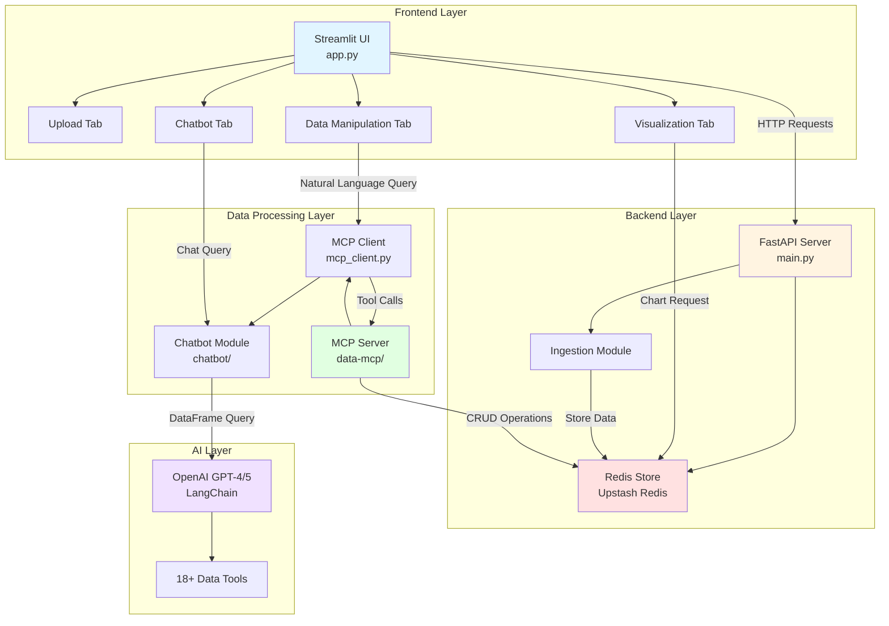

### Data Flow Diagram

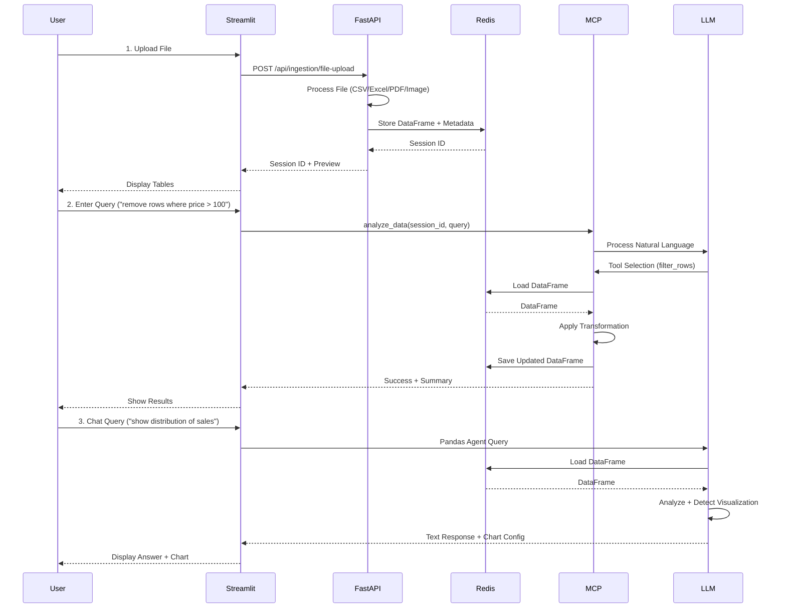

### Session Lifecycle

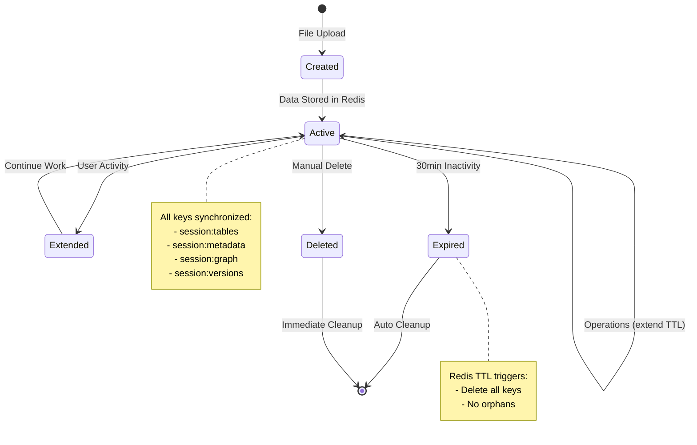

### Component Interaction Map

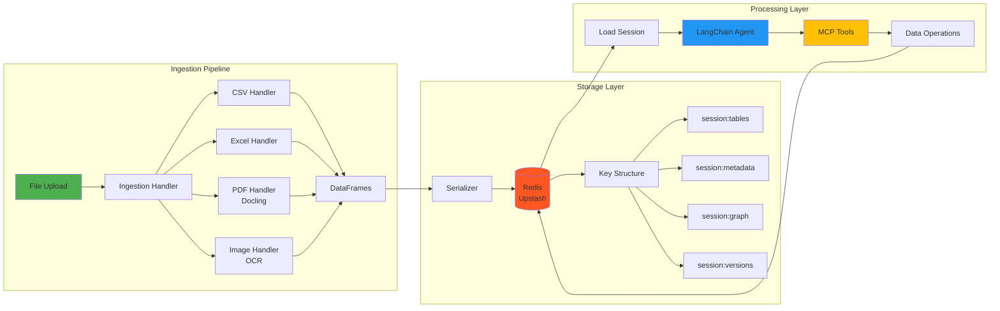

## ✨ Features

### 1. Multi-Format File Upload
- **CSV/TSV**: Automatic delimiter detection
- **Excel**: Multi-sheet support (.xlsx, .xls, .xlsm)
- **PDF**: Table extraction with layout preservation (Docling)
- **Images**: OCR-based table extraction (PNG, JPEG, TIFF, BMP)

#### File Ingestion Pipeline

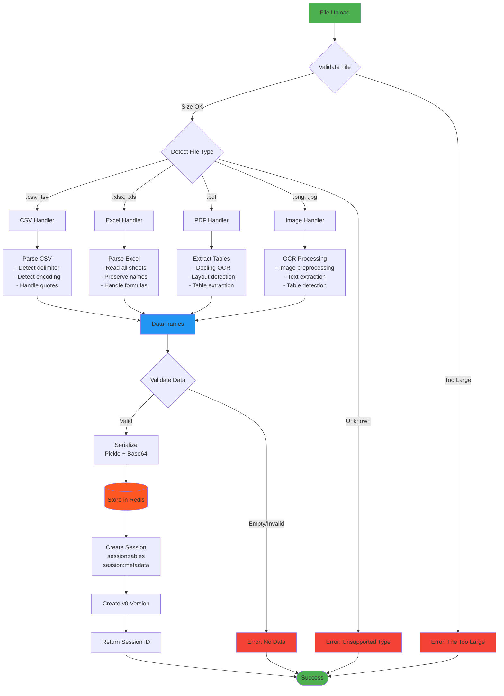

#### File Format Support Matrix

```mermaid
flowchart LR
    subgraph "Structured Data"
        CSV[CSV/TSV<br/>✓ Delimiter detection<br/>✓ Encoding detection<br/>✓ Fast parsing]
        EXCEL[Excel<br/>✓ Multi-sheet<br/>✓ .xlsx, .xls, .xlsm<br/>✓ Formula evaluation]
    end
    
    subgraph "Semi-Structured Data"
        PDF[PDF<br/>✓ Docling extraction<br/>✓ Layout preservation<br/>✓ Multi-page]
        IMG[Images<br/>✓ OCR processing<br/>✓ PNG, JPEG, TIFF<br/>✓ Table detection]
    end
    
    subgraph "Processing"
        CSV --> PARSER[Smart Parser]
        EXCEL --> PARSER
        PDF --> OCR[OCR Engine]
        IMG --> OCR
        PARSER --> DF[DataFrames]
        OCR --> DF
    end
    
    subgraph "Storage"
        DF --> SER[Serializer<br/>Pickle + Base64]
        SER --> REDIS[(Upstash Redis<br/>TTL: 30min)]
    end
    
    style CSV fill:#4CAF50
    style EXCEL fill:#4CAF50
    style PDF fill:#FFC107
    style IMG fill:#FFC107
    style REDIS fill:#FF5722
```

### 2. Data Manipulation Tab
- **Natural Language Queries**: Describe operations in plain English
- **Operation History**: Track all operations with timestamps
- **Real-time Preview**: See data changes immediately
- **Session Persistence**: Data persists across page reloads

### 3. Visualization Centre Tab
- **Zero-Latency Charts**: Instant chart generation using Plotly
- **8 Chart Types**: Bar, Line, Scatter, Area, Box, Histogram, Pie, Heatmap
- **Interactive Visualizations**: Zoom, pan, hover tooltips
- **Column Mapping**: Easy X/Y axis and color grouping selection
- **Aggregations**: Sum, mean, count, min, max for grouped data
- **One-Click Exports**: PNG, SVG, and interactive HTML formats
- **Theme-Aware**: Automatically adapts to light/dark mode

#### Visualization Generation Pipeline


#### Chart Type Decision Tree

```mermaid
flowchart TD
    DATA[Your Data] --> Q1{What do you want to show?}
    
    Q1 -->|Comparison| Q2{Number of Categories}
    Q1 -->|Trend| Q3{Time Series?}
    Q1 -->|Distribution| Q4{Single Variable?}
    Q1 -->|Relationship| Q5{Two Variables?}
    Q1 -->|Part-to-Whole| Q6{Proportions?}
    
    Q2 -->|"< 20"| BAR[Bar Chart<br/>✓ Clear comparison<br/>✓ Easy to read]
    Q2 -->|"> 20"| LINE[Line Chart<br/>✓ Better for many values]
    
    Q3 -->|Yes| LINE2[Line Chart<br/>✓ Show trends<br/>✓ Time on X-axis]
    Q3 -->|No| AREA[Area Chart<br/>✓ Cumulative data]
    
    Q4 -->|Yes| HIST[Histogram<br/>✓ Distribution shape<br/>✓ Numeric data]
    Q4 -->|No| BOX[Box Plot<br/>✓ Multiple groups<br/>✓ Outliers visible]
    
    Q5 -->|Yes| SCATTER[Scatter Plot<br/>✓ Correlation<br/>✓ Both numeric]
    Q5 -->|No| HEATMAP[Heatmap<br/>✓ Many variables<br/>✓ Correlation matrix]
    
    Q6 -->|"< 7 slices"| PIE[Pie Chart<br/>✓ Percentage breakdown]
    Q6 -->|"> 7 slices"| BAR2[Bar Chart<br/>✓ Better readability]
    
    style DATA fill:#4CAF50
    style Q1 fill:#FFC107
    style BAR fill:#2196F3
    style LINE fill:#2196F3
    style HIST fill:#2196F3
    style SCATTER fill:#2196F3
```

### 4. InsightBot - Intelligent Chatbot Tab
- **🤖 LangGraph-Powered Architecture**: State-of-the-art conversational AI with persistent memory
- **💬 Multi-Turn Conversations**: Maintains context across the entire conversation with memory checkpointing
- **🧠 Context-Aware Responses**: Uses schema, statistics, and operation history for accurate answers
- **📊 Automatic Visualization Detection**: Intelligently detects when charts are needed and generates appropriate visualizations
- **🔧 Function Calling**: Dynamic tool selection based on query intent (statistical, comparative, visualization)
- **🎯 Intent Classification**: Routes queries to appropriate processing nodes (analyzer, insight, visualization, responder)
- **⚡ Safe Code Execution**: Generates and executes pandas code in sandboxed environment with timeout protection
- **📈 Real-time Chart Generation**: Embeds interactive Plotly charts directly in chat responses
- **🔄 Session Integration**: Seamlessly loads DataFrames from Redis for instant analysis
- **📝 Query Types Supported**:
  - Statistical queries (averages, counts, sums, aggregations)
  - Comparative queries (compare X by Y, rankings, differences)
  - Filtering & sorting (list items matching criteria, top N)
  - Visualization requests (explicit and implicit chart generation)
  - Exploratory queries (patterns, correlations, distributions)
  - Debugging queries (operation history, schema inspection)

#### InsightBot LangGraph Architecture

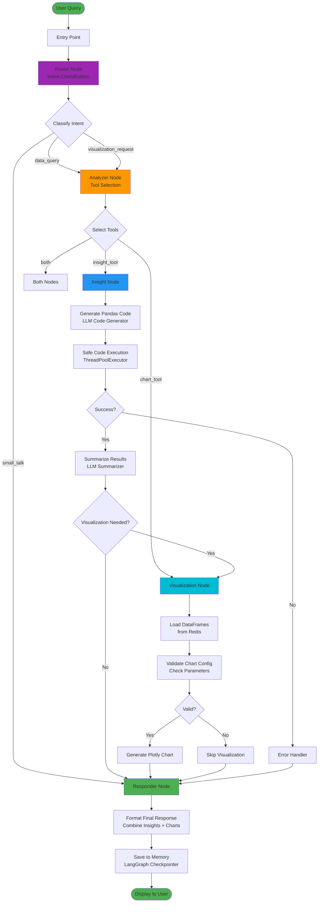

#### LangGraph State Management

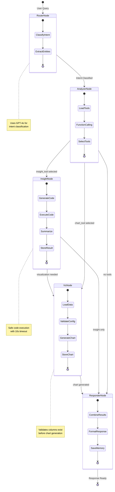

#### Visualization Detection Logic

```mermaid
flowchart LR
    QUERY[User Query] --> KEYWORDS{Check Keywords}
    
    KEYWORDS -->|"show, plot, chart"| EXPLICIT[Explicit Request]
    KEYWORDS -->|"distribution"| CHECK_CAT{Categorical Indicator?}
    KEYWORDS -->|"compare, top, rank"| COMP[Comparative → Bar]
    KEYWORDS -->|"over time, trend"| TREND[Trend → Line]
    KEYWORDS -->|"correlation, vs"| REL[Relationship → Scatter]
    
    CHECK_CAT -->|"by, per, of, across"| CAT_DIST[Categorical Distribution<br/>→ Bar Chart]
    CHECK_CAT -->|None| NUM_DIST[Numeric Distribution<br/>→ Histogram]
    
    EXPLICIT --> INFER{Infer Type}
    INFER -->|"bar, column"| BAR_OUT[Bar Chart]
    INFER -->|"line"| LINE_OUT[Line Chart]
    INFER -->|"scatter"| SCATTER_OUT[Scatter Plot]
    INFER -->|"pie"| PIE_OUT[Pie Chart]
    INFER -->|Default| DEFAULT[Bar Chart]
    
    COMP --> OUTPUT
    TREND --> OUTPUT
    REL --> OUTPUT
    CAT_DIST --> OUTPUT
    NUM_DIST --> OUTPUT
    BAR_OUT --> OUTPUT
    LINE_OUT --> OUTPUT
    SCATTER_OUT --> OUTPUT
    PIE_OUT --> OUTPUT
    DEFAULT --> OUTPUT
    
    OUTPUT[Chart Configuration]
    
    style QUERY fill:#4CAF50
    style CHECK_CAT fill:#FFC107
    style CAT_DIST fill:#2196F3
    style NUM_DIST fill:#FF5722
    style OUTPUT fill:#4CAF50
```

### 5. Session Management & Version Control
- **Automatic TTL**: Sessions expire after 30 minutes of inactivity
- **TTL Extension**: Sessions auto-extend on access
- **Metadata Tracking**: File names, table counts, timestamps
- **Multi-table Support**: Handle multiple tables per session
- **Version History**: Git-like version control for data transformations
- **Branching**: Try multiple analysis paths without losing work
- **Graph Visualization**: Visual representation of transformation lineage

#### Data Git History - Version Graph


#### Version Control Operations

```mermaid
flowchart TD
    START([Data Operation]) --> CURRENT[Get Current Version]
    CURRENT --> EXECUTE[Execute Transformation]
    EXECUTE --> SUCCESS{Success?}
    
    SUCCESS -->|Yes| SNAPSHOT[Create Version Snapshot]
    SUCCESS -->|No| ERROR[Error Handler]
    
    SNAPSHOT --> GEN_ID[Generate Version ID<br/>v0, v1, v2...]
    GEN_ID --> SAVE[Save to Redis<br/>session:version:vX]
    SAVE --> GRAPH[Update Version Graph]
    
    GRAPH --> NODE[Add Node<br/>version + operation]
    NODE --> EDGE[Add Edge<br/>parent → new]
    EDGE --> META[Update Metadata<br/>current_version]
    
    META --> TTL[Sync TTLs<br/>All keys expire together]
    TTL --> END([Version Created])
    
    ERROR --> ROLLBACK[Rollback]
    ROLLBACK --> END
    
    BRANCH([User Clicks Version]) --> LOAD_VER[Load Version Data]
    LOAD_VER --> OVERWRITE[Overwrite Current Session]
    OVERWRITE --> SET_CURRENT[Set as Current Version]
    SET_CURRENT --> BRANCH_END([Branch Created])
    
    style START fill:#4CAF50
    style SNAPSHOT fill:#2196F3
    style GRAPH fill:#FF9800
    style BRANCH fill:#9C27B0
    style BRANCH_END fill:#9C27B0
```

#### Session Storage Structure

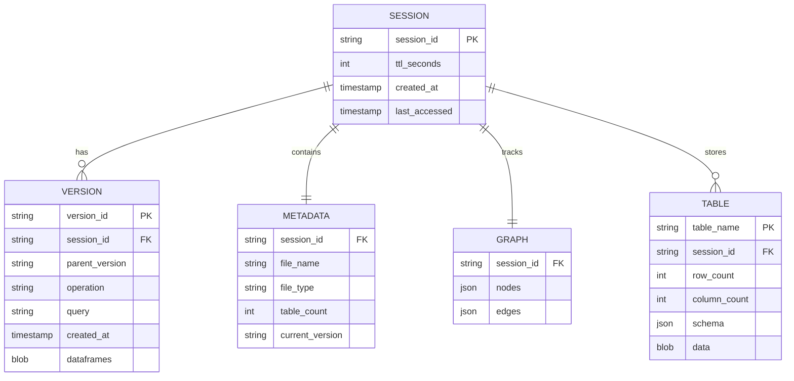

### 6. MCP Integration
- **18+ Data Tools**: Filter, sort, clean, transform operations
- **Safe Execution**: Tool-based approach prevents code injection
- **Tool Tracking**: See which tools are used for each operation
- **Error Handling**: Graceful error recovery

#### MCP Tool Execution Flow


#### Available MCP Tools Categories


## 🌐 Deployment Architecture

### Local Development Setup

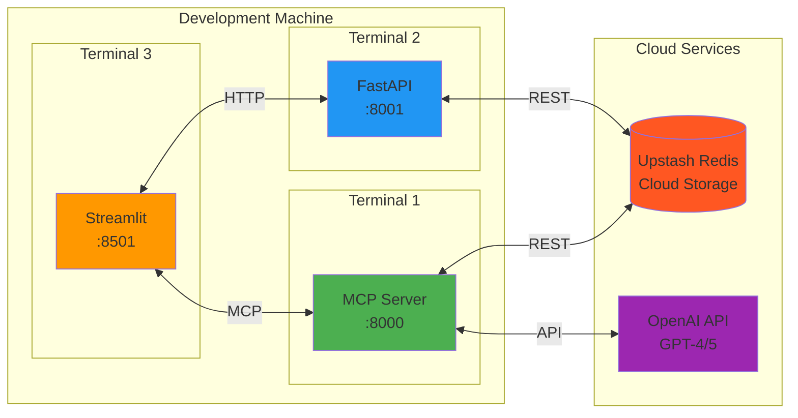

### Current Production Deployment


### Alternative Deployment Options

```mermaid
flowchart TD
    subgraph "Option 1: Single Server (On-Premise)"
        NGINX[Nginx<br/>Reverse Proxy]
        NGINX --> UI1[Streamlit :8501]
        NGINX --> API1[FastAPI :8001]
        NGINX --> MCP1[MCP Server :8000]
    end
    
    subgraph "Option 2: Microservices (Cloud)"
        LB[Load Balancer]
        LB --> UI2[Streamlit<br/>Multiple Instances]
        LB --> API2[FastAPI<br/>Auto-scaling]
        LB --> MCP2[MCP Server<br/>Worker Pool]
    end
    
    subgraph "Option 3: Current Setup (Full Cloud)"
        STREAMLIT_CLOUD[Streamlit Cloud: UI<br/>✅ Live]
        RENDER_MCP[Render: MCP Server<br/>✅ Live]
        RENDER_API[Render: FastAPI<br/>✅ Live]
        
        STREAMLIT_CLOUD --> RENDER_API
        STREAMLIT_CLOUD --> RENDER_MCP
    end
    
    subgraph "Shared Infrastructure"
        REDIS2[(Upstash Redis<br/>Serverless)]
        OPENAI2[OpenAI API]
        MONITORING[Monitoring<br/>Logs & Metrics]
    end
    
    UI1 -.->|Data| REDIS2
    API1 -.->|Data| REDIS2
    MCP1 -.->|Data| REDIS2
    
    UI2 -.->|Data| REDIS2
    API2 -.->|Data| REDIS2
    MCP2 -.->|Data| REDIS2
    
    RENDER_API -.->|Data| REDIS2
    RENDER_MCP -.->|Data| REDIS2
    RENDER_MCP -.->|AI| OPENAI2
    
    style RENDER_MCP fill:#4CAF50
    style RENDER_API fill:#2196F3
    style LOCAL fill:#FF9800
    style REDIS2 fill:#FF5722
    style OPENAI2 fill:#9C27B0
```

## 🚀 Installation

### Option 1: Use Live Deployment (Recommended) ⚡

**No installation needed!** Access the fully deployed platform:

🌐 **https://data-assistant-mu6xtnwivdpi8umtp94wuh.streamlit.app/**

**Features:**
- ✅ Instant access from any device
- ✅ All backend services running
- ✅ No setup or configuration required
- ✅ Always up-to-date with latest features

**Just bring your data and start analyzing!**

---

### Option 2: Local Development Setup

For customization or local development:

#### Prerequisites

- Python 3.8+
- OpenAI API key (for data manipulation)
- Git

### Step 1: Clone Repository

```bash
git clone <repository-url>
cd Data-Assistant
```

### Step 2: Create Virtual Environment

```bash
python -m venv venv
source venv/bin/activate  # On Windows: venv\Scripts\activate
```

### Step 3: Install Dependencies

```bash
pip install -r requirements.txt
```

### Step 4: Set Up Secrets Configuration

**Option A: Using Streamlit Secrets (Recommended)**

Create `.streamlit/secrets.toml` in the project root:

```bash
# Create the .streamlit directory if it doesn't exist
mkdir -p .streamlit

# Copy the template and edit with your values
cp .streamlit/secrets.toml.template .streamlit/secrets.toml
```

Edit `.streamlit/secrets.toml`:

```toml
# OpenAI Configuration
[openai]
api_key = "sk-your-openai-api-key-here"
model = "gpt-4o"

# Production Deployment URLs (Render)
[api]
fastapi_url = "https://data-assistant-m4kl.onrender.com"
mcp_server_url = "https://data-analyst-mcp-server.onrender.com/data/mcp"

# For Local Development: Uncomment and use these
# [api.local]
# fastapi_url = "http://127.0.0.1:8001"
# mcp_server_url = "http://127.0.0.1:8000/data/mcp"

# Optional: Redis Configuration (if running backend locally)
[redis]
rest_url = "https://your-redis-url.upstash.io"
rest_token = "your-redis-token-here"
session_ttl_minutes = 30
```

**Option B: Using Environment Variables (Legacy)**

Alternatively, create a `.env` file in the project root:

```bash
# Upstash Redis Configuration
UPSTASH_REDIS_REST_URL=https://your-redis-url.upstash.io
UPSTASH_REDIS_REST_TOKEN=your-redis-token
SESSION_TTL_MINUTES=30

# OpenAI Configuration
OPENAI_API_KEY=your-openai-api-key
OPENAI_MODEL=gpt-4o

# Production Deployment URLs
MCP_SERVER_URL=https://data-analyst-mcp-server.onrender.com/data/mcp
FASTAPI_URL=https://data-assistant-m4kl.onrender.com
```

**Note**: The app will try `secrets.toml` first, then fall back to environment variables.

### Step 5: Start Services

#### Option A: Use Production Deployment (Recommended)

**🌐 Production Services (Already Deployed)**:
- **MCP Server**: https://data-analyst-mcp-server.onrender.com
- **FastAPI Backend**: https://data-assistant-m4kl.onrender.com
- **Status**: Both services are live on Render!

**Only Start Streamlit Locally:**
```bash
streamlit run app.py
# UI runs on http://localhost:8501
# Connects to production MCP & FastAPI automatically
```

#### Option B: Full Local Development

**Terminal 1 - MCP Server:**
```bash
cd data-mcp
python server.py
# Server runs on http://127.0.0.1:8000
```

**Terminal 2 - FastAPI Backend:**
```bash
python main.py
# API runs on http://127.0.0.1:8001
```

**Terminal 3 - Streamlit Frontend:**
```bash
streamlit run app.py
# UI runs on http://localhost:8501
```

**Note**: For local development, update `.env` to use local URLs.

## ⚙️ Configuration

### Configuration Methods

The platform supports two configuration methods:

1. **Streamlit Secrets** (`.streamlit/secrets.toml`) - **Recommended** ✅
2. **Environment Variables** (`.env` file) - Legacy fallback

The app checks for secrets in this order:
1. Streamlit secrets (`.streamlit/secrets.toml`)
2. Environment variables (`.env` or system environment)
3. Hardcoded defaults

### Streamlit Secrets Configuration

Based on [Streamlit's official secrets management](https://docs.streamlit.io/develop/api-reference/connections/secrets.toml).

**File**: `.streamlit/secrets.toml`

| Section | Key | Description | Default | Required |
|---------|-----|-------------|---------|----------|
| `[openai]` | `api_key` | OpenAI API key for LLM | - | Yes |
| `[openai]` | `model` | OpenAI model to use | gpt-4o | No |
| `[api]` | `fastapi_url` | FastAPI backend URL | https://data-assistant-m4kl.onrender.com | No |
| `[api]` | `mcp_server_url` | MCP server endpoint | https://data-analyst-mcp-server.onrender.com/data/mcp | No |
| `[redis]` | `rest_url` | Upstash Redis REST API URL | - | Yes* |
| `[redis]` | `rest_token` | Upstash Redis REST API Token | - | Yes* |
| `[redis]` | `session_ttl_minutes` | Session expiration time (minutes) | 30 | No |

*Required only if running backend services locally

### Environment Variables (Legacy)

| Variable | Description | Production Default | Local Default | Required |
|----------|-------------|-------------------|---------------|----------|
| `UPSTASH_REDIS_REST_URL` | Upstash Redis REST API URL | - | None | Yes* |
| `UPSTASH_REDIS_REST_TOKEN` | Upstash Redis REST API Token | - | None | Yes* |
| `SESSION_TTL_MINUTES` | Session expiration time (minutes) | 30 | 30 | No |
| `OPENAI_API_KEY` | OpenAI API key for LLM | - | None | Yes |
| `OPENAI_MODEL` | OpenAI model to use | gpt-4o | gpt-4o | No |
| `MCP_SERVER_URL` | MCP server endpoint | https://data-analyst-mcp-server.onrender.com/data/mcp | http://127.0.0.1:8000/data/mcp | No |
| `FASTAPI_URL` | FastAPI backend URL | https://data-assistant-m4kl.onrender.com | http://127.0.0.1:8001 | No |
| `PORT` | FastAPI server port | 8001 | 8001 | No |

*Required only if running backend services locally

### File Size Limits

Configured in `ingestion/config.py`:
- **Max File Size**: 100 MB (default)
- **Max Tables per File**: 10 (default)

## 📖 Usage

### Web Interface

1. **Upload File**:
   - Navigate to Upload tab
   - Select file (CSV, Excel, PDF, or Image)
   - Click "Upload & Process"
   - View extracted tables and metadata

2. **Manipulate Data**:
   - Switch to Data Manipulation tab
   - Enter natural language query (e.g., "Remove rows with missing email")
   - Click "Execute Query"
   - View results and operation history

3. **Visualize Data**:
   - Switch to Visualization Centre tab
   - Select chart type (Bar, Line, Scatter, etc.)
   - Choose X and Y axis columns
   - Optionally select color/grouping column
   - Chart renders instantly
   - Export as PNG, SVG, or HTML

4. **Chat with Your Data**:
   - Switch to Chatbot tab
   - Ask questions about your data (e.g., "What's the average salary by department?")
   - Get context-aware answers with automatic visualizations when needed
   - View conversation history and clear chat when needed
   - Charts are automatically embedded in responses when relevant

### Example Queries

```
"Remove rows where price is greater than 1000"
"Sort the data by revenue in descending order"
"Fill missing values in the age column with the median"
"Filter rows where status equals 'Active'"
"Drop columns 'temp1' and 'temp2'"
"Group by department and calculate average salary"
"Create a new column 'full_name' by combining 'first_name' and 'last_name'"
```

### Visualization Examples

**Bar Chart**: Select categorical column for X, numeric column for Y
**Line Chart**: Perfect for time series data (date on X, value on Y)
**Scatter Plot**: Explore correlations between two numeric variables
**Histogram**: Distribution analysis of a single numeric column
**Box Plot**: Outlier detection and quartile visualization
**Pie Chart**: Proportional breakdown of categorical data
**Heatmap**: Correlation matrix or pivot table visualization

### Chatbot Examples

**Statistical Queries**:
- "What's the average salary by department?"
- "Show me the distribution of ages"
- "What are the top 5 products by revenue?"

**Comparative Queries**:
- "Compare sales across different regions"
- "Which department has the highest average salary?"
- "Show me the difference between Q1 and Q2 sales"

**Exploratory Queries**:
- "What patterns do you see in the data?"
- "Are there any outliers in the price column?"
- "What's the correlation between age and salary?"

**Debugging Queries**:
- "Why did the row count drop after my last change?"
- "What operations were performed on this data?"
- "Show me the schema of the current data"

**Visualization Requests**:
- "Show me a bar chart of sales by region"
- "Plot the trend of revenue over time"
- "Visualize the distribution of ages"

### Command Line (MCP Client)

```bash
# Interactive mode
python mcp_client.py

# Direct query
python mcp_client.py <session_id> "your query here"
```

## 📚 API Documentation

### FastAPI Endpoints

#### File Upload
```http
POST /api/ingestion/file-upload
Content-Type: multipart/form-data

Parameters:
- file: File (required)
- file_type: string (optional) - csv, excel, pdf, image
- session_id: string (optional) - Custom session ID

Response:
{
  "success": true,
  "session_id": "uuid",
  "metadata": {
    "file_type": "csv",
    "table_count": 1,
    "processing_time": 0.5
  },
  "tables": [...]
}
```

#### Get Session Tables
```http
GET /api/session/{session_id}/tables?format=summary

Response:
{
  "session_id": "uuid",
  "table_count": 1,
  "tables": {
    "current": {
      "row_count": 100,
      "column_count": 5,
      "columns": [...],
      "preview": [...]
    }
  }
}
```

#### Get Session Metadata
```http
GET /api/session/{session_id}/metadata

Response:
{
  "session_id": "uuid",
  "metadata": {
    "file_name": "data.csv",
    "file_type": "csv",
    "table_count": 1,
    "created_at": 1234567890
  }
}
```

#### Update Session Tables
```http
PUT /api/session/{session_id}/tables

Body:
{
  "tables": {
    "table_name": {
      "data": "base64_encoded_pickle",
      "row_count": 100,
      "column_count": 5,
      "columns": [...],
      "dtypes": {...}
    }
  },
  "metadata": {...}
}
```

#### List All Sessions
```http
GET /api/sessions

Response:
{
  "success": true,
  "count": 5,
  "sessions": [...]
}
```

#### Delete Session
```http
DELETE /api/session/{session_id}

Response:
{
  "success": true,
  "message": "Session deleted successfully"
}
```

#### Extend Session TTL
```http
POST /api/session/{session_id}/extend

Response:
{
  "success": true,
  "message": "Session TTL extended"
}
```

### Health Check
```http
GET /health

Response:
{
  "status": "healthy",
  "service": "ingestion-api",
  "redis_connected": true,
  "version": "1.1.0"
}
```

## 📁 Project Structure

```
Data-Assistant/
├── app.py                      # Streamlit frontend application
├── main.py                     # FastAPI backend server
├── mcp_client.py              # MCP client with LangChain integration
├── test_visualization_evaluation.py  # Visualization test suite
├── requirements.txt           # Python dependencies
├── README.md                  # This file
│
├── chatbot/                   # InsightBot - LangGraph-powered chatbot
│   ├── __init__.py
│   ├── state.py              # LangGraph state schema (TypedDict)
│   ├── graph.py              # StateGraph definition and compilation
│   ├── streamlit_ui.py       # Streamlit UI components
│   ├── nodes/                # LangGraph nodes
│   │   ├── router.py         # Intent classification node
│   │   ├── analyzer.py       # Tool selection node (function calling)
│   │   ├── insight.py        # Pandas code generation and execution
│   │   ├── viz.py            # Visualization configuration and validation
│   │   └── responder.py      # Response formatting and memory
│   ├── tools/                # LangChain tools
│   │   ├── simple_charts.py  # Bar, line, scatter, histogram tools
│   │   └── complex_charts.py # Combo charts and dashboard tools
│   ├── execution/            # Safe code execution
│   │   ├── code_generator.py # LLM-based pandas code generation
│   │   └── safe_executor.py  # Sandboxed execution with timeout
│   ├── utils/                # Utility modules
│   │   └── session_loader.py # Load DataFrames from Redis
│   ├── prompts/              # LLM prompts
│   │   └── system_prompts.py # Centralized prompts for all nodes
│   └── INSIGHTBOT_IMPLEMENTATION.md  # Architecture documentation
│
├── redis_db/                  # Redis session management
│   ├── __init__.py
│   ├── constants.py          # Redis configuration constants
│   ├── redis_store.py        # Core Redis operations
│   └── serializer.py         # DataFrame serialization
│
├── ingestion/                 # File processing module
│   ├── __init__.py
│   ├── ingestion_handler.py  # Main ingestion orchestrator
│   ├── config.py             # Ingestion configuration
│   ├── csv_handler.py        # CSV file processor
│   ├── excel_handler.py      # Excel file processor
│   ├── pdf_handler.py        # PDF file processor (Docling)
│   └── image_handler.py      # Image file processor (OCR)
│
├── data_visualization/        # Visualization module
│   ├── __init__.py
│   ├── visualization.py      # Main visualization tab
│   ├── chart_compositions.py  # Advanced chart types
│   ├── dashboard_builder.py   # Multi-chart layouts
│   ├── smart_recommendations.py  # LLM-based chart recommendations
│   └── utils.py              # Utility functions
│
├── data-mcp/                  # MCP server for data operations
│   ├── server.py             # FastMCP server
│   ├── data_functions/       # Data manipulation tools
│   │   ├── core.py           # Core data operations
│   │   ├── cleaning.py       # Data cleaning tools
│   │   ├── transformation.py # Data transformation tools
│   │   ├── selection.py      # Column/row selection
│   │   ├── aggregation.py    # Aggregation operations
│   │   ├── feature_engineering.py
│   │   ├── multi_table.py    # Multi-table operations
│   │   ├── http_client.py    # HTTP client for Redis
│   │   └── config.py         # MCP configuration
│   └── requirements.txt
│
└── test_files/                # Sample test files
    ├── test.csv
    ├── test.xlsx
    └── test_image.png
```

## 🔧 Components

### 1. Redis Database Module (`redis_db/`)

**Purpose**: Manages session storage and data persistence using Upstash Redis.

**Key Functions**:
- `save_session()`: Store DataFrames and metadata with TTL
- `load_session()`: Retrieve DataFrames from Redis
- `delete_session()`: Remove session data
- `get_metadata()`: Get session metadata
- `extend_ttl()`: Extend session expiration time
- `list_sessions()`: List all active sessions

**Storage Format**:
- Tables: Base64-encoded pickled DataFrames
- Metadata: JSON format
- Keys: `session:{session_id}:tables` and `session:{session_id}:meta`

### 2. Ingestion Module (`ingestion/`)

**Purpose**: Processes various file formats and extracts tabular data.

**Supported Formats**:
- **CSV**: Automatic delimiter detection, encoding detection
- **Excel**: Multi-sheet support, preserves sheet names
- **PDF**: Uses Docling for table extraction with OCR
- **Images**: Uses Gemini Vision API for OCR-based table extraction

**Key Functions**:
- `process_file()`: Main entry point for file processing
- `process_csv()`: CSV-specific handler
- `process_excel()`: Excel-specific handler
- `process_pdf()`: PDF-specific handler
- `process_image()`: Image-specific handler

### 3. MCP Client (`mcp_client.py`)

**Purpose**: Connects to MCP server and provides LangChain agent for natural language queries.

**Key Functions**:
- `create_mcp_agent()`: Initialize LangChain agent with MCP tools
- `analyze_data()`: Execute natural language query on data
- `get_available_sessions()`: Fetch all active sessions
- `get_session_metadata()`: Get session metadata

**Features**:
- Tool usage tracking and display
- Async/await support
- Error handling and cleanup

### 4. FastAPI Backend (`main.py`)

**Purpose**: REST API for file upload, session management, and data operations.

**Endpoints**:
- File upload and processing
- Session CRUD operations
- Table retrieval and updates
- Health checks and configuration

**Features**:
- CORS support
- Automatic TTL management
- Error handling and logging
- Base64 serialization for MCP integration

### 5. Visualization Module (`data_visualization/`)

**Purpose**: Provides zero-latency chart generation using Plotly with session data integration.

**Key Components**:
- `visualization.py`: Main visualization tab rendering
- `dashboard_builder.py`: Multi-chart layouts and dashboard creation
- `chart_compositions.py`: Advanced chart types (combo charts)
- `smart_recommendations.py`: LLM-based chart type recommendations

**Key Functions**:
- `render_visualization_tab()`: Main function to render the visualization tab
- `get_dataframe_from_session()`: Fetches session data and converts to DataFrame
- `generate_chart()`: Generate Plotly figure based on user selections

**Features**:
- 8 chart types: Bar, Line, Scatter, Area, Box, Histogram, Pie, Heatmap
- Smart column selection with automatic defaults
- Aggregation support (sum, mean, count, min, max)
- Interactive Plotly charts with zoom/pan/hover
- Export to PNG, SVG, and HTML formats
- Theme-aware (light/dark mode support)
- Multi-table support with table selection
- Dashboard builder with grid layouts and chart pinning

### 6. InsightBot Module (`chatbot/`)

**Purpose**: Advanced LangGraph-powered conversational AI for data analysis with intelligent tool selection and visualization.

**Architecture**: Multi-node state graph with persistent memory and dynamic tool routing.

**Key Components**:

**Nodes**:
- `nodes/router.py`: Intent classification using structured LLM output
- `nodes/analyzer.py`: Tool selection via function calling (insight_tool, chart_tools)
- `nodes/insight.py`: Pandas code generation and safe execution
- `nodes/viz.py`: Visualization configuration and validation
- `nodes/responder.py`: Response formatting and memory persistence

**Tools**:
- `tools/simple_charts.py`: Bar, line, scatter, histogram chart tools
- `tools/complex_charts.py`: Combo charts and dashboard tools
- `tools/insight_tool.py`: Statistical analysis and data querying

**Execution**:
- `execution/code_generator.py`: LLM-based pandas code generation
- `execution/safe_executor.py`: Sandboxed code execution with timeout

**Utilities**:
- `utils/session_loader.py`: Loads DataFrames and metadata from Redis
- `prompts/system_prompts.py`: Centralized LLM prompts for all nodes
- `state.py`: TypedDict schema for LangGraph state management
- `graph.py`: StateGraph definition and compilation with MemorySaver

**Key Features**:
- ✅ **Stateful Conversations**: LangGraph MemorySaver for persistent multi-turn memory
- ✅ **Intent Classification**: Automatic routing between data queries, visualizations, and small talk
- ✅ **Function Calling**: LLM dynamically selects appropriate tools based on query
- ✅ **Safe Code Execution**: ThreadPoolExecutor-based timeout (10s) for pandas code
- ✅ **Parameter Extraction**: Intelligent extraction of x_col, y_col, agg_func from queries
- ✅ **Column Validation**: Verifies columns exist before chart generation
- ✅ **Error Handling**: Graceful fallback when visualizations or insights fail
- ✅ **Session Integration**: Seamless loading of DataFrames from Redis store
- ✅ **Serialization**: Handles non-serializable objects (DataFrames, Plotly figures)

**Supported Query Patterns**:
- 📊 Statistical: "What's the average Price by Company?"
- 📈 Comparative: "Compare average Weight by Cpu_brand"
- 🔍 Filtering: "List all laptops with Price > 11.0 and Ram=16"
- 📉 Distribution: "Show the distribution of Weight"
- 🎯 Visualization: "Plot average Price by Company (bar chart)"
- 🔗 Relationship: "Visualize Ram vs. Price relationship"
- 📦 Breakdown: "Show breakdown of Os types as percentages"

### 7. Streamlit Frontend (`app.py`)

**Purpose**: Web-based user interface for file upload, data manipulation, visualization, and chatbot.

**Tabs**:
1. **Upload Tab**: File upload, processing, and preview
2. **Data Manipulation Tab**: Natural language queries, operation history, data preview
3. **Visualization Centre Tab**: Interactive chart generation with Plotly, export options
4. **Chatbot Tab**: Conversational interface for data queries with automatic visualizations

**Features**:
- Real-time data preview
- Operation history tracking
- Session management UI
- Error display and recovery
- Interactive visualizations with Plotly
- Chart export functionality
- Conversational chatbot interface
- Automatic visualization detection in chat

## 🧪 Testing & Quality Assurance

### Visualization Test Suite

The platform includes a comprehensive automated test suite for evaluating visualization generation capabilities.

**Test Script**: `test_visualization_evaluation.py`

**Features**:
- ✅ **Automated Testing**: Tests 10 different visualization query types
- 📸 **Visual Proof**: Generates PNG images and interactive HTML files
- 📊 **Beautiful Reports**: Creates HTML report with all charts embedded
- 📈 **Pass/Fail Analysis**: Detailed results with expected vs. actual chart types
- 🎯 **Coverage**: Bar charts, histograms, scatter plots, pie charts

**Running Tests**:
```bash
# Run visualization tests
python test_visualization_evaluation.py <session_id>

# View results
open viz_test_output/test_report.html
```

**Test Output Structure**:
```
viz_test_output/
├── images/              # PNG images of all visualizations
├── html/                # Interactive HTML charts
├── test_report.html     # Main HTML report
└── viz_test_results.json # Structured results
```

**Test Coverage**:
1. **Bar Charts**: Compare average values across categories
2. **Histograms**: Distribution analysis of numeric columns
3. **Scatter Plots**: Relationship analysis between two variables
4. **Pie Charts**: Percentage breakdown of categorical data

**Success Criteria**:
- All queries generate visualization configs
- Parameters are correctly extracted (x_col, y_col, agg_func)
- Charts render without errors
- Chart types match query intent

**Recent Improvements**:
- ✅ Fixed parameter naming mismatch between tools and prompts
- ✅ Added column validation before chart generation
- ✅ Improved error messages showing available columns
- ✅ Handle missing color columns gracefully after aggregation
- ✅ Added breakdown/percentage query detection

## 🛠 Development

### Running in Development Mode

```bash
# FastAPI with auto-reload
uvicorn main:app --reload --port 8001

# Streamlit with auto-reload (default)
streamlit run app.py
```

### Testing

```bash
# Test file upload
curl -X POST http://localhost:8001/api/ingestion/file-upload \
  -F "file=@test_files/test.csv"

# Test session retrieval
curl http://localhost:8001/api/session/{session_id}/tables

# Test MCP client
python mcp_client.py {session_id} "show me the first 5 rows"
```

### Adding New File Handlers

1. Create handler in `ingestion/` (e.g., `json_handler.py`)
2. Add to `_HANDLERS` dict in `ingestion_handler.py`
3. Update `IngestionConfig.FILE_TYPES` in `config.py`
4. Add file type to Streamlit uploader in `app.py`

### Adding New MCP Tools

1. Add tool function in `data-mcp/data_functions/`
2. Register in `data-mcp/server.py`
3. Tool automatically available to LangChain agent

**Built with ❤️ for data analysts**
