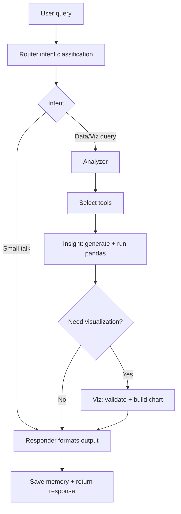

# InsightBot (Chatbot)

LangGraph-powered conversational analytics module for the Data Assistant
Platform. InsightBot routes queries, executes safe pandas operations,
and returns natural language insights with optional visualizations.

## Responsibilities
- Classify user intent and route to the right analysis path.
- Generate and safely execute pandas code for data queries.
- Configure and validate visualizations for chart requests.
- Format final responses and persist conversation memory.

## Contribution to the Main Project
- Provides the conversational layer for data exploration.
- Connects LLM reasoning to the MCP toolset and Redis-backed sessions.
- Delivers analysis results with embedded Plotly charts when relevant.

## Flow Diagram

## Key Files and Folders
- `graph.py`: LangGraph state graph definition and compilation.
- `state.py`: Typed state schema shared across nodes.
- `nodes/`: Router, analyzer, insight, viz, and responder nodes.
- `tools/`: LangChain tools for charts and data analysis.
- `execution/`: Code generation and safe execution environment.
- `utils/session_loader.py`: Loads DataFrames and metadata from Redis.
- `streamlit_ui.py`: Chatbot UI components for the Streamlit app.
- `prompts/system_prompts.py`: LLM prompts used across nodes.

## File Details
- `graph.py`: Defines the state graph and connects node transitions, then
  compiles the graph with memory checkpoints.
- `state.py`: TypedDict that carries user query, session data, results,
  and chart payloads across nodes.
- `nodes/router.py`: Classifies intent to decide the analysis path.
- `nodes/analyzer.py`: Selects tools and parameters from the query.
- `nodes/insight.py`: Generates pandas code and executes it safely.
- `nodes/viz.py`: Validates chart configuration and builds Plotly figures.
- `nodes/responder.py`: Formats final responses and writes memory.
- `tools/`: Tool functions for chart creation and data querying.
- `execution/`: LLM code generation and sandboxed execution utilities.
- `utils/session_loader.py`: Loads DataFrames and schema metadata for
  the session ID.
- `streamlit_ui.py`: Streamlit components that render chat history and
  results in the UI.
- `prompts/system_prompts.py`: Centralized system and tool prompts.

## High-Level Flow
1. Router classifies intent (data query, visualization, small talk).
2. Analyzer selects tools or analysis paths.
3. Insight node generates pandas code and executes safely.
4. Viz node validates chart config and generates Plotly output.
5. Responder formats the final response and updates memory.

