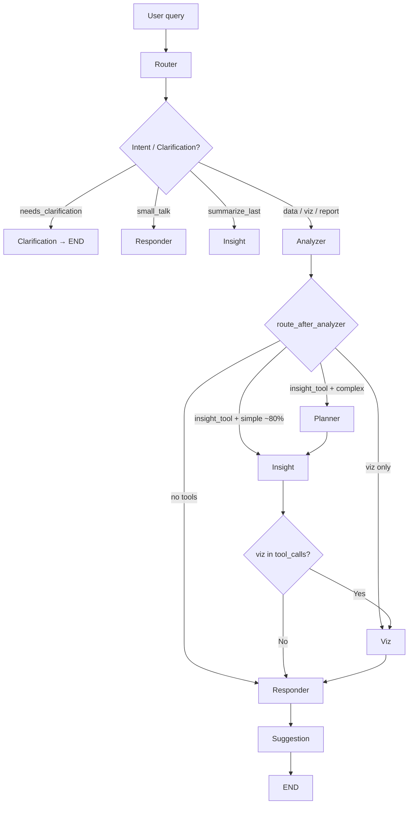

# InsightBot (Chatbot)

LangGraph-powered conversational analytics for the Data Assistant platform. InsightBot classifies intent, resolves context and clarification, generates and safely executes pandas code, configures visualizations, and returns natural-language insights with optional charts. Conversation memory and per-turn response snapshots keep history and visualizations intact across turns.

---

## Table of Contents

- [Responsibilities](#responsibilities)
- [Architecture Overview](#architecture-overview)
- [LLM Model Assignments](#llm-model-assignments)
- [State Schema](#state-schema)
- [Graph and Flow](#graph-and-flow)
- [Nodes (Logical Implementation)](#nodes-logical-implementation)
- [Tools](#tools)
- [Execution (Code Generation & Safe Run)](#execution-code-generation--safe-run)
- [Prompts](#prompts)
- [UI and Session Loading](#ui-and-session-loading)
- [File Structure](#file-structure)
- [How to Run and Test](#how-to-run-and-test)
- [Limitations and Troubleshooting](#limitations-and-troubleshooting)

---

## Responsibilities

- **Intent & routing:** Classify user intent (data query, visualization, small talk, report, summarize_last) and route to the right path; handle follow-ups and clarification.
- **Context resolution:** Resolve short follow-ups (e.g. "What about the maximum?") into full questions using conversation context.
- **Column disambiguation:** When the user mentions a term that matches multiple columns, ask for clarification ("Did you mean X or Y?") and resolve on the next turn.
- **Code generation & execution:** Generate pandas code from the query and run it in a sandboxed environment with timeout and error handling.
- **Visualization:** Validate chart parameters, build Plotly figures via the shared `data_visualization` module, and handle viz failures (e.g. too many categories) with fallback to tables.
- **Response formatting:** Combine insight text, chart/table, and optional "see code" expander; support report and summarize_last formats.
- **Memory & snapshots:** Persist conversation with LangGraph checkpointer; keep per-turn `response_snapshots` so the UI can show each message's chart/table/code (previous visualizations do not disappear on new queries).
- **Suggestions:** Generate three contextual follow-up question chips after each response.

---

## Architecture Overview

- **Framework:** LangGraph `StateGraph` with typed state.
- **Memory:** `MemorySaver` (thread/session-based checkpoints).
- **LLM:** OpenAI gpt-4o (complex reasoning) and gpt-4o-mini (classification, summarization, suggestions). See [LLM Model Assignments](#llm-model-assignments).
- **LLM Initialisation:** Singleton registry (`llm_registry.py`) — one `ChatOpenAI` instance per `(model, temperature, max_tokens)` tuple, reused for the process lifetime. Eliminates ~200ms/node of per-call object-creation overhead (~1.4s/query saved).
- **Tools:** LangChain tools (insight_tool, bar_chart, line_chart, scatter_chart, histogram, etc.) with function calling from the analyzer.
- **Execution:** Safe pandas execution with timeout and controlled namespace; correlation and analysis rules enforced via prompts (e.g. numeric-only correlation).
- **Streaming:** Graph is invoked with `graph.stream(stream_mode='values')` so the response is rendered as soon as the responder node finishes, before the suggestion node completes (~1–2s perceived vs 15s all-or-nothing).

---

## LLM Model Assignments

Managed centrally in `chatbot/llm_registry.py`. Override any assignment via environment variables without code changes.

| Node / Task | Model | Temp | max_tokens | Rationale |
|---|---|---|---|---|
| Router (intent classification) | gpt-4o-mini | 0.0 | 256 | Binary routing; no schema reasoning needed |
| Context Resolver (follow-up) | gpt-4o-mini | 0.0 | 128 | One-sentence output |
| Analyzer (tool selection) | gpt-4o | 0.1 | — | Schema-aware reasoning |
| Planner (multi-step breakdown) | gpt-4o | 0.1 | — | Complex multi-step output |
| Code Generator (pandas) | gpt-4o | 0.1 | — | Accuracy on data operations |
| Summarizer (`summarize_insight`) | gpt-4o-mini | 0.2 | 256 | Simple paraphrase of results |
| Suggestion Engine | gpt-4o-mini | 0.4 | 128 | 3 short questions |
| Small Talk / Fallback Responder | gpt-4o-mini | 0.7 / 0.3 | 150 / 512 | Conversational replies |

**Environment variable overrides:**
```bash
MAIN_MODEL=gpt-4o          # Analyzer, Planner, Code Gen
MINI_MODEL=gpt-4o-mini     # Summarizer, Suggestions, Small Talk
ROUTER_MODEL=gpt-4o-mini   # Router specifically
CONTEXT_RESOLVER_MODEL=gpt-4o-mini
SUGGESTION_MODEL=gpt-4o-mini
```

**Latency impact of model assignments:**

| Source | Saving per query |
|---|---|
| Singleton registry (no repeated init) | ~1.4s |
| Router: gpt-4o → mini | ~1.7s |
| Context Resolver: gpt-4o → mini | ~1.4s |
| Summarizer: gpt-4o → mini | ~1.0s |
| Suggestion Engine: gpt-4o → mini | ~1.4s |
| Planner skip for simple queries | ~2.0s (~80% of queries) |
| Streaming UI (perceived latency) | 15s → ~1–2s first token |

---

## State Schema

Defined in `state.py` as a `TypedDict`. DataFrames are not stored in state; they are loaded from Redis by `session_id` when needed.

| Field | Purpose |
|-------|---------|
| `session_id` | Identifies the user session and Redis data. |
| `messages` | Conversation history (annotated with `add_messages` for append/reduce). |
| `schema`, `operation_history`, `table_names` | Data context (metadata only). |
| `intent` | Router output: data_query, visualization_request, small_talk, report, summarize_last. |
| `entities` | Extracted columns, operations, aggregations. |
| `tool_calls` | Selected tools and parameters from the analyzer. |
| `plan` | Multi-step plan: list of dicts with step, description, code, output_var. |
| `needs_planning` | True if query requires multi-step reasoning. |
| `effective_query` | Resolved full question (e.g. after context resolution or clarify). |
| `conversation_context` | last_columns, last_aggregation, last_group_by, active_filters, current_topic, last_query. |
| `needs_clarification` | True when multiple columns match one user mention. |
| `clarification_*` | Options, type, resolved choice, original query. |
| `last_insight`, `insight_data` | Text insight and optional DataFrame-as-dict for tables. |
| `viz_config`, `viz_type`, `chart_reason` | Chart configuration and one-line reason. |
| `one_line_insight`, `generated_code` | Single-sentence takeaway and code for "see how this was computed". |
| `error`, `error_suggestion`, `viz_error` | Errors and "did you mean" suggestions. |
| `sources`, `suggestions` | Tools used and three follow-up question strings. |
| `response_snapshots` | List of dicts per AI turn: viz_config, insight_data, generated_code, viz_error (so UI can render each turn's chart/table/code). |

---

## Graph and Flow

- **Entry:** `router`.
- **Router →** `clarification` (if needs_clarification), `responder` (small_talk), `insight` (summarize_last), or `analyzer`.
- **Clarification →** `END` (no tools this turn).
- **Analyzer →** `planner` (complex queries only — YoY, cohort, rolling avg, trend/correlate sub-intent, or query >25 words), `insight` (simple queries, ~80%), `viz`, or `responder`.
- **Planner →** `insight` (creates multi-step plan).
- **Insight →** `viz` (if viz tools in tool_calls) or `responder`.
- **Viz →** `responder`.
- **Responder →** `suggestion` → `END`.



**Planner skip complexity gate** (in `graph.py`):
A query routes directly to `insight` unless it contains complex keywords (`year over year`, `yoy`, `rolling average`, `cumulative`, `cohort`, `percentile`, etc.), has sub-intent `trend`, `correlate`, or `report`, or is longer than 25 words. ~80% of typical data queries skip the planner entirely, saving ~2s.

---

## Nodes (Logical Implementation)

| Node | File | Responsibility |
|------|------|----------------|
| **Router** | `nodes/router.py` | Classify intent (data_query, visualization_request, small_talk, report, summarize_last). Uses **gpt-4o-mini** (temp=0.0, max_tokens=256). Set `is_follow_up` and resolve context: if follow-up, call context_resolver (**gpt-4o-mini**, max_tokens=128) to produce `effective_query`. Detect ambiguous column mentions and set `needs_clarification` + `clarification_options`. |
| **Clarification** | `nodes/clarification.py` | When multiple columns match one mention, emit an assistant message asking the user to choose (e.g. "Did you mean: ColA or ColB?"). On next turn, router/insight use `clarification_resolved` to substitute the chosen column into the query. |
| **Analyzer** | `nodes/analyzer.py` | Select tools and parameters from the query (and schema) using **gpt-4o** (temp=0.1). Output `tool_calls`. Route to planner (complex queries), insight (simple), viz, or responder. Post-processes tool_calls to coerce bar/scatter → heatmap for correlation queries. |
| **Planner** | `nodes/planner.py` | Break down complex queries into multi-step plans using **gpt-4o** (temp=0.1). Only invoked for ~20% of queries (YoY, rolling, cohort, trend, correlate, report, or >25 words). Creates plan with step descriptions and code. For simple queries, the router skips this node entirely. |
| **Insight** | `nodes/insight.py` | Use `effective_query` (or clarified query). Try rule-based execution first (for simple queries — zero LLM calls). If `plan` exists, execute plan steps sequentially. Otherwise, call code_generator (**gpt-4o**) to produce pandas code. Summarize result with **gpt-4o-mini** (max_tokens=256). Run in safe_executor (with validation, row limits, profiling). Handle summarize_last. Map result to `last_insight`, `insight_data`, `one_line_insight`, `generated_code`. On executor/column errors, set `error` and optional `error_suggestion`. |
| **Viz** | `nodes/viz.py` | Read `tool_calls` for chart tools; validate and build config. Call `data_visualization` to generate Plotly figure. Set `viz_config`, `viz_type`, `chart_reason`; on failure set `viz_error` (e.g. too many categories). |
| **Responder** | `nodes/responder.py` | Format final assistant message from intent, `last_insight`, `viz_config`, `viz_error`, `insight_data`. Handle small_talk (**gpt-4o-mini**), did_you_mean, and generic errors. Append AIMessage to `messages` and append current turn's snapshot to `response_snapshots` (viz_config, insight_data, generated_code, viz_error). |
| **Suggestion** | `nodes/suggestion_engine.py` | Generate three follow-up questions using **gpt-4o-mini** (temp=0.4, max_tokens=128). Intent-aware pre-defined fallbacks (compare, trend, correlate, segment, distribution, filter, report) returned instantly on any LLM failure — suggestions always appear, never empty. |

---

## Data Profiling Layer

Comprehensive data profiling runs automatically before any query:

- **Missing Value %**: Percentage of null values per column
- **Cardinality**: Low (<10), Medium (10-100), High (>100) unique values
- **Numeric Distribution**: Mean, median, std, min, max, quartiles for numeric columns
- **Category Counts**: Top 10 most frequent values for categorical columns

Profiles are:
- **Injected into prompts** for better tool selection and code generation
- **Used for chart validation** to prevent unsuitable visualizations
- **Used for smart chart selection** based on data characteristics

See `DATA_PROFILING.md` for detailed documentation.

## Code Execution Guardrails

InsightBot includes comprehensive guardrails for safe code execution:

1. **Code Validation**: Blocks forbidden operations (`.plot()`, file writes, `eval()`, etc.)
2. **Result Variable Enforcement**: Ensures code assigns to `result` variable
3. **Row Limit Enforcement**: Truncates results to max 100k rows
4. **Execution Time Profiling**: Tracks execution time for monitoring
5. **Rule-Based Fast Path**: Handles simple queries (mean, sum, count, max, min) without any LLM call — ~2.5s saved for ~30% of queries

See `execution/GUARDRAILS.md` for detailed documentation.

## Tools

InsightBot uses LangChain's `@tool` decorator pattern for tool definition and LLM function calling:
https://docs.langchain.com/oss/python/langchain/tools

**Tool Definition & Selection:**
- Tools are defined with `@tool` decorator in `chatbot/tools/`
- Analyzer node binds tools to LLM using `llm.bind_tools(tools)`
- LLM selects which tools to call based on user query
- Tool calls are extracted and stored in `state["tool_calls"]`

**Tool Execution (Custom Pattern):**
Unlike LangChain's `ToolNode` (which auto-executes tools), InsightBot uses specialized execution nodes:
- **`insight_tool`** (`tools/data_tools.py`): Executed in `insight_node` for pandas code generation and execution
- **Chart tools** (`tools/simple_charts.py`, `tools/complex_charts.py`): Executed in `viz_node` for chart config validation and storage

This custom pattern allows:
- Domain-specific execution logic (data analysis vs visualization)
- Better error handling per tool type
- Separation of concerns (config generation vs execution)

**Available Tools:**
- `insight_tool`: Data analysis queries (mean, sum, filter, groupby, correlation, etc.)
- `bar_chart`, `line_chart`, `scatter_chart`, `histogram`, `area_chart`, `box_chart`, `heatmap_chart`, `correlation_matrix`: Visualization tools
- `combo_chart`, `dashboard`: Complex visualization tools

---

## Execution (Code Generation & Safe Run)

- **`execution/code_generator.py`:** Uses **gpt-4o** (singleton from registry) via the code_generator prompt to produce pandas code. Prompts enforce:
  - **Correlation:** Only numeric columns. Generic "show correlation" → `df.select_dtypes(include=['number']).corr()`. Two columns → `df['col1'].corr(df['col2'])`. Never full `df.corr()` or `groupby(...).corr()` with no arguments.
  - **Categorical vs numeric:** "Correlation between X and [categorical]" → groupby + agg (e.g. mean/count), not correlation.
  - Filtering, grouping, "for each" (idxmax/idxmin), etc. as in prompts.
- **`execution/rule_based_executor.py`:** Called first in `insight_node` before any LLM. Handles mean, sum, count, min, max queries with direct pandas operations — zero API cost, zero latency.
- **`execution/safe_executor.py`:** Runs the code in a restricted namespace (e.g. only `df`, `pd`, `result`), with timeout and exception handling. Returns result or raises; insight node maps failures to `error` and `error_suggestion`.

---

## Prompts

All in `prompts/` (one file per prompt, loaded via `prompts/__init__.py`):

| Prompt | Use |
|--------|-----|
| **router** | Intent classification, follow-up detection, entity extraction, conversation_context. |
| **context_resolver** | Turn short follow-ups into one full natural-language question. |
| **analyzer** | Tool selection and parameters; schema-aware. |
| **code_generator** | Pandas code from query; correlation rules, filtering, groupby, "for each" patterns. |
| **summarizer** | One-sentence takeaway + optional second sentence from pandas output. |
| **responder** | Not used as a single LLM call; responder node composes from state. |
| **small_talk** | Friendly short replies. |
| **suggestions** | Three follow-up questions for UI chips. |

---

## UI and Session Loading

- **`streamlit_ui.py`:** Renders the InsightBot tab: session pill, sidebar (options, quick actions, clear chat), chat history, suggestion chips, and input. Uses `graph.get_state(config)` and invokes the graph via `ui/chat_input.py`. **Message history:** When `response_snapshots` is present, `display_message_history` iterates messages and for each AI message renders its snapshot (table if no chart/viz_error, chart from `viz_config`, code expander). So previous visualizations stay visible when the user sends a new query.
- **`ui/chat_input.py`:** Handles chat input and invokes the graph using **`graph.stream(stream_mode='values')`**. Yields full state snapshots after each node completes. Shows progressive status captions (`Understanding your question…` → `Selecting analysis tools…` → `Composing response…`) while nodes run. As soon as the responder appends its `AIMessage`, the response is rendered immediately — before the suggestion node finishes. Calls `st.rerun()` at the end to load the full message history with charts/tables/chips.
- **`utils/session_loader.py`:** Loads DataFrames and metadata from Redis by `session_id`; `prepare_state_dataframes()` returns schema, df_dict, operation_history for the graph inputs.

---

## File Structure

```
chatbot/
├── __init__.py
├── state.py              # TypedDict state schema
├── graph.py              # StateGraph, nodes, edges, checkpointer, planner skip gate
├── llm_registry.py       # Singleton LLM cache — one ChatOpenAI per (model, temp, max_tokens)
├── streamlit_ui.py       # Streamlit tab, message history, snapshots
├── README.md             # This file
├── INSIGHTBOT_IMPLEMENTATION.md
│
├── nodes/
│   ├── __init__.py
│   ├── router.py         # Intent (gpt-4o-mini), context resolution, clarification detection
│   ├── clarification.py  # "Did you mean X or Y?" message
│   ├── analyzer.py       # Tool selection (gpt-4o), route_after_analyzer, correlation→heatmap
│   ├── planner.py        # Multi-step query breakdown (gpt-4o, complex queries only)
│   ├── insight.py        # Rule-based fast path → code gen (gpt-4o) → summarize (gpt-4o-mini)
│   ├── viz.py            # Chart config + data_visualization integration
│   ├── responder.py      # Format response, append message, append snapshot
│   └── suggestion_engine.py  # Follow-up suggestions (gpt-4o-mini + intent-aware fallbacks)
│
├── tools/
│   ├── __init__.py       # get_all_tools()
│   ├── data_tools.py     # insight_tool
│   ├── simple_charts.py  # bar, line, scatter, histogram, heatmap, correlation_matrix
│   └── complex_charts.py # combo, dashboard
│
├── execution/
│   ├── __init__.py
│   ├── code_generator.py    # LLM pandas code generation (gpt-4o via registry)
│   ├── code_validator.py    # Forbidden ops, result variable enforcement
│   ├── safe_executor.py     # Sandboxed execution, timeout, row limit
│   └── rule_based_executor.py  # Zero-LLM fast path for simple queries
│
├── prompts/
│   ├── __init__.py           # get_*_prompt() accessors
│   ├── base.py               # PromptTemplate, truncate_schema
│   ├── router_prompt.py
│   ├── analyzer_prompt.py
│   ├── planner_prompt.py
│   ├── code_generator_prompt.py
│   ├── summarizer_prompt.py
│   ├── responder_prompt.py
│   ├── suggestion_prompt.py
│   ├── small_talk_prompt.py
│   └── context_resolver_prompt.py
│
├── utils/
│   ├── __init__.py
│   ├── session_loader.py      # Redis load, prepare_state_dataframes, get_session_profile
│   ├── state_helpers.py       # get_current_query(state) — shared query resolution
│   ├── profile_formatter.py   # Format profile for prompts, chart validation
│   └── chart_selector.py      # Rule-based chart suggestion (not in main graph)
│
└── ui/
    ├── message_history.py     # Render per-turn snapshots (chart/table/code)
    ├── chat_input.py          # graph.stream() with progressive status UI
    └── chart_ui.py            # generate_chart_from_config_ui (Plotly from viz_config)
```

---

## How to Run and Test

1. **Environment:** Set `OPENAI_API_KEY`. Optionally override models via `MAIN_MODEL`, `MINI_MODEL`, etc. Ensure Redis and app backend are running if using session data.
2. **Run app:** `streamlit run app.py`; open the InsightBot tab. Upload data or use an existing session.
3. **Basic flow:** Ask a data question (e.g. "What's the average of X?"), then a chart request (e.g. "Bar chart of X by Y"), then a follow-up (e.g. "What about the maximum?"). Confirm responses and that previous charts remain visible.
4. **Streaming:** Confirm progressive status labels appear while nodes run, and the response renders before suggestion chips load.
5. **Planner skip:** Ask a simple query ("What is the average salary?") and confirm it routes analyzer → insight (no planner). Ask a complex query ("Show year-over-year revenue growth") and confirm the planner is invoked.
6. **Clarification:** Ask something that matches multiple columns (e.g. "show sales") where "sales" matches two columns; confirm "Did you mean …?" and that the next message uses the chosen column.
7. **Correlation:** Ask "show correlation" or "correlation between Price and Weight"; confirm numeric-only behavior.
8. **Rule-based fast path:** Ask "What is the average Price?" — confirm `Rule-based execution hit` in logs (no code generator LLM call).
9. **Suggestions:** Confirm three suggestion chips always appear, even if the LLM fails (intent-based fallbacks kick in).

---

## Limitations and Troubleshooting

- **Windows:** Signal-based timeout in the executor may not work; fallback is try/except without signal.
- **Single chart per response:** One chart per turn; multiple charts in one reply is not implemented.
- **Session not found:** Session expired or missing in Redis; re-upload or re-select data.
- **OpenAI errors:** Check `OPENAI_API_KEY` and quota. `MAIN_MODEL` defaults to `gpt-4o`; `MINI_MODEL` defaults to `gpt-4o-mini`.
- **State field missing:** New state fields must be initialized in the inputs passed from `streamlit_ui.py` when invoking the graph (and in any reducer if applicable).
- **Streaming + checkpointer:** The `MemorySaver` checkpointer is compatible with `graph.stream()`. Each yielded snapshot reflects the full state after the completed node.

For more test scenarios and migration notes, see `TESTING.md` and `MIGRATION.md` (if present). For implementation history and checklist, see `INSIGHTBOT_IMPLEMENTATION.md`.
