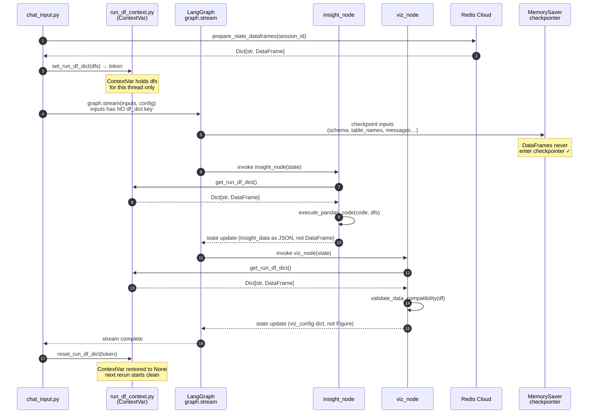
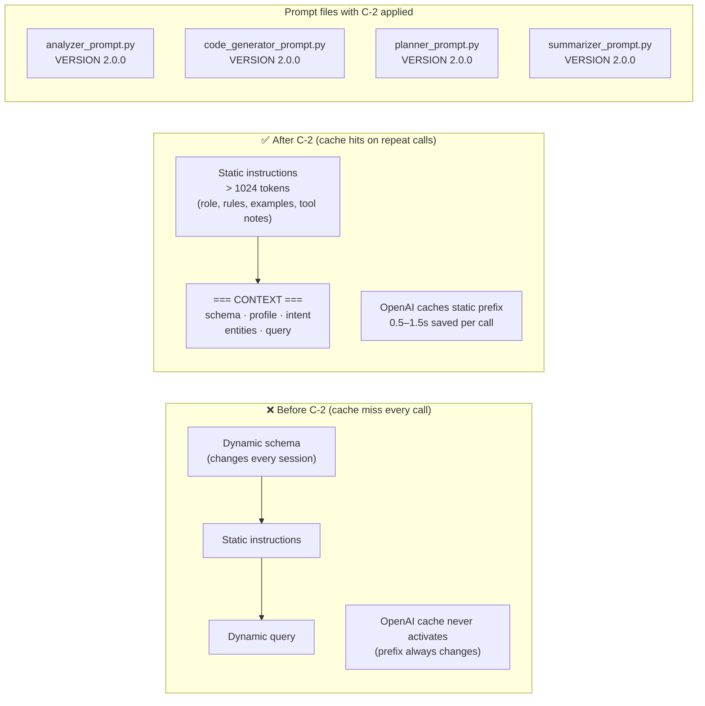
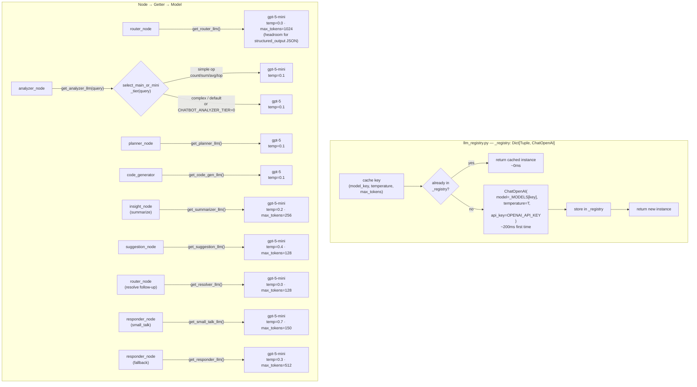
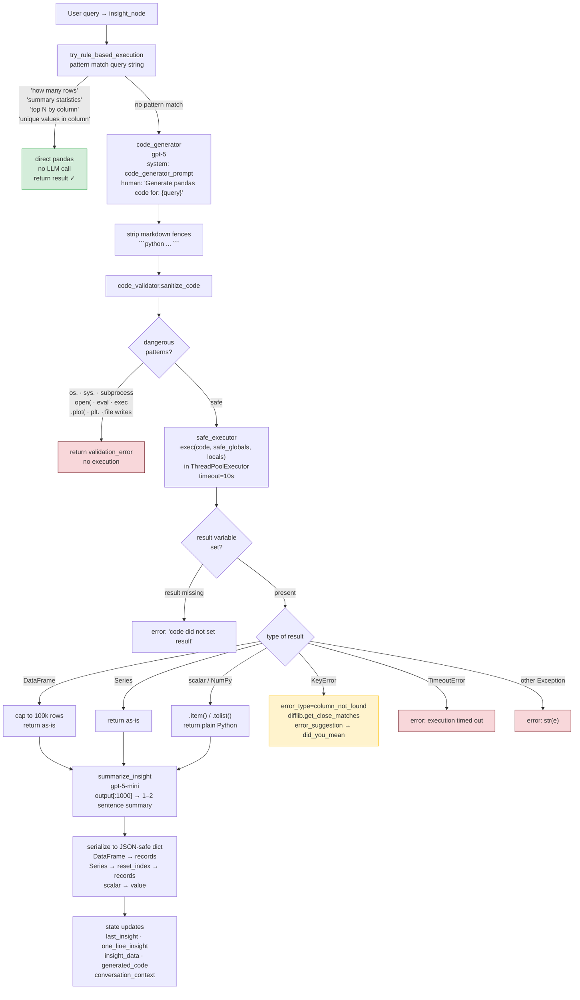
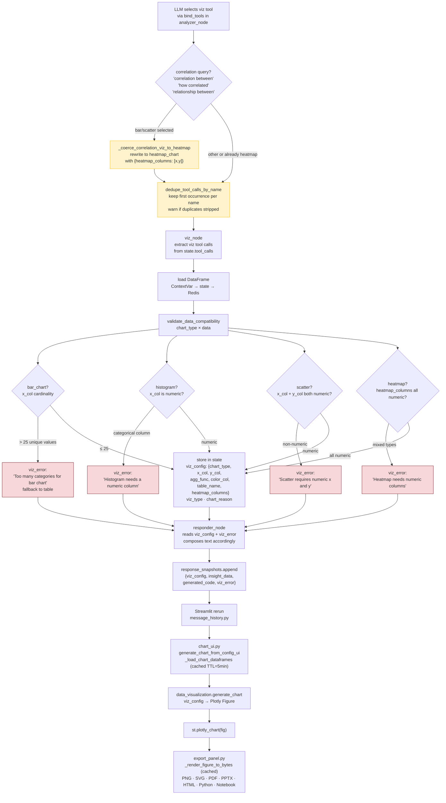
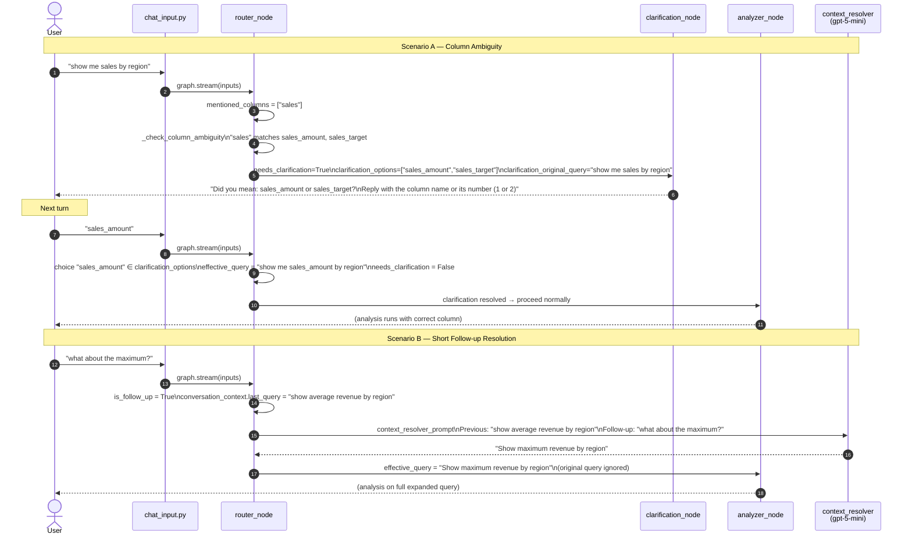
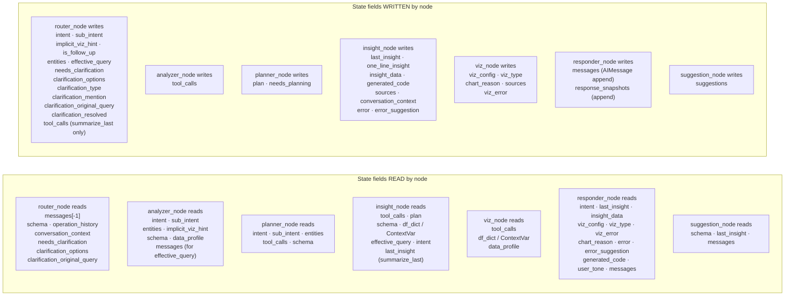

# InsightBot — Implementation Reference

Complete file-by-file guide to every component in the `chatbot/` package. For each file you'll find: its role, how the feature works internally, and how it connects to the rest of the system.

---

## Table of Contents

1. [Package root](#1-package-root)
2. [Graph & state](#2-graph--state)
3. [LLM registry](#3-llm-registry)
4. [Nodes](#4-nodes)
5. [Execution layer](#5-execution-layer)
6. [Prompts](#6-prompts)
7. [Tools](#7-tools)
8. [UI layer](#8-ui-layer)
9. [Utilities](#9-utilities)
10. [Data flow diagram](#10-data-flow-diagram)

---

## 1. Package root

### `__init__.py`
**Role:** Public API surface for the `chatbot` package.

Exports `render_chatbot_tab` (Streamlit entry point), `graph` (compiled LangGraph), `State` and `Node` types, `SessionLoader`, and `prepare_state_dataframes`. Any file outside `chatbot/` should import only from here rather than from sub-modules directly.

---

### `constants.py`
**Role:** Single source of truth for every magic string in the system.

| Group | Constants | Used by |
|---|---|---|
| Intents | `INTENT_DATA_QUERY`, `INTENT_VISUALIZATION`, `INTENT_SMALL_TALK`, `INTENT_REPORT`, `INTENT_SUMMARIZE_LAST` | router, graph edges, responder |
| Sub-intents | `SUB_INTENT_COMPARE`, `SUB_INTENT_TREND`, … | router, graph complexity check |
| Tool names | `TOOL_INSIGHT`, `TOOL_BAR_CHART`, `TOOL_HEATMAP_CHART`, … | analyzer, viz node, graph routing |
| `VIZ_TOOL_NAMES` tuple | All chart tool names | `graph.py` routing, analyzer dedup |
| User tones | `USER_TONE_EXPLORER`, `USER_TONE_TECHNICAL`, `USER_TONE_EXECUTIVE` | responder, streamlit sidebar |

**Why it exists:** Prevents typo-driven bugs. If a tool is renamed, change it once here and all nodes update automatically.

---

### `streamlit_ui.py`
**Role:** Top-level Streamlit tab renderer (`render_chatbot_tab`). Composes sidebar settings, chat history display, suggestion chips, and the chat input box.

**What it does:**
- Reads `current_session_id` from `st.session_state`; shows an empty state if absent.
- Calls `graph.get_state(config)` to hydrate the latest LangGraph checkpoint without re-running the graph.
- Renders per-response snapshots (`response_snapshots`) so every AI message has its own chart/table/code — not just the most recent.
- Suggestion chips fire `st.session_state["pending_chat_query"]` + `st.rerun()` and spawn background daemon threads to pre-warm the analyzer cache (scaffolded; currently a no-op log).
- Sidebar contains a `show_data` toggle and a `Response style` selector (tone), plus quick-action buttons ("Summary stats", "Trend", "Top 10", "Correlation").

**Connections:** delegates input handling to `ui.handle_chat_input`, history display to `ui.display_message_history`, and chart rendering to `ui.generate_chart_from_config_ui`.

---

### `run_df_context.py`
**Role:** Thread-safe `ContextVar` that holds the session's DataFrames for the duration of one graph run.

**Problem it solves:** LangGraph's default checkpoint serializer (msgpack) cannot serialize `pandas.DataFrame`. If `df_dict` were stored in graph state, every `graph.stream()` call would crash with `Type is not msgpack serializable: DataFrame`.

**How it works:**
```
chat_input.py → set_run_df_dict(dfs)    # stores in ContextVar, returns token
graph.stream(...)                        # nodes call get_run_df_dict() instead of state["df_dict"]
finally: reset_run_df_dict(token)        # restores previous value (None), preventing cross-turn leakage
```

Functions: `set_run_df_dict(dfs)`, `get_run_df_dict()`, `reset_run_df_dict(token)`.

---

## 2. Graph & state

### `state.py`
**Role:** Defines the `State` TypedDict — the shared memory that every graph node reads from and writes to.

Key field groups:

| Group | Fields |
|---|---|
| Session | `session_id` |
| Conversation | `messages` (append-only via `add_messages` reducer) |
| Data context | `schema`, `table_names`, `data_profile`, `df_dict` (non-checkpointed in production) |
| Intent | `intent`, `sub_intent`, `implicit_viz_hint`, `entities` |
| Tool selection | `tool_calls`, `prior_tool_calls`, `prior_schema_hash`, `is_follow_up` |
| Planning | `plan`, `needs_planning`, `effective_query`, `conversation_context` |
| Clarification | `needs_clarification`, `clarification_options`, `clarification_type`, `clarification_mention`, `clarification_original_query`, `clarification_resolved` |
| Results | `last_insight`, `insight_data`, `viz_config`, `viz_type`, `chart_reason`, `one_line_insight`, `generated_code` |
| Errors | `error`, `error_suggestion`, `viz_error` |
| Response | `user_tone`, `sources`, `suggestions`, `response_snapshots` |

**Why `response_snapshots`:** LangGraph checkpoints the full state after each turn. By accumulating a list of `{viz_config, insight_data, generated_code, viz_error}` dicts, the UI can show each AI message's original chart without re-running analysis.

---

### `graph.py`
**Role:** Assembles the LangGraph `StateGraph`, defines routing logic, and compiles the final `graph` object used throughout the app.

**Node wiring:**

```
[router] ──→ clarification → END
          ──→ responder (small talk) → suggestion → END
          ──→ insight (follow-up reuse) → viz → responder → suggestion → END
          ──→ analyzer ──→ planner → insight → (viz?) → responder → suggestion → END
                       ──→ insight
                       ──→ viz → responder → suggestion → END
                       ──→ responder → END
```

**Key routing functions:**

- `route_from_router`: C-5 fast path — if `is_follow_up=True` and the schema hash hasn't changed, it injects the prior turn's `tool_calls` directly and jumps to `insight`, skipping the analyzer LLM entirely (~1–2s saved).
- `route_after_analyzer_with_planning`: calls `route_after_analyzer` from `analyzer.py`, then applies a complexity heuristic (`_COMPLEX_KEYWORDS` + `sub_intent` + query word count). Sends only ~20% of queries through the full `planner` path.
- `route_from_insight`: if any tool in `tool_calls` is a viz tool, route to `viz`; otherwise straight to `responder`.
- `route_after_responder`: skips suggestion node for small talk, errors, and clarification turns (saves ~0.5–1s LLM call).

**Schema fingerprinting (`_hash_schema`):** MD5 of sorted column lists per table. Used by the C-5 follow-up reuse guard to detect when underlying tables have changed between turns.

**Checkpointer:** `MemorySaver` (in-memory). Each Streamlit session uses `thread_id = session_id` so conversation state is isolated per user.

---

## 3. LLM registry

### `llm_registry.py`
**Role:** Singleton cache for `ChatOpenAI` instances. Eliminates the ~200ms per-node overhead of constructing a new client on every LLM call.

**Cache key:** `(model_key, temperature, max_tokens)` tuple. One instance is created per unique combination and reused for the process lifetime.

**Model tiers:**

| Getter | Model | Use case |
|---|---|---|
| `get_router_llm()` | `gpt-5-mini` | Structured intent classification, `max_tokens=1024` |
| `get_analyzer_llm(query)` | `gpt-5` (or mini for simple queries) | Tool selection; tiered via `CHATBOT_ANALYZER_TIER` env + `model_routing.select_main_or_mini_tier` |
| `get_planner_llm()` | `gpt-5` | Multi-step plan generation |
| `get_code_gen_llm()` | `gpt-5` | Pandas code generation |
| `get_summarizer_llm()` | `gpt-5-mini`, `max_tokens=256` | One/two-sentence result summaries |
| `get_suggestion_llm()` | `gpt-5-mini`, `max_tokens=128` | Three follow-up chip suggestions |
| `get_resolver_llm()` | `gpt-5-mini`, `max_tokens=128` | Follow-up query resolution |
| `get_small_talk_llm()` | `gpt-5-mini`, `max_tokens=150` | Conversational replies |
| `get_responder_llm()` | `gpt-5-mini`, `max_tokens=512` | Fallback response formatting |

**Override:** All model names are read from environment variables (`MAIN_MODEL`, `MINI_MODEL`, `ROUTER_MODEL`, etc.) at import time, so you can swap models without code changes.

---

## 4. Nodes

Each node is a pure function `(state: Dict) -> Dict` decorated with `@observe` (Langfuse tracing). They read from state, do their work, and return an updated state dict. None of them have side effects beyond logging and the Langfuse trace.

---

### `nodes/router.py`
**Role:** First node every turn. Classifies the user's intent and extracts entities.

**What it does:**
1. Extracts the last `HumanMessage` from `state["messages"]`.
2. Invokes `get_router_llm().with_structured_output(IntentClassification)` with the system prompt (schema + operation history + conversation context).
3. Populates: `intent`, `sub_intent`, `implicit_viz_hint`, `is_follow_up`, `entities`.
4. **Clarification resolution:** if `needs_clarification` is active and the user's reply matches one of `clarification_options`, it substitutes the column name into `effective_query` and clears the clarification flags.
5. **Follow-up resolution:** for short follow-ups (`"What about max?"`) it calls `_resolve_follow_up` with the prior query + summary context, using `get_resolver_llm()` to expand the follow-up into a full question stored as `effective_query`.
6. **Clarification detection:** runs `_check_column_ambiguity` — if a mentioned column name matches multiple schema columns, sets `needs_clarification=True` and populates `clarification_options`.

**`IntentClassification` schema:** `intent`, `sub_intent`, `implicit_viz_hint`, `mentioned_columns`, `operations`, `confidence`, `is_follow_up`.

---

### `nodes/analyzer.py`
**Role:** Selects which tools to call for the current query. Does not execute tools — only decides which ones.

**What it does:**
1. Builds the analyzer prompt (schema + intent + sub-intent + entities + data profile summary).
2. Calls `llm.bind_tools(get_all_tools())` — LangChain's function-calling pattern.
3. Invokes the LLM; extracts `tool_calls` from `response.tool_calls`.
4. **Correlation coercion (`_coerce_correlation_viz_to_heatmap`):** if the query looks like a correlation question but the LLM picked `bar_chart` or `scatter_chart`, rewrites that call to `heatmap_chart` with the same columns.
5. **Deduplication (`dedupe_tool_calls_by_name`):** keeps only the first occurrence of each tool name. Prevents duplicate tool selections (e.g. `insight_tool` appearing twice) that caused the downstream nodes to double-execute.
6. Writes `state["tool_calls"]`.

**Tiered model selection:** passes the query to `get_analyzer_llm(query=query)`, which uses `model_routing.select_main_or_mini_tier` to route simple queries to `gpt-5-mini` and complex ones to `gpt-5`. Controlled by `CHATBOT_ANALYZER_TIER` env var.

**`analyzer_cache_warm`:** scaffold for the future C-1 semantic cache. Currently a no-op log; the UI already fires daemon threads for each suggestion chip so the wiring is in place.

---

### `nodes/planner.py`
**Role:** Breaks complex multi-step queries into a JSON plan that `insight_node` executes step-by-step.

**When it runs:** only ~20% of queries — those with `_COMPLEX_KEYWORDS` (YoY, rolling average, cohort, etc.), complex `sub_intent` (trend, correlate, report), or queries longer than 25 words.

**What it does:**
1. Detects query complexity with `_detect_complexity`.
2. Invokes `get_planner_llm()` with the planner prompt.
3. Parses the LLM response as a JSON array of step objects: `{"step": N, "description": "...", "code": "...", "output_var": "result"}`.
4. Falls back to a single-step plan if JSON parsing fails.
5. Writes `state["plan"]`.

**Plan structure example:**
```json
[
  {"step": 1, "description": "Group by year", "code": "yearly = df.groupby('year')['revenue'].sum()", "output_var": "yearly"},
  {"step": 2, "description": "Compute YoY growth", "code": "result = yearly.pct_change() * 100", "output_var": "result"}
]
```

---

### `nodes/insight.py`
**Role:** Executes data analysis and produces a natural-language summary.

**Dispatch logic:**
- `summarize_last` intent → `_handle_summarize_last`: re-summarizes the previous `last_insight`/`insight_data` without running any new code.
- `plan` present → `_execute_plan`: concatenates step code blocks into one script and calls `execute_pandas_code`.
- Default → `_execute_with_llm`: tries `try_rule_based_execution` first (zero LLM cost for simple queries like "count rows", "show top 10"); falls back to `generate_pandas_code` + `execute_pandas_code`.

**DataFrame sourcing priority:**
1. `state.get("df_dict")` — injected directly (tests / CLI)
2. `get_run_df_dict()` — ContextVar set by `chat_input.py` before each `graph.stream`
3. `SessionLoader().load_session_dataframes(session_id)` — Redis fallback

**Result serialization:** DataFrames and Series are converted to `{"type": "dataframe", "data": [...], "columns": [...], "shape": [...]}` dicts so they survive LangGraph checkpointing. Scalar values are `.item()`-ed out of NumPy types.

**Summary:** calls `summarize_insight(query, output)` which invokes `get_summarizer_llm()` to produce a 1–2 sentence natural language description. The first sentence becomes `one_line_insight`.

**Error handling:** column-not-found errors produce an `error_suggestion` dict with `did_you_mean` suggestions for the responder to surface to the user.

---

### `nodes/viz.py`
**Role:** Validates the chart configuration produced by the LLM tool calls and stores a clean `viz_config` in state. Does **not** build Plotly figures (that happens in the Streamlit UI layer).

**What it does:**
1. Finds all viz tool calls in `state["tool_calls"]`.
2. For each, extracts and normalizes the config dict (column names, aggregation function, table name).
3. Calls `validate_data_compatibility` against the actual DataFrame — checks cardinality (≤25 categories for bar charts), data types, non-empty data.
4. If valid, writes `state["viz_config"]`, `state["viz_type"]`, `state["chart_reason"]`.
5. If invalid (too many categories, wrong column types), writes `state["viz_error"]` and falls back to showing the data as a table.

**Key design:** viz_node stores only serializable config dicts. The Streamlit layer (`chart_ui.py`) turns these into actual Plotly figures on demand, keeping LangGraph checkpoints lean.

**DataFrame sourcing:** same three-tier priority as `insight_node` (state → ContextVar → Redis).

---

### `nodes/responder.py`
**Role:** Composes the final user-facing reply and appends it to `state["messages"]`.

**Routing within the node:**
- `small_talk` → `generate_small_talk_response` (mini LLM, conversational)
- `did_you_mean` error → formats a column suggestion message
- Other errors (no insight yet) → surfaces the error + rephrasing suggestion
- Normal data query → combines `last_insight` + `viz_config` presence + `viz_error` into a natural sentence

**Tone adaptation (`_apply_tone`):**
- `technical`: appends "You can see how this was computed in the expander below."
- `executive`: truncates to the first 2 sentences only.
- `explorer`: appends a follow-up question invitation if the response is short and ends without a `?`.

**`response_snapshots`:** after composing the text, appends `{viz_config, insight_data, generated_code, viz_error}` to `state["response_snapshots"]` so the UI can re-render this turn's chart/table in future reruns.

**Streaming:** both `generate_small_talk_response` and `format_fallback_response` accept and forward the LangGraph `RunnableConfig` to `llm.invoke`, enabling token-level streaming via `stream_mode="messages"`.

---

### `nodes/suggestion_engine.py`
**Role:** Generates 3 contextual follow-up question chips shown below the AI response.

**What it does:** invokes `get_suggestion_llm()` with the suggestion prompt (query + last insight + schema), parses the 3-line response, and writes `state["suggestions"]`.

**When it's skipped:** the `route_after_responder` function in `graph.py` bypasses this node for small talk, clarification turns, and error states — saving one LLM call (~0.5–1s).

---

### `nodes/clarification.py`
**Role:** Handles turns where the router detected column ambiguity.

**What it does:** reads `clarification_options` and `clarification_mention` from state, formats an `AIMessage` asking the user to pick the correct column ("Did you mean: sales_amount, sales_target?"), appends it to `state["messages"]`, and returns. The graph routes directly to `END` after this node — no analysis runs this turn.

**Resolution:** next turn, `router_node` detects the pending clarification and resolves `effective_query` before proceeding.

---

## 5. Execution layer

### `execution/code_generator.py`
**Role:** Asks `get_code_gen_llm()` (`gpt-5`) to write a pandas code snippet that answers the user's query.

**Input:** `query`, `schema`, `df_names` list.  
**Output:** a clean Python string (markdown fences stripped) ending with `result = ...`.

The code generator prompt (`prompts/code_generator_prompt.py`) places static examples above the dynamic context block to maximize OpenAI prompt cache hits.

---

### `execution/safe_executor.py`
**Role:** Runs generated pandas code in a sandboxed environment with a thread-based timeout.

**Safety features:**
- `sanitize_code` (from `code_validator.py`) blocks dangerous patterns: `.plot()`, `os.`, `subprocess`, `open(`, `import sys`, file writes.
- Execution uses `exec()` with a restricted `safe_globals` dict (only `pandas`, `numpy`, standard math).
- Thread-pool timeout (default 10s) prevents runaway queries from hanging Streamlit.
- Result rows capped at `MAX_RESULT_ROWS = 100,000`.
- Column-not-found `KeyError` is caught and converted to `{"error_type": "column_not_found", "suggested_columns": [...]}` using `difflib.get_close_matches`.

**Return shape:**
```python
{"success": True/False, "output": <DataFrame|Series|scalar>, "execution_time_ms": N, "error": "..."}
```

---

### `execution/code_validator.py`
**Role:** Static analysis pass that sanitizes generated code before execution.

Blocks: `os`, `sys`, `subprocess`, `open`, `eval`, `exec` (nested), `.plot(`, `plt.`, file extension writes. Returns `(sanitized_code, error_message_or_None)`.

---

### `execution/rule_based_executor.py`
**Role:** Handles the most common simple queries (row count, describe, top N, unique values) without calling the LLM.

**How it works:** pattern-matches the query string against known templates ("how many rows", "summary statistics", "top 10 by", "unique values in"). If a match is found, executes a hardcoded pandas operation directly and returns `{"success": True, "output": ...}`. If no match, returns `None` to signal the insight node should fall through to LLM code generation.

**Benefit:** zero LLM latency for the most common questions in a data exploration session.

---

### `execution/GUARDRAILS.md`
Documents the security model: what code patterns are blocked, why, and how to extend the blocklist.

---

## 6. Prompts

All prompts are versioned (`VERSION = "2.0.0"`) and follow a **static prefix first, dynamic context last** layout. This aligns with OpenAI's prompt cache: the cache activates when a static prefix exceeds 1024 tokens. The `=== CONTEXT ===` boundary makes future diffs reviewable.

---

### `prompts/analyzer_prompt.py`
Builds the system prompt for the analyzer LLM. Static sections cover tool selection rules, chart type guidance, and data profiling interpretation. The `=== CONTEXT ===` block at the end injects `schema`, `data_profile_summary`, `intent`, `sub_intent`, `entities`, and `implicit_viz_hint`.

### `prompts/code_generator_prompt.py`
Builds the prompt for pandas code generation. Static sections include a `Examples:` block with common patterns. Dynamic `=== CONTEXT ===` appends `df_names`, `schema`, and `query`.

### `prompts/planner_prompt.py`
Multi-step planning prompt. Instructs the LLM to return a JSON array of steps. Dynamic context is a single `=== CONTEXT ===` block at the end.

### `prompts/router_prompt.py`
Intent classification prompt. Describes all valid intents, sub-intents, and the `is_follow_up` flag. Schema + operation history + conversation context injected at the end.

### `prompts/summarizer_prompt.py`
One/two-sentence summarization prompt. Static guidance first; `User Query` and `Pandas Output` injected last.

### `prompts/responder_prompt.py`
Fallback response formatting prompt. Used only when no insight or visualization is available.

### `prompts/small_talk_prompt.py`
Short conversational system prompt for greetings and off-topic messages.

### `prompts/suggestion_prompt.py`
Prompts the LLM to generate exactly 3 follow-up question suggestions based on the current query and insight.

### `prompts/context_resolver_prompt.py`
Prompts the LLM to expand a short follow-up message into a full question using the previous query + summary as context.

### `prompts/base.py`
Shared prompt utilities (e.g. schema serialization helper).

### `prompts/system_prompts.py`
Houses any global system message constants shared across multiple nodes.

### `prompts/__init__.py`
Re-exports every `get_*_prompt` function so nodes can do `from ..prompts import get_analyzer_prompt`.

---

## 7. Tools

LangChain `@tool`-decorated functions. The analyzer LLM is bound to these via `llm.bind_tools(get_all_tools())`. They return **lightweight config dicts**, not Plotly figures. The viz node and Streamlit UI layer do the actual rendering.

---

### `tools/data_tools.py`
**`insight_tool(query)`** — placeholder tool definition telling the LLM "call this to analyze data and produce a text insight". Execution is handled entirely by `insight_node`, not by LangChain's `ToolNode`.

### `tools/simple_charts.py`
Defines: `bar_chart`, `line_chart`, `scatter_chart`, `histogram`, `area_chart`, `box_chart`. Each tool accepts column names, aggregation function, and table name; returns a config dict. Type annotations and docstrings drive the LLM's tool-call argument generation.

### `tools/complex_charts.py`
Defines: `heatmap_chart`, `correlation_matrix`, `combo_chart`, `dashboard`. Used for multi-series or matrix-style visualizations.

### `tools/__init__.py`
Exports `get_all_tools()` — returns the full list for `llm.bind_tools`.

---

## 8. UI layer

### `ui/chat_input.py`
**Role:** Renders the chat input box and drives the `graph.stream` call for each new message.

**Key responsibilities:**
- Renders `st.chat_input`; handles `pending_chat_query` from session state (e.g. suggestion chip clicks).
- Builds the initial `inputs` dict: session metadata, schema, table names, data profile, `tool_calls=[]`, `prior_tool_calls`, `prior_schema_hash`, `user_tone`, `response_snapshots`.
- Calls `set_run_df_dict(df_dict)` before streaming and `reset_run_df_dict(token)` in `finally` to ensure DataFrames are available to nodes via ContextVar without going through the checkpointer.
- Streams with `graph.stream(inputs, config, stream_mode=["values", "messages"])`:
  - `"values"` snapshots: detects when `last_insight` appears (insight node completed) and shows an immediate preview in the chat bubble before the responder runs.
  - `"messages"` chunks: (available for token-level streaming when the responder LLM is invoked directly).
- Sets `response_finalized=True` once `state["messages"]` contains a new `AIMessage`.

---

### `ui/message_history.py`
**Role:** Renders the full conversation history from `state["messages"]`.

**What it does:**
- Iterates `HumanMessage` / `AIMessage` pairs; renders each with `st.chat_message`.
- For AI messages, shows a `key_finding` highlight box (from `one_line_insight` / `additional_kwargs`).
- For each AI message that has a matching `response_snapshot`, renders the snapshot's chart (`generate_chart_from_config_ui`) or table inside a collapsible expander — so every historical message shows its own visualization.
- Per-message action bar: "Refine", "Save insight", "Share" buttons; "See how this was computed" expander with generated code.
- Falls back to rendering a single global viz/table/code for sessions without per-turn snapshots (backward compatibility).

---

### `ui/chart_ui.py`
**Role:** Generates Plotly figures from `viz_config` dicts for the chatbot UI.

**`generate_chart_from_config_ui(viz_config, session_id)`:**
- Calls `_load_chart_dataframes(session_id)` (cached with `@st.cache_data`, TTL=5 minutes) — prevents Redis reconnects on every Streamlit rerun.
- Passes the DataFrame and config to `data_visualization.visualization.generate_chart`.
- Returns a Plotly `Figure` or `None` on error.

**`invalidate_chart_df_cache(session_id)`:** clears the Streamlit function cache after a data manipulation so the next chart render fetches fresh frames from Redis.

---

### `ui/__init__.py`
Re-exports `display_message_history`, `display_session_pill`, `display_session_info`, `handle_chat_input`, `generate_chart_from_config_ui`, `invalidate_chart_df_cache`.

---

## 9. Utilities

### `utils/session_loader.py`
**`SessionLoader`:** loads DataFrames from Redis for a given session ID. `load_session_dataframes(session_id)` returns `Dict[str, pd.DataFrame]`.

**`prepare_state_dataframes(session_id)`:** called by `chat_input.py` before streaming. Returns the DataFrames dict and the schema dict (column names, dtypes). The schema is stored in graph state; the DataFrames go into the ContextVar.

---

### `utils/profile_formatter.py`
**`format_profile_for_prompt(data_profile, max_columns)`:** converts the `data_profile` dict (per-column stats: dtype, n_unique, n_null, sample values) into a compact text block for the analyzer prompt. Limits to `max_columns` to avoid blowing out token budgets.

**`is_suitable_for_chart(df, chart_type, x_col, y_col)`:** heuristic used by `viz_node` to detect whether a DataFrame's cardinality and dtypes are compatible with the requested chart type before committing to it.

---

### `utils/state_helpers.py`
**`get_current_query(state)`:** returns `state.get("effective_query") or last HumanMessage.content`. Nodes should always use this instead of reading `messages[-1]` directly to respect follow-up resolution.

**`get_tool_calls(state)`:** returns `state["tool_calls"]` as a guaranteed list. Normalizes `None` or missing key to `[]`. This fixes a subtle bug where `dict.get("tool_calls", [])` returns `None` when the key exists but its value is `None` (LangGraph can merge a `None` from inputs).

---

### `utils/__init__.py`
Empty. Sub-module imports are explicit.

---

## 10. Mermaid Diagrams

---

### 10.1 Full System Architecture

```mermaid
graph TB
    subgraph Browser["🌐 Browser / Streamlit"]
        USER["👤 User"]
        UI_INPUT["chat_input.py\nst.chat_input + pending_chat_query"]
        UI_HIST["message_history.py\nPer-turn snapshots"]
        UI_CHART["chart_ui.py\n@st.cache_data · Plotly figure"]
        UI_EXPORT["export_panel.py\n@st.cache_data · Kaleido PNG/SVG/PDF"]
        SIDEBAR["streamlit_ui.py Sidebar\nTone selector · Quick actions"]
    end

    subgraph LangGraph["⚙️ LangGraph StateGraph  (MemorySaver checkpointer)"]
        ROUTER["router_node\ngpt-5-mini · structured_output"]
        ANALYZER["analyzer_node\ngpt-5 / mini · bind_tools"]
        PLANNER["planner_node\ngpt-5 · JSON plan"]
        INSIGHT["insight_node\nrule-based → code_gen → safe_exec"]
        VIZ["viz_node\nvalidate config · no Plotly"]
        RESPONDER["responder_node\ngpt-5-mini · tone adapt"]
        SUGGEST["suggestion_node\ngpt-5-mini · 3 chips"]
        CLARIFY["clarification_node\nask user to pick column"]
    end

    subgraph Execution["🔬 Execution Layer"]
        RULE["rule_based_executor\nzero-LLM fast path"]
        CODEGEN["code_generator\ngpt-5 → pandas code"]
        VALIDATOR["code_validator\nblock os/sys/open/plot"]
        EXECUTOR["safe_executor\nthreaded exec · 10s timeout · 100k row cap"]
    end

    subgraph Prompts["📝 Prompt Templates  (static prefix → cache alignment)"]
        P_ROUTER["router_prompt"]
        P_ANALYZER["analyzer_prompt"]
        P_PLANNER["planner_prompt"]
        P_CODEGEN["code_generator_prompt"]
        P_SUMMARIZER["summarizer_prompt"]
        P_RESPONDER["responder_prompt"]
        P_SMALLTALK["small_talk_prompt"]
        P_SUGGEST["suggestion_prompt"]
        P_RESOLVER["context_resolver_prompt"]
    end

    subgraph LLM_REG["🤖 LLM Registry  (singleton cache)"]
        LLM_MAIN["gpt-5\nAnalyzer · Planner · CodeGen"]
        LLM_MINI["gpt-5-mini\nRouter · Summarizer · Suggest · Responder"]
    end

    subgraph State["📦 LangGraph State  (TypedDict + MemorySaver)"]
        ST_MSG["messages\nadd_messages reducer"]
        ST_INTENT["intent · sub_intent\nimplicit_viz_hint · is_follow_up"]
        ST_TOOLS["tool_calls\nprior_tool_calls · prior_schema_hash"]
        ST_RESULT["last_insight · insight_data\nviz_config · viz_type · generated_code"]
        ST_SNAP["response_snapshots\nper-turn chart/table/code"]
        ST_ERR["error · error_suggestion · viz_error"]
    end

    subgraph DataLayer["🗄️ Data Layer"]
        REDIS[("Redis Cloud\nsession DataFrames")]
        CTX_VAR["run_df_context.py\nContextVar — df_dict\nnot checkpointed"]
        SESSION_LOADER["SessionLoader\nload_session_dataframes"]
        CACHE_FN["_load_chart_dataframes\n@st.cache_data TTL=5min"]
    end

    USER -->|"types message"| UI_INPUT
    UI_INPUT -->|"set_run_df_dict · graph.stream"| ROUTER
    ROUTER --> ANALYZER
    ROUTER --> CLARIFY
    ROUTER -->|"small_talk"| RESPONDER
    ROUTER -->|"follow-up reuse"| INSIGHT
    ANALYZER --> PLANNER
    ANALYZER --> INSIGHT
    ANALYZER --> VIZ
    ANALYZER --> RESPONDER
    PLANNER --> INSIGHT
    INSIGHT --> RULE
    INSIGHT --> CODEGEN
    CODEGEN --> VALIDATOR
    VALIDATOR --> EXECUTOR
    INSIGHT --> VIZ
    VIZ --> RESPONDER
    RESPONDER --> SUGGEST
    SUGGEST -->|"state.suggestions"| UI_INPUT
    RESPONDER -->|"AIMessage + snapshot"| UI_HIST
    UI_HIST --> UI_CHART
    UI_CHART --> UI_EXPORT
    SIDEBAR -->|"tone · show_data"| UI_INPUT

    ROUTER -.->|uses| P_ROUTER
    ANALYZER -.->|uses| P_ANALYZER
    PLANNER -.->|uses| P_PLANNER
    CODEGEN -.->|uses| P_CODEGEN
    INSIGHT -.->|uses| P_SUMMARIZER
    RESPONDER -.->|uses| P_RESPONDER
    RESPONDER -.->|uses| P_SMALLTALK
    SUGGEST -.->|uses| P_SUGGEST
    ROUTER -.->|uses| P_RESOLVER

    P_ROUTER -.->|calls| LLM_MINI
    P_ANALYZER -.->|calls| LLM_MAIN
    P_PLANNER -.->|calls| LLM_MAIN
    P_CODEGEN -.->|calls| LLM_MAIN
    P_SUMMARIZER -.->|calls| LLM_MINI
    P_RESPONDER -.->|calls| LLM_MINI
    P_SMALLTALK -.->|calls| LLM_MINI
    P_SUGGEST -.->|calls| LLM_MINI
    P_RESOLVER -.->|calls| LLM_MINI

    ROUTER --> ST_INTENT
    ANALYZER --> ST_TOOLS
    INSIGHT --> ST_RESULT
    RESPONDER --> ST_MSG
    RESPONDER --> ST_SNAP

    SESSION_LOADER --> REDIS
    SESSION_LOADER --> CTX_VAR
    CTX_VAR -->|"get_run_df_dict()"| INSIGHT
    CTX_VAR -->|"get_run_df_dict()"| VIZ
    CACHE_FN --> REDIS
    CACHE_FN --> UI_CHART
```



---

### 10.2 Complete Turn-by-Turn Flow — All Scenarios

```mermaid
flowchart TD
    START(["👤 User sends message"])
    PREP["chat_input.py\nprepare_state_dataframes\nset_run_df_dict\nbuild inputs dict\ngraph.stream start"]

    START --> PREP --> ROUTER

    ROUTER{"router_node\nclassify intent\n+extract entities"}

    %% ── Clarification pending from prior turn ──
    ROUTER -->|"needs_clarification=True\n+ user replied"| RESOLVE["Resolve clarification\nsubstitute column name\ninto effective_query\nneeds_clarification=False"]
    RESOLVE --> ANALYZER

    %% ── Column ambiguity detected this turn ──
    ROUTER -->|"mentioned column\nmatches 2+ schema cols"| CLARIFY["clarification_node\nappend AIMessage\n'Did you mean X or Y?'"]
    CLARIFY --> END_CLARIFY(["END\n(wait for user reply)"])

    %% ── Small talk ──
    ROUTER -->|"intent = small_talk"| RESP_SMALL["responder_node\ngenerate_small_talk_response\ngpt-5-mini · streaming"]
    RESP_SMALL --> END_ST(["END\n(no suggestion chips)"])

    %% ── Summarize last ──
    ROUTER -->|"intent = summarize_last\ninject insight_tool call"| INSIGHT_SUM["insight_node\n_handle_summarize_last\nre-summarize prior result\nno new code"]
    INSIGHT_SUM --> RESP_SUM["responder_node"] --> SUGGEST_SUM["suggestion_node"] --> END_SUM(["END"])

    %% ── Follow-up reuse (C-5 fast path) ──
    ROUTER -->|"is_follow_up=True\nschema_hash unchanged\nprior_tool_calls present"| FASTPATH["C-5 Fast Path\nskip analyzer\nreuse prior tool_calls\n~1–2s saved"]
    FASTPATH --> INSIGHT_FP["insight_node"]
    INSIGHT_FP --> CHECK_VIZ_FP{has viz\ntool call?}
    CHECK_VIZ_FP -->|yes| VIZ_FP["viz_node"] --> RESP_FP["responder_node"] --> SUGGEST_FP["suggestion_node"] --> END_FP(["END"])
    CHECK_VIZ_FP -->|no| RESP_FP

    %% ── Follow-up with schema change ──
    ROUTER -->|"is_follow_up=True\nbut schema_hash changed"| ANALYZER

    %% ── Normal data / viz query ──
    ROUTER -->|"data_query /\nvisualization_request"| FOLLOW_CHECK{"is_follow_up?\n+ short phrase?"}
    FOLLOW_CHECK -->|yes → resolve| RESOLVER["context_resolver\ngpt-5-mini\nexpand to full question\nstores effective_query"]
    FOLLOW_CHECK -->|no| ANALYZER
    RESOLVER --> ANALYZER

    ANALYZER{"analyzer_node\nbind_tools · gpt-5 or mini\nvia CHATBOT_ANALYZER_TIER"}

    %% ── Tier selection ──
    ANALYZER -->|"simple query\nCHATBOT_ANALYZER_TIER=1"| TIER_MINI["gpt-5-mini\nselect_main_or_mini_tier"]
    ANALYZER -->|"complex query\nor CHATBOT_ANALYZER_TIER=0"| TIER_MAIN["gpt-5"]
    TIER_MINI --> TOOL_SELECT
    TIER_MAIN --> TOOL_SELECT

    TOOL_SELECT["LLM selects tools\nfrom bound tool list\n+ correlation coercion\n+ name dedup"]

    TOOL_SELECT --> CHECK_TOOLS{which tools\nselected?}

    %% ── No tools selected ──
    CHECK_TOOLS -->|"no tools\nor small_talk"| RESP_NOTOOL["responder_node\nformat_fallback_response"]
    RESP_NOTOOL --> SUGGEST_NT["suggestion_node"] --> END_NT(["END"])

    %% ── Insight-only ──
    CHECK_TOOLS -->|"insight_tool only"| COMPLEX_CHECK{"complex query?\n_COMPLEX_KEYWORDS\nor sub_intent∈{trend,\ncorrelate,report}\nor >25 words"}

    COMPLEX_CHECK -->|"yes (~20%)"| PLANNER["planner_node\ngpt-5 · JSON plan\nlist of {step,code,output_var}"]
    PLANNER --> INSIGHT_PLAN["insight_node\n_execute_plan\nbuild unified code\nexec all steps"]

    COMPLEX_CHECK -->|"no (~80%)"| INSIGHT_SIMPLE["insight_node\n_execute_with_llm"]

    INSIGHT_SIMPLE --> RULE_CHECK{"try_rule_based\n_execution"}
    RULE_CHECK -->|"matched pattern\n(count,top N,describe…)"| RULE_EXEC["rule_based_executor\nzero LLM · direct pandas\nreturn result"]
    RULE_CHECK -->|"no match"| LLM_CODE["code_generator\ngpt-5\ngenerate pandas snippet"]

    LLM_CODE --> VALIDATE["code_validator\nblock os/sys/open/plot/eval"]
    VALIDATE -->|"blocked"| CODE_ERR["return validation_error"]
    VALIDATE -->|"safe"| SAFE_EXEC["safe_executor\nthreaded exec\n10s timeout\n100k row cap"]

    SAFE_EXEC -->|"KeyError → column_not_found"| COL_ERR["error_suggestion\ndid_you_mean\ndifflib close matches"]
    SAFE_EXEC -->|"timeout"| TIMEOUT_ERR["error: execution timed out"]
    SAFE_EXEC -->|"success"| SUMMARIZE

    RULE_EXEC --> SUMMARIZE
    INSIGHT_PLAN --> SUMMARIZE

    SUMMARIZE["summarize_insight\ngpt-5-mini · max 1000 chars\nfirst sentence → one_line_insight"]
    SUMMARIZE --> SERIALIZE["serialize result\nDataFrame → JSON records\nSeries → reset_index → JSON\nscalar → .item()"]
    SERIALIZE --> CHECK_VIZ_INS{has viz\ntool call?}
    CHECK_VIZ_INS -->|yes| VIZ_MAIN
    CHECK_VIZ_INS -->|no| RESP_INS

    %% ── Viz-only ──
    CHECK_TOOLS -->|"viz tool(s) only\nno insight_tool"| VIZ_MAIN

    VIZ_MAIN["viz_node\nvalidate_data_compatibility\ncardinality check\ncolumn type check"]
    VIZ_MAIN -->|"bar: >25 cats\npie: >10 cats\nwrong dtypes"| VIZ_ERR["viz_error stored\nfallback to table"]
    VIZ_MAIN -->|"valid"| VIZ_OK["store viz_config\nviz_type · chart_reason\n(no Plotly built here)"]

    VIZ_ERR --> RESP_INS
    VIZ_OK --> RESP_INS

    COL_ERR --> RESP_INS
    TIMEOUT_ERR --> RESP_INS
    CODE_ERR --> RESP_INS

    RESP_INS["responder_node\ncompose reply text\n_apply_tone\nappend AIMessage\nappend response_snapshot"]

    %% ── Tone paths ──
    RESP_INS --> TONE{user_tone?}
    TONE -->|"technical"| TONE_T["append 'see code in expander'"]
    TONE -->|"executive"| TONE_E["truncate to 2 sentences"]
    TONE -->|"explorer"| TONE_X["append follow-up invitation\nif short + no ?"]
    TONE_T --> SUGGEST_MAIN
    TONE_E --> SUGGEST_MAIN
    TONE_X --> SUGGEST_MAIN

    SUGGEST_MAIN{"skip suggestions?"}
    SUGGEST_MAIN -->|"error or\nneeds_clarification"| END_MAIN(["END"])
    SUGGEST_MAIN -->|"normal"| SUGGEST_NODE["suggestion_node\ngpt-5-mini\n3 contextual chips"]
    SUGGEST_NODE --> END_MAIN

    style FASTPATH fill:#d4edda,stroke:#28a745
    style RULE_EXEC fill:#d4edda,stroke:#28a745
    style TIER_MINI fill:#fff3cd,stroke:#ffc107
    style TIER_MAIN fill:#cce5ff,stroke:#004085
    style VIZ_ERR fill:#f8d7da,stroke:#721c24
    style CODE_ERR fill:#f8d7da,stroke:#721c24
    style TIMEOUT_ERR fill:#f8d7da,stroke:#721c24
    style COL_ERR fill:#fff3cd,stroke:#ffc107
    style CLARIFY fill:#e2d9f3,stroke:#6f42c1
```



---

### 10.3 DataFrame Lifecycle — ContextVar vs Checkpoint



---

### 10.4 Prompt Cache Alignment — Static Prefix Strategy (C-2)



---

### 10.5 LLM Registry — Singleton Cache & Model Tiers



---

### 10.6 Execution Pipeline — Code Safety & Fallbacks



---

### 10.7 Visualization Pipeline — Config to Chart



---

### 10.8 Clarification & Follow-up Resolution Flow



---

### 10.9 State Snapshot — What Each Node Reads and Writes



---

## Environment variables reference

| Variable | Default | Effect |
|---|---|---|
| `MAIN_MODEL` | `gpt-5` | Main-tier LLM (analyzer, planner, code gen) |
| `MINI_MODEL` | `gpt-5-mini-2025-08-07` | Mini-tier LLM (router, summarizer, suggestions) |
| `ROUTER_MODEL` | inherits `MINI_MODEL` | Override router model independently |
| `SUGGESTION_MODEL` | inherits `MINI_MODEL` | Override suggestion model independently |
| `CONTEXT_RESOLVER_MODEL` | inherits `MINI_MODEL` | Override follow-up resolver model independently |
| `CHATBOT_ANALYZER_TIER` | `1` | `0` = always use main; `1` = auto-tier via `model_routing` |
| `PERF_LOG` | `` (off) | `1` / `true` = log `[PERF]` timing + token usage for router and analyzer |
| `OPENAI_API_KEY` | required | OpenAI API key |
