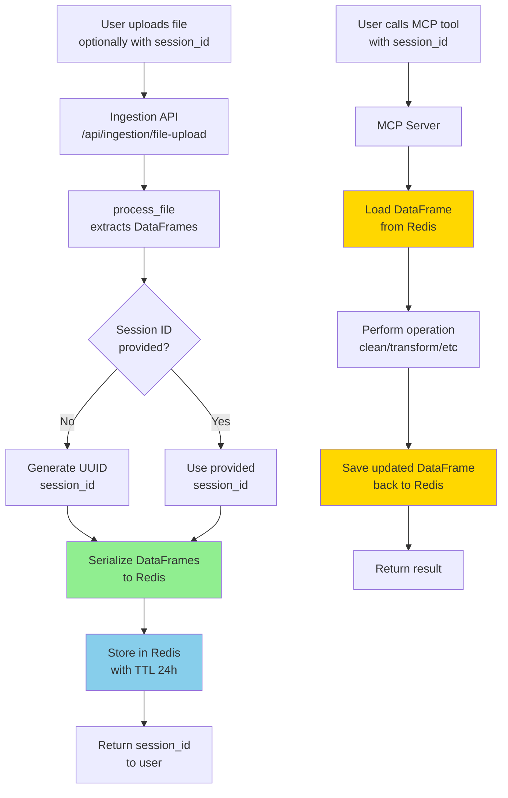

<!-- a948ad5c-7278-4380-b14f-b3884a11df63 96682354-c516-4fd4-b96d-bb400eac9759 -->
# Production-Ready Integration Plan: Redis-Backed Session Storage

## Problem Statement

Currently:

- **Ingestion API** (`main.py`): Processes files, extracts DataFrames, returns metadata (DataFrames lost after response)
- **MCP Server** (`data-mcp/server.py`): Uses in-memory `_session_states` dict (not scalable, lost on restart)
- **Gap**: No connection between ingestion and MCP server, and current architecture won't scale for production

**Requirements for Production:**

- Multi-instance scaling (horizontal scaling)
- Persistent storage (survive server restarts)
- Concurrent users support
- Deployable on Render/Vercel/Fly.io (serverless-friendly)
- Auto-cleanup of old sessions

## Solution Architecture: Redis-Backed Storage



## Implementation Plan

### Phase 1: Redis Integration Layer

**File: `data-mcp/data_functions/core.py`**

**Changes:**

1. Replace in-memory `_session_states` dict with Redis-backed storage
2. Add Redis client initialization (with connection pooling)
3. Implement DataFrame serialization/deserialization:

   - **Primary**: Parquet format (efficient, compressed)
   - **Fallback**: Pickle (simpler, but larger)

4. Update all core functions:

   - `_get_session_state()` → Load from Redis
   - `load_current_dataframe()` → Deserialize from Redis
   - `commit_dataframe()` → Serialize and save to Redis
   - `initialize_table()` → Store in Redis with TTL

5. Add session metadata storage (Redis Hash):

   - Store table list, history pointers, etc.

6. Handle Redis connection errors gracefully
7. Add feature flag: `STORAGE_BACKEND` env var ("redis" or "memory" for backward compatibility)

**Redis Key Structure:**

```
{session_id}:{table_name}:data          → Parquet bytes (DataFrame)
{session_id}:{table_name}:history:0     → History snapshot 0
{session_id}:{table_name}:history:1     → History snapshot 1
{session_id}:metadata                   → Hash: {tables: "current,table_1", ...}
{session_id}:{table_name}:history_index → Integer (current history position)
```

### Phase 2: Ingestion Endpoint Auto-Initialization

**File: `main.py`**

**Changes:**

1. Auto-generate `session_id` if not provided (UUID v4)
2. After successful file processing:

   - Import `initialize_table` from `data_functions.core`
   - For each DataFrame in `result["tables"]`:
     - Determine table name: `df.attrs.get('sheet_name')` or `f'table_{idx}'` or `"current"` for first
     - Call `initialize_table(session_id, df, table_name)`
   - Store metadata about initialized tables

3. Update response to include:

   - `session_id` (generated or provided)
   - `initialized_tables` list
   - `message` confirming initialization

4. Handle cross-package imports (data-mcp directory structure)

### Phase 3: Enhanced MCP Initialization Tool

**File: `data-mcp/server.py`**

**Changes:**

1. Replace placeholder `initialize_data_table` with working implementation
2. Support two modes:

   - **Mode 1**: Initialize from file path (for direct MCP testing)
     - Accept `file_path`, `session_id`, optional `file_type`
     - Import and call `ingestion.ingestion_handler.process_file()`
     - Initialize tables from results
   - **Mode 2**: Initialize from existing session (table copy/rename)
     - Accept `source_session_id`, `target_session_id`, `table_name` mapping
     - Copy tables between sessions

3. Handle import paths correctly (ingestion is in parent directory)

### Phase 4: Configuration & Environment Setup

**Files: `requirements.txt`, `data-mcp/requirements.txt`**

**Add dependencies:**

- `redis` (or `redis-py`): Redis client
- `pyarrow`: For Parquet serialization
- `uuid`: For session ID generation (built-in, but ensure imports)

**Environment variables:**

- `REDIS_URL`: Redis connection string (e.g., `redis://localhost:6379/0`)
- `REDIS_PASSWORD`: Optional password
- `SESSION_TTL_SECONDS`: Default 86400 (24 hours)
- `STORAGE_BACKEND`: `"redis"` (default) or `"memory"` (fallback for dev)

**New: `data-mcp/data_functions/storage.py`** (optional, for clean separation)

- Redis client initialization
- Serialization utilities
- Connection management
- Storage backend abstraction

## Technical Implementation Details

### DataFrame Serialization Strategy

**Primary: Parquet (recommended)**

- Efficient compression (much smaller than pickle)
- Fast serialization/deserialization
- Type preservation
- Works well with large DataFrames

**Fallback: Pickle**

- Simpler implementation
- Handles all Python objects
- Larger file size
- Use if Parquet fails

**Implementation:**

```python
def serialize_dataframe(df: pd.DataFrame) -> bytes:
    """Serialize DataFrame to Parquet bytes."""
    buffer = io.BytesIO()
    table = pa.Table.from_pandas(df)
    pq.write_table(table, buffer, compression='snappy')
    return buffer.getvalue()

def deserialize_dataframe(data: bytes) -> pd.DataFrame:
    """Deserialize Parquet bytes to DataFrame."""
    buffer = io.BytesIO(data)
    table = pq.read_table(buffer)
    return table.to_pandas()
```

### Redis Connection Management

**Best practices:**

- Use connection pooling (`redis.ConnectionPool`)
- Handle connection errors gracefully (retry logic)
- Support both Redis and Redis Cluster
- Environment-aware (local vs. Upstash/Redis Cloud)

### History Management in Redis (Undo/Redo System)

**Challenge**: Store operation history and enable undo/redo efficiently

**Solution**: Multi-layered history tracking system

**Redis Key Structure for History:**

```
{session_id}:{table_name}:operations       → Redis List: [op_json, op_json, ...] (chronological)
{session_id}:{table_name}:undo_stack       → Redis List: [op_json, op_json, ...] (for undo)
{session_id}:{table_name}:redo_stack       → Redis List: [op_json, op_json, ...] (for redo)
{session_id}:{table_name}:history:0        → Parquet bytes (snapshot 0)
{session_id}:{table_name}:history:1        → Parquet bytes (snapshot 1)
{session_id}:{table_name}:history_index    → Integer (current snapshot position)
```

**Operation History Format:**

Each operation stored as JSON:

```json
{
  "action": "fill_missing",
  "params": {"method": "mean", "columns": ["Price"]},
  "timestamp": "2024-01-15T10:30:00Z",
  "change_summary": "Filled 15 missing values in Price column",
  "snapshot_id": 5,
  "rows_before": 1000,
  "rows_after": 1000,
  "columns_before": 10,
  "columns_after": 10
}
```

**Implementation Strategy:**

1. **Operation Tracking**:

   - When `commit_dataframe()` is called, store operation metadata in `{session_id}:{table_name}:operations` list
   - Append operation JSON to list (RPUSH)
   - Store DataFrame snapshot in `{session_id}:{table_name}:history:{snapshot_id}`
   - Increment `history_index`
   - Push operation to undo_stack (RPUSH)

2. **Undo Operation**:

   - Pop from undo_stack (RPOP) to get last operation
   - Load previous snapshot from history (history_index - 1)
   - Move operation to redo_stack (LPUSH)
   - Decrement history_index
   - Restore DataFrame from previous snapshot
   - Save current state back to Redis

3. **Redo Operation**:

   - Pop from redo_stack (RPOP) to get next operation
   - Re-apply operation or load next snapshot
   - Move operation back to undo_stack (LPUSH)
   - Increment history_index
   - Save updated state

4. **History Limits**:

   - Store last N snapshots (e.g., 50) to prevent unbounded growth
   - When limit exceeded, remove oldest snapshots
   - Keep full operation history (metadata is small)
   - Use Redis TTL for auto-cleanup of old sessions

**Benefits:**

- Lightweight: Only store snapshots + metadata
- Efficient: Redis Lists for stack operations (O(1) push/pop)
- Reliable: All history persisted in Redis
- Scalable: Per-table history tracking

### Error Handling & Fallbacks

1. **Redis unavailable**: 

   - Fallback to in-memory mode if `STORAGE_BACKEND=memory`
   - Log warning, return error to user in production

2. **Serialization failures**:

   - Try Parquet → fallback to Pickle
   - Handle very large DataFrames (chunking if needed)

3. **Session not found**:

   - Clear error message with available sessions
   - Suggest checking session_id spelling

## Files to Modify

1. **`data-mcp/data_functions/core.py`** (major refactor)

   - Replace `_session_states` dict with Redis operations
   - Add serialization/deserialization functions
   - Update all state management functions
   - Add Redis connection initialization
   - Add storage backend abstraction

2. **`main.py`** (lines 64-124)

   - Add session_id auto-generation
   - Import and call `initialize_table` after processing
   - Handle cross-package imports

3. **`data-mcp/server.py`** (lines 96-122)

   - Replace placeholder `initialize_data_table`
   - Add file_path mode implementation
   - Handle ingestion imports

4. **`requirements.txt`** (both root and data-mcp)

   - Add `redis`, `pyarrow` dependencies

5. **New: `data-mcp/data_functions/storage.py`** (optional, for clean separation)

   - Redis client initialization
   - Serialization utilities
   - Connection management
   - Storage backend abstraction layer

## Deployment Considerations

### Local Development

- Use local Redis: `docker run -p 6379:6379 redis:alpine`
- Or Redis on localhost with default config
- Can use `STORAGE_BACKEND=memory` for testing without Redis

### Production (Render/Vercel/Fly.io)

- Use Upstash Redis (serverless, free tier available)
- Or Redis Cloud / AWS ElastiCache
- Set `REDIS_URL` environment variable

### Migration Path

- Support both Redis and in-memory modes via `STORAGE_BACKEND` env var
- In-memory fallback for development/testing
- Gradual migration path

## Testing Strategy

1. **Unit tests for serialization**:

   - Test Parquet serialization/deserialization
   - Test with various DataFrame types (strings, dates, nulls)
   - Test large DataFrames

2. **Integration test: Full flow**:
   ```
   POST /api/ingestion/file-upload (no session_id)
   → Verify session_id generated
   → Verify DataFrame stored in Redis
   → Call MCP tool: get_table_summary(session_id)
   → Verify data loaded correctly
   → Call manipulation tool
   → Verify updated data saved back
   ```

3. **Multi-table test**:

   - Upload Excel with 3 sheets
   - Verify all 3 tables stored
   - Verify can manipulate each independently

4. **TTL/Expiry test**:

   - Create session with short TTL
   - Wait for expiry
   - Verify session not found (appropriate error)

5. **Storage backend fallback test**:

   - Test with `STORAGE_BACKEND=memory`
   - Test with `STORAGE_BACKEND=redis`
   - Verify both work correctly

## Recommended Implementation Order

1. **Phase 1**: Redis storage layer in `core.py`

   - Implement serialization functions
   - Replace in-memory storage with Redis
   - Add connection management
   - Add storage backend abstraction
   - Test with simple operations

2. **Phase 2**: Ingestion auto-initialization

   - Add session_id generation in `main.py`
   - Integrate with `initialize_table`
   - Test end-to-end upload → MCP tool flow

3. **Phase 3**: Enhanced MCP tool

   - Implement file_path mode
   - Test direct initialization
   - Add error handling

4. **Phase 4**: Production hardening

   - Add connection retry logic
   - Implement fallback mechanisms
   - Add monitoring/logging
   - Document environment variables
   - Test deployment scenarios

### To-dos

- [ ] Modify main.py file_upload endpoint to auto-initialize MCP sessions when session_id is provided - import initialize_table, loop through result tables, call initialize_table for each
- [ ] Replace placeholder initialize_data_table MCP tool with working implementation that can initialize from file_path - import ingestion handler, process file, initialize tables
- [ ] Fix import paths between main.py (ingestion) and data-mcp/server.py - handle cross-directory imports correctly
- [ ] Implement smart table naming: use sheet_name from attrs, default to table_0/table_1 for multiple tables, use current for single table
- [ ] Add robust error handling for initialization failures - log errors, include status in response, dont fail entire upload if init fails
- [ ] Test end-to-end flow: upload file with session_id → verify auto-init → call MCP tools → verify data manipulation works