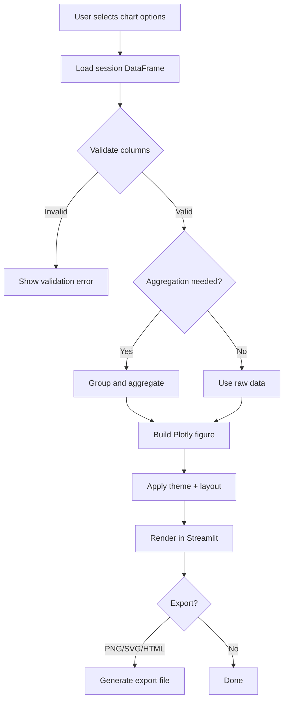

# Data Visualization Module

A comprehensive visualization module for the Data Assistant Platform that provides zero-latency chart generation, smart AI-powered recommendations, advanced chart compositions, and dynamic dashboard building capabilities.

## 📋 Table of Contents

- [Overview](#overview)
- [Features](#features)
- [Module Structure](#module-structure)
- [Installation](#installation)
- [Quick Start](#quick-start)
- [API Documentation](#api-documentation)
- [Usage Examples](#usage-examples)
- [Integration Guide](#integration-guide)

## 🎯 Overview

The `data_visualization` module is a powerful visualization toolkit that enables users to:

- **Generate charts instantly** with zero-latency using Plotly
- **Get AI-powered recommendations** for optimal chart types based on data characteristics
- **Create advanced compositions** with combo charts, small multiples, faceted views, and layered visualizations
- **Build dynamic dashboards** with flexible grid layouts and chart pinning
- **Export visualizations** in multiple formats (PNG, SVG, HTML)

All visualizations are fully interactive, theme-aware, and automatically update with data manipulation changes.

## Contribution to the Main Project

- Powers the Visualization Centre tab in the Streamlit UI.
- Translates session DataFrames into Plotly figures with export support.
- Complements InsightBot by rendering chart requests in chat responses.

## Flow Diagram



## ✨ Features

### 1. **Basic Chart Generation**
- 8 chart types: Bar, Line, Scatter, Area, Box, Histogram, Pie, Heatmap
- Smart column selection with automatic defaults
- Aggregation support (sum, mean, count, min, max)
- Theme-aware (light/dark mode support)
- Real-time data integration from session storage

### 2. **Smart Chart Recommendations** 🤖
- AI-powered analysis using LangChain and OpenAI
- Analyzes data distribution, cardinality, correlations, and patterns
- Provides 3-5 ranked recommendations with reasoning
- One-click application of recommendations
- Fallback to rule-based recommendations if AI unavailable

### 3. **Custom Chart Compositions** 🎨
- **Combo Charts**: Dual y-axes combining different chart types (bar + line, scatter + area, etc.)
- **Small Multiples**: Grid of charts faceted by category (up to 12 panels)
- **Faceted Charts**: Automatic subplot creation (up to 4x4 grid) based on grouping
- **Layered Visualizations**: Multiple traces with adjustable opacity/transparency

### 4. **Dynamic Dashboard Builder** 📊
- Flexible grid layouts (2x2, 3x3, 2x3, 1x2, etc.)
- Chart pinning system for multi-view analysis
- Drag-and-drop style arrangement
- Individual chart management (remove, view info)
- State persistence across sessions

### 5. **Export Capabilities** 📥
- PNG export (static images)
- SVG export (vector graphics)
- HTML export (interactive charts)
- Automatic sizing for composition charts

## 📁 Module Structure

```
data_visualization/
├── __init__.py                 # Module exports and initialization
├── visualization.py            # Core visualization tab and chart generation
├── smart_recommendations.py    # AI-powered chart recommendations
├── chart_compositions.py        # Advanced chart composition functions
├── dashboard_builder.py         # Dynamic dashboard builder
└── README.md                   # This file
```

## File Details
- `__init__.py`: Exposes the main public API functions used by `app.py`.
- `visualization.py`: Renders the Visualization Centre UI, validates user
  selections, and generates Plotly figures from session data.
- `smart_recommendations.py`: Builds chart recommendations using LLMs or
  fallback heuristics when AI is unavailable.
- `chart_compositions.py`: Implements advanced chart types like combo,
  faceted, layered, and small-multiples charts.
- `dashboard_builder.py`: Manages dashboard layout state, pinning, and
  multi-chart rendering in Streamlit.
- `utils.py`: Shared helpers for column validation, theming, and config
  normalization.

## 📦 Installation

The module requires the following dependencies (already included in main `requirements.txt`):

- streamlit>=1.28.0
- plotly>=5.17.0
- pandas>=2.1.3
- numpy>=1.24.0
- langchain-openai>=0.0.5
- kaleido>=0.2.1 (for static image exports)

## 🚀 Quick Start

### Basic Usage

Import `render_visualization_tab()` in `app.py` and call it inside the
Visualization tab to render the full UI.

### Generate a Chart Programmatically

Use `generate_chart()` to build a Plotly figure from a DataFrame by passing
the chart type and column mappings.

### Get Smart Recommendations

Use `get_chart_recommendations()` to receive ranked chart suggestions based
on the DataFrame and an optional user query.

## 📚 API Documentation

### Core Functions

#### `render_visualization_tab()`
Main function to render the complete visualization tab in Streamlit.

**Returns:** None (renders UI directly)

#### `generate_chart(df, chart_type, x_col, y_col, agg_func='none', color_col=None)`
Generate a basic Plotly chart.

**Parameters:**
- `df` (pd.DataFrame): Data to visualize
- `chart_type` (str): Chart type ('bar', 'line', 'scatter', 'area', 'box', 'histogram', 'pie', 'heatmap')
- `x_col` (str, optional): X-axis column name
- `y_col` (str, optional): Y-axis column name
- `agg_func` (str): Aggregation function ('none', 'sum', 'mean', 'count', 'min', 'max')
- `color_col` (str, optional): Column for color/grouping

**Returns:** `plotly.graph_objects.Figure`

#### `get_dataframe_from_session(session_id, table_name)`
Fetch DataFrame from session storage.

**Parameters:**
- `session_id` (str): Session identifier
- `table_name` (str): Name of the table to fetch

**Returns:** `pd.DataFrame` or `None`

### Smart Recommendations

#### `get_chart_recommendations(df, user_query=None)`
Get AI-powered chart recommendations.

**Parameters:**
- `df` (pd.DataFrame): Data to analyze
- `user_query` (str, optional): User's visualization goal

**Returns:** `List[Dict[str, Any]]` - List of recommendation dictionaries with:
- `chart_type`: Recommended chart type
- `x_column`: Suggested X-axis column
- `y_column`: Suggested Y-axis column
- `relevance`: Relevance score (1-5, lower is better)
- `reasoning`: Explanation for the recommendation

### Chart Compositions

#### `generate_combo_chart(df, x_col, y1_col, y2_col, chart1_type='bar', chart2_type='line', color_col=None)`
Generate combo chart with dual y-axes.

**Parameters:**
- `df` (pd.DataFrame): Data to visualize
- `x_col` (str): X-axis column
- `y1_col` (str): First Y-axis column (left)
- `y2_col` (str): Second Y-axis column (right)
- `chart1_type` (str): Type for first chart ('bar', 'line', 'scatter', 'area')
- `chart2_type` (str): Type for second chart ('bar', 'line', 'scatter', 'area')
- `color_col` (str, optional): Color/grouping column

**Returns:** `plotly.graph_objects.Figure`

#### `generate_small_multiples(df, x_col, y_col, facet_col, chart_type='bar', max_facets=12)`
Generate small multiples (grid of charts).

**Parameters:**
- `df` (pd.DataFrame): Data to visualize
- `x_col` (str): X-axis column
- `y_col` (str): Y-axis column
- `facet_col` (str): Column to facet by
- `chart_type` (str): Base chart type ('bar', 'line', 'scatter', 'histogram')
- `max_facets` (int): Maximum number of facets to show

**Returns:** `plotly.graph_objects.Figure`

#### `generate_faceted_chart(df, x_col, y_col, facet_col, chart_type='scatter', max_facets=16)`
Generate faceted chart with automatic subplot creation.

**Parameters:**
- `df` (pd.DataFrame): Data to visualize
- `x_col` (str): X-axis column
- `y_col` (str): Y-axis column
- `facet_col` (str): Column to facet by
- `chart_type` (str): Chart type ('scatter', 'bar', 'line', 'box')
- `max_facets` (int): Maximum facets (up to 4x4 grid)

**Returns:** `plotly.graph_objects.Figure`

#### `generate_layered_chart(df, x_col, y_cols, layer_types, opacity=0.7, color_col=None)`
Generate layered visualization with multiple traces.

**Parameters:**
- `df` (pd.DataFrame): Data to visualize
- `x_col` (str): X-axis column
- `y_cols` (List[str]): List of Y-axis columns to layer
- `layer_types` (List[str]): Chart types for each layer
- `opacity` (float): Opacity level (0-1)
- `color_col` (str, optional): Color/grouping column

**Returns:** `plotly.graph_objects.Figure`

### Dashboard Builder

#### `initialize_dashboard_state()`
Initialize dashboard state variables in Streamlit session state.

**Returns:** None

#### `pin_chart_to_dashboard(chart_config, position=None)`
Pin a chart configuration to the dashboard.

**Parameters:**
- `chart_config` (Dict[str, Any]): Chart configuration dictionary
- `position` (int, optional): Position index (None = append)

**Returns:** `bool` - True if successful

#### `render_dashboard_tab(df, selected_table)`
Render the dashboard builder interface.

**Parameters:**
- `df` (pd.DataFrame): Data to visualize
- `selected_table` (str): Name of the selected table

**Returns:** `bool` - Dashboard active status

#### `get_current_chart_config(chart_mode, chart_type, x_col, y_col, agg_func, color_col, composition_params)`
Get current chart configuration for pinning.

**Parameters:**
- `chart_mode` (str): Chart mode ('basic', 'combo', 'small_multiples', 'faceted', 'layered')
- `chart_type` (str): Chart type
- `x_col` (str): X column
- `y_col` (str): Y column
- `agg_func` (str): Aggregation function
- `color_col` (str, optional): Color column
- `composition_params` (Dict): Composition-specific parameters

**Returns:** `Dict[str, Any]` - Configuration dictionary

## 💡 Usage Examples

### Example 1: Basic Bar Chart
Generate a bar chart using `generate_chart()` by mapping a categorical
column to X and a numeric column to Y.

### Example 2: Combo Chart (Bar + Line)
Create a dual-axis combo chart with `generate_combo_chart()` to compare
two metrics over the same X axis.

### Example 3: Small Multiples
Use `generate_small_multiples()` to create a faceted grid grouped by a
categorical column.

### Example 4: Get Recommendations
Request recommendations by passing the DataFrame and a short visualization
goal; the module ranks chart types with reasoning.

### Example 5: Dashboard Building
Initialize dashboard state, generate a chart configuration, and pin it so
multiple charts can be managed in one layout.

## 🔗 Integration Guide

### Integration with Streamlit App

The module is designed to integrate seamlessly with the main Streamlit application:
Import `render_visualization_tab()` and call it inside the Visualization tab
section of `app.py`.

### Session Data Integration

The module automatically fetches data from the session storage:
Call `get_dataframe_from_session(session_id, table_name)` to retrieve a
DataFrame for visualization.

### Environment Variables

The module uses the following environment variables:

- `FASTAPI_URL`: FastAPI backend URL (default: `http://localhost:8001`)
- `OPENAI_API_KEY`: OpenAI API key for smart recommendations
- `OPENAI_MODEL`: OpenAI model to use (default: `gpt-4o`)

## 🎨 Chart Types Reference

### Basic Charts

| Chart Type | Best For | Required Columns |
|------------|----------|------------------|
| Bar | Categorical comparisons | X (category), Y (value) |
| Line | Trends over time | X (time), Y (value) |
| Scatter | Correlations | X (numeric), Y (numeric) |
| Area | Cumulative values | X (time), Y (value) |
| Box | Distribution analysis | Y (numeric) |
| Histogram | Distribution shape | X (numeric) |
| Pie | Proportional breakdown | X or Y (categorical) |
| Heatmap | Correlation matrices | X, Y (both numeric) |

### Composition Charts

| Composition | Best For | Key Features |
|-------------|----------|--------------|
| Combo | Comparing different metrics | Dual y-axes, mixed chart types |
| Small Multiples | Comparing across categories | Grid layout, consistent scales |
| Faceted | Deep categorical analysis | Automatic subplots, shared legends |
| Layered | Overlaying multiple series | Transparency controls, blending |

## 🛠️ Advanced Features

### Theme Detection

Charts automatically adapt to Streamlit's theme:
The module selects the appropriate Plotly template (`plotly_dark` or
`plotly_white`) based on the current Streamlit theme.

### Aggregation Support

Apply aggregations directly in chart generation:
Set `agg_func` to apply grouping and aggregation during chart generation.

### Export Options

All charts support multiple export formats:
Use Plotly export helpers to generate PNG, SVG, or HTML output.

## 📝 Notes

- **Performance**: Charts are generated with zero latency using Plotly's efficient rendering
- **Interactivity**: All charts support zoom, pan, hover, and selection
- **Data Updates**: Charts automatically reflect changes from data manipulation operations
- **Session Persistence**: Dashboard state persists across page refreshes
- **Error Handling**: Graceful fallbacks for missing data or invalid configurations

## 🤝 Contributing

When adding new features:

1. Follow the existing module structure
2. Add type hints to all functions
3. Include docstrings with parameter descriptions
4. Update this README with new features
5. Ensure compatibility with existing chart types

## 📄 License

Part of the Data Assistant Platform project.

---

**Last Updated:** 2024
**Version:** 1.0.0

