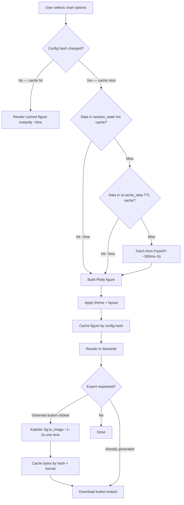

# Data Visualization Module

A comprehensive visualization module for the Data Assistant Platform providing multi-layer cached data fetching, figure memoization, lazy export generation, AI-powered chart recommendations, advanced chart compositions, and dynamic dashboard building.

## Table of Contents

- [Overview](#overview)
- [Features](#features)
- [Module Structure](#module-structure)
- [Caching Architecture](#caching-architecture)
- [Quick Start](#quick-start)
- [API Documentation](#api-documentation)
- [Integration Guide](#integration-guide)
- [Chart Types Reference](#chart-types-reference)

---

## Overview

The `data_visualization` module powers the Visualization Centre tab in the Streamlit UI. It translates session DataFrames (fetched from the FastAPI backend) into interactive Plotly figures with export support, and complements InsightBot by rendering chart requests in chat responses.

**Key design principles:**
- **Multi-layer caching** eliminates redundant HTTP calls to the FastAPI backend on every Streamlit rerender.
- **Figure memoization** caches generated Plotly figures by chart config hash — config unchanged = instant re-render, no spinner.
- **Lazy export generation** — Kaleido (headless Chromium) is only invoked when the user explicitly clicks "Generate". Previously, `fig.to_image()` was called on every rerender, blocking for ~5s.

## Contribution to the Main Project

- Powers the Visualization Centre tab in the Streamlit UI.
- Translates session DataFrames into Plotly figures with export support.
- Complements InsightBot by rendering chart requests in chat responses.
- Cache invalidation (`cache_invalidation.py`) coordinates state between the Data Manipulation tab and the Visualization Centre so charts always reflect the latest data.

## Flow Diagram



---

## Features

### 1. Basic Chart Generation
- 8 chart types: Bar, Line, Scatter, Area, Box, Histogram, Pie, Heatmap
- Smart column selection with automatic defaults
- Aggregation support (sum, mean, count, min, max)
- Theme-aware (light/dark mode support)
- Real-time data integration from session storage

### 2. Multi-Layer Data Caching
- **Layer 1 — `st.session_state` hot cache (~0ms):** Survives rerenders within a session. Tables list and per-table DataFrames stored on first fetch.
- **Layer 2 — `@st.cache_data(ttl=30)` (~5ms on hit):** Process-level TTL cache keyed by `(session_id, cache_version)`. Cache-busted by incrementing `cache_version` on data changes.
- **Layer 3 — FastAPI (~500ms–2s):** Called only on true miss (first load or after cache bust).

### 3. Figure Memoization
All chart configuration inputs (type, columns, aggregation, palette, etc.) are hashed into an MD5 key. Up to 10 generated figures are stored in `st.session_state`. A cache hit renders instantly with no spinner. A cache miss shows a spinner on first generation only.

### 4. Lazy Export Generation
Export buttons in the Visualization Centre use a two-stage flow:
- **Stage 1 — "Generate PNG/SVG/PDF" button:** Triggers a single `fig.to_image()` call (via Kaleido, ~1–2s). The resulting bytes are cached in `st.session_state` by `(config_hash, format)`.
- **Stage 2 — "Download" button:** Instant; bytes served from cache.
- HTML, Python script, and notebook exports are always instant (no Kaleido).
- PPTX reuses the cached PNG bytes.

### 5. Smart Chart Recommendations
- AI-powered analysis using LangChain and OpenAI
- Analyzes data distribution, cardinality, correlations, and patterns
- Provides ranked recommendations with reasoning
- One-click application of recommendations
- Fallback to rule-based recommendations if AI unavailable

### 6. Custom Chart Compositions
- **Combo Charts**: Dual y-axes combining different chart types (bar + line, scatter + area, etc.)
- **Heatmaps**: Correlation matrices with configurable column selection
- **Faceted Charts**: Automatic subplot creation based on grouping

### 7. Dynamic Dashboard Builder
- Flexible grid layouts (2×2, 3×3, 2×3, 1×2, etc.)
- Chart pinning system for multi-view analysis
- Individual chart management (remove, view info)
- State persistence across sessions

### 8. Cache Invalidation
`cache_invalidation.py` provides cross-tab coordination. The Data Manipulation tab calls `on_data_changed()` after every successful operation:
- Bumps the `cache_version` counter → invalidates all `@st.cache_data` TTL caches
- Clears the `st.session_state` hot cache (tables list, per-table DataFrames)
- Clears the figure memoization cache
- Clears the export byte cache
- All subsequent visualization renders fetch fresh data from FastAPI

---

## Module Structure

```
data_visualization/
├── __init__.py                    # Public API exports
├── visualization.py               # Visualization Centre tab, figure memoization
├── cache_invalidation.py          # Cross-tab cache coordination (on_data_changed)
├── dashboard_builder.py           # Dashboard state management and multi-chart rendering
├── utils.py                       # Shared helpers (column validation, theming, config)
│
├── core/
│   ├── __init__.py
│   ├── data_fetcher.py            # Multi-layer cached data fetching from FastAPI
│   ├── chart_generator.py         # Plotly figure construction
│   └── validators.py              # Column and config validation
│
├── charts/
│   ├── __init__.py
│   ├── basic.py                   # Bar, line, scatter, area, box, histogram, pie
│   ├── heatmap.py                 # Heatmap and correlation matrix
│   └── combo.py                   # Dual-axis combo charts
│
├── ui/
│   ├── __init__.py
│   ├── controls.py                # Chart control widgets (type, columns, aggregation)
│   ├── dashboard.py               # Dashboard UI rendering
│   ├── export.py                  # Lazy export buttons (PNG/SVG/PDF/HTML/PPTX)
│   └── recommendations.py         # AI recommendation display
│
└── intelligence/
    ├── __init__.py
    └── recommender.py             # LLM-based chart type recommendations
```

### File Responsibilities

| File | Responsibility |
|------|----------------|
| `__init__.py` | Exposes `render_visualization_tab`, `get_dataframe_from_session`, `get_tables_from_session`, `invalidate_viz_cache`, `on_data_changed` |
| `visualization.py` | Renders the Visualization Centre UI; computes config hash; checks figure cache before generating; passes `cfg_hash` to export section |
| `cache_invalidation.py` | `on_data_changed()` — bumps cache version, clears all hot caches and figure/export caches |
| `core/data_fetcher.py` | `get_tables_from_session()` and `get_dataframe_from_session()` — three-layer cache logic |
| `core/chart_generator.py` | Constructs Plotly figures from validated config + DataFrame |
| `core/validators.py` | Column existence checks, type validation, cardinality guards |
| `charts/basic.py` | Plotly Express wrappers for the 7 basic chart types |
| `charts/heatmap.py` | Heatmap and correlation matrix generation |
| `charts/combo.py` | Dual-axis combo chart with mixed chart types |
| `ui/controls.py` | Streamlit widgets for chart type, column, and aggregation selection |
| `ui/export.py` | Two-stage lazy export: "Generate" button → Kaleido → cache → "Download" button |
| `ui/recommendations.py` | Renders AI recommendation cards with one-click apply |
| `intelligence/recommender.py` | LLM + rule-based chart recommendations from data profile |
| `dashboard_builder.py` | Dashboard grid state, chart pinning, grid rendering |

---

## Caching Architecture

### Data Cache (core/data_fetcher.py)

```python
# Layer 1: session_state hot cache — 0ms, within-session
st.session_state["_viz_tables_cache"][session_id]
st.session_state["_viz_df_cache"][(session_id, table_name)]

# Layer 2: st.cache_data TTL — ~5ms on hit, process-level
@st.cache_data(ttl=30, show_spinner=False)
def _fetch_tables_from_api(session_id, cache_version): ...

@st.cache_data(ttl=30, show_spinner=False)
def _build_dataframe(session_id, table_name, cache_version): ...

# Layer 3: FastAPI — only on true miss
requests.get(f"{SESSION_ENDPOINT}/{session_id}/tables")
```

### Figure Cache (visualization.py)

```python
# MD5 hash of all chart config inputs
cfg_hash = _chart_config_hash(
    chart_type, x_col, y_col, agg_func, color_col, palette, ...
)

# Check cache before generating
fig_cache = st.session_state.get("_viz_fig_cache", {})
if cfg_hash in fig_cache:
    st.plotly_chart(fig_cache[cfg_hash])   # instant, no spinner
else:
    with st.spinner("Generating chart..."):
        fig = generate_chart(...)
    fig_cache[cfg_hash] = fig              # cache for next render
```

### Export Cache (ui/export.py)

```python
# Bytes cached by (config_hash, format) — Kaleido only runs once per chart+format
_export_cache = st.session_state.get("viz_export_cache", {})
cached_bytes = _export_cache.get((cfg_hash, "png"))

if cached_bytes:
    st.download_button(...)    # instant
else:
    if st.button("Generate PNG"):
        data = fig.to_image(format="png")   # ~1–2s, Kaleido
        _export_cache[(cfg_hash, "png")] = data
        st.rerun()
```

### Cache Invalidation (cache_invalidation.py)

Called from `app.py` after every successful data manipulation:
```python
from data_visualization.cache_invalidation import on_data_changed

if result.get("success"):
    on_data_changed()   # bumps version, clears all caches
    st.rerun()
```

---

## Quick Start

### Rendering the Visualization Tab

```python
from data_visualization import render_visualization_tab
render_visualization_tab()  # inside the Visualization Centre tab in app.py
```

### Fetching Session Data

```python
from data_visualization import get_dataframe_from_session, get_tables_from_session

tables = get_tables_from_session(session_id)       # cached, dict
df = get_dataframe_from_session(session_id, "sales")  # cached, DataFrame
```

### Invalidating Caches After Data Changes

```python
from data_visualization.cache_invalidation import on_data_changed
on_data_changed()   # call after any successful data manipulation
```

---

## API Documentation

### Core Public Functions

#### `render_visualization_tab()`
Render the complete Visualization Centre tab in Streamlit.

#### `get_tables_from_session(session_id) → Optional[Dict[str, Any]]`
Fetch the tables dictionary from session storage using the three-layer cache.

#### `get_dataframe_from_session(session_id, table_name) → Optional[pd.DataFrame]`
Fetch a specific table as a DataFrame using the three-layer cache.

#### `invalidate_viz_cache()`
Bump the cache version and clear all session_state hot caches. Used internally; prefer `on_data_changed()` from outside the module.

#### `on_data_changed()`
Full cache invalidation: bumps version, clears hot caches, clears figure cache, clears export byte cache. Call this from the Data Manipulation tab after any successful operation.

### Chart Generation

#### `generate_chart(df, chart_type, x_col, y_col, agg_func='none', color_col=None) → Figure`
Generate a Plotly figure from a DataFrame.

**Parameters:**
- `df` — DataFrame to visualize
- `chart_type` — `'bar'`, `'line'`, `'scatter'`, `'area'`, `'box'`, `'histogram'`, `'pie'`, `'heatmap'`
- `x_col` — X-axis column name
- `y_col` — Y-axis column name
- `agg_func` — `'none'`, `'sum'`, `'mean'`, `'count'`, `'min'`, `'max'`
- `color_col` — Column for color/grouping (optional)

**Returns:** `plotly.graph_objects.Figure`

### Dashboard Builder

#### `render_dashboard_tab(df, selected_table) → bool`
Render the dashboard builder interface.

#### `pin_chart_to_dashboard(chart_config, position=None) → bool`
Pin a chart configuration to the dashboard.

---

## Integration Guide

### Environment Variables

| Variable | Description | Default |
|----------|-------------|---------|
| `FASTAPI_URL` | FastAPI backend URL | `http://localhost:8001` |
| `OPENAI_API_KEY` | OpenAI key for smart recommendations | — |
| `OPENAI_MODEL` | Model for recommendations | `gpt-4o` |

### Cache Tuning

Default TTL is 30 seconds. Adjust in `core/data_fetcher.py`:
```python
@st.cache_data(ttl=30, show_spinner=False)   # change ttl as needed
```

The `cache_version` counter in `st.session_state` ensures that `on_data_changed()` busts the TTL cache immediately regardless of the TTL setting.

---

## Chart Types Reference

### Basic Charts

| Chart Type | Best For | Required Columns |
|------------|----------|------------------|
| Bar | Categorical comparisons | X (category), Y (value) |
| Line | Trends over time | X (time), Y (value) |
| Scatter | Correlations | X (numeric), Y (numeric) |
| Area | Cumulative values | X (time), Y (value) |
| Box | Distribution analysis | Y (numeric) |
| Histogram | Distribution shape | X (numeric) |
| Pie | Proportional breakdown | X or Y (categorical) |
| Heatmap | Correlation matrices | X, Y (both numeric) |

### Composition Charts

| Composition | Best For | Key Features |
|-------------|----------|--------------|
| Combo | Comparing different metrics | Dual y-axes, mixed chart types |
| Heatmap / Correlation Matrix | Numeric relationships | Auto numeric-column selection |

---

## Performance Notes

| Operation | Latency (before caching) | Latency (after caching) |
|-----------|--------------------------|------------------------|
| Tables list fetch | ~500ms–2s (API call every rerender) | ~0ms (hot cache hit) |
| DataFrame fetch | ~500ms–2s (API call every rerender) | ~0ms (hot cache hit) |
| Chart generation (same config) | ~80–200ms (Plotly, every rerender) | ~0ms (figure cache hit) |
| PNG/SVG export (on render) | ~5–6s (Kaleido × 3 formats, blocking) | ~0ms (lazy, only on click) |
| PNG/SVG export (after generate) | N/A | ~0ms (bytes cached) |

---

**Last Updated:** February 2026
**Version:** 2.0.0
