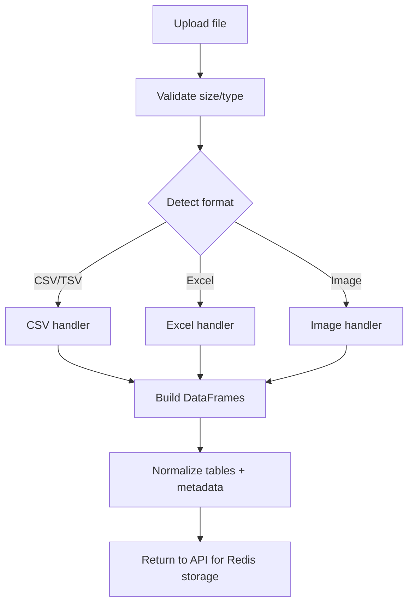

# Ingestion Module

File ingestion pipeline for the Data Assistant Platform. This module
validates incoming files, routes them to format-specific handlers,
and returns DataFrames plus metadata for storage in Redis.

## Responsibilities
- Validate file size and file type.
- Parse CSV, Excel, and image inputs into DataFrames.
- Normalize multi-table outputs and table naming.
- Surface clear errors when parsing fails.

## Contribution to the Main Project
- Provides the first step of the data lifecycle by turning raw files
  into clean, structured tables.
- Feeds the session store so downstream analysis, visualization,
  and chatbot features can operate immediately.
- Ensures consistent ingestion across local and production deployments.

## Flow Diagram

## Key Files
- `ingestion_handler.py`: Orchestrates file detection and dispatch.
- `config.py`: Limits and supported file types.
- `csv_handler.py`: CSV/TSV parsing with delimiter detection.
- `excel_handler.py`: Excel multi-sheet processing.
- `image_handler.py`: OCR-based table extraction for images.
- `supabase_handler.py`: Optional upload/storage integration.

## File Details
- `ingestion_handler.py`: Validates the incoming file, chooses the
  appropriate handler, normalizes outputs, and returns tables + metadata.
- `config.py`: Central place for max file size, max tables, and allowed
  file types.
- `csv_handler.py`: Detects delimiter/encoding and returns DataFrames from
  CSV or TSV input.
- `excel_handler.py`: Reads all sheets, preserves sheet names, and returns
  a table-per-sheet structure.
- `image_handler.py`: Runs OCR to detect and extract tabular text from
  images into DataFrames.
- `supabase_handler.py`: Optional helper for uploading and fetching files
  from Supabase storage.

## Typical Flow
1. Validate file size and extension.
2. Route to the correct handler based on type.
3. Build DataFrames and metadata.
4. Return results to the API for Redis storage.

