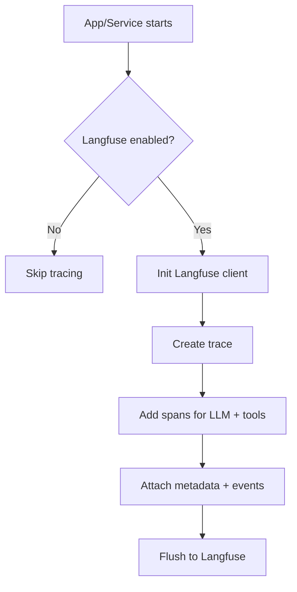

# Observability Module

Centralized observability utilities for the Data Assistant Platform. This
module currently provides a Langfuse client wrapper to capture traces and
events from LLM- and tool-driven workflows.

## Responsibilities
- Initialize and configure Langfuse with environment settings.
- Provide a thin client layer to record traces, spans, and metadata.
- Keep observability optional so core workflows still run without it.

## Contribution to the Main Project
- Adds traceability for LLM prompts, tool calls, and end-to-end workflows.
- Improves debugging and performance analysis across ingestion, chatbot,
  and visualization flows.
- Enables monitoring of user actions and system health in production.

## Flow Diagram

## Key Files
- `langfuse_client.py`: Langfuse client initialization and helpers.
- `__init__.py`: Module export surface.

## File Details
- `langfuse_client.py`: Reads Langfuse environment variables, builds the
  client instance, and exposes helper methods to create traces and spans
  for LLM calls, tool calls, and workflow steps.
- `__init__.py`: Keeps the public import surface minimal for callers so
  observability can be toggled without touching core logic.

## Integration Points
- Imported by core services when tracing is enabled.
- Uses environment variables for Langfuse credentials and base URL.

