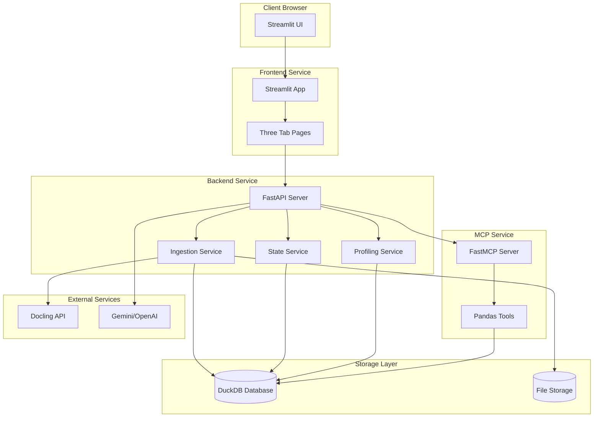
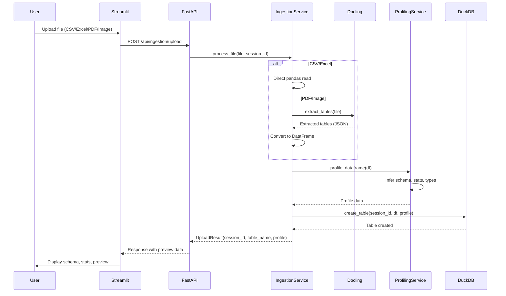
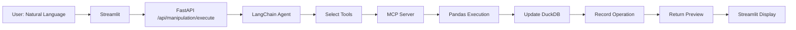
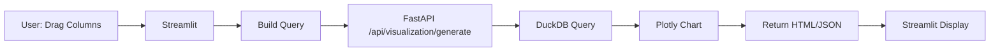

<!-- ab9a9991-c48c-41de-8c26-4bc63914b923 0157d495-5382-44ae-9715-492a1ae10a4d -->
# Data Analyst Platform - Architecture & Structure Plan

## Project Structure

```
Data-Assistant/
├── README.md
├── requirements.txt
├── .env.example
├── .gitignore
├── render.yaml                    # Multi-service deployment config
│
├── frontend/                      # Streamlit application
│   ├── app.py                     # Main Streamlit entry point
│   ├── pages/
│   │   ├── upload.py              # File upload & ingestion UI
│   │   ├── manipulation.py        # Data Manipulation tab
│   │   ├── visualization.py       # Visualization Centre tab
│   │   └── chatbot.py             # Chatbot tab
│   ├── components/
│   │   ├── file_uploader.py       # Multi-format upload widget
│   │   ├── data_preview.py        # Schema & stats display
│   │   ├── operation_history.py   # Undo/redo UI
│   │   ├── chart_builder.py       # Drag-and-drop chart interface
│   │   └── chat_interface.py      # Chat UI component
│   └── utils/
│       ├── session_state.py       # Streamlit session helpers
│       └── ui_helpers.py          # Common UI utilities
│
├── backend/                       # FastAPI service
│   ├── fastapi_app.py             # Main FastAPI application
│   ├── api/
│   │   ├── ingestion.py           # File upload & processing endpoints
│   │   ├── manipulation.py        # Data transformation endpoints
│   │   ├── visualization.py       # Chart generation endpoints
│   │   ├── chatbot.py             # Chat endpoints
│   │   └── state.py               # Session state management
│   ├── services/
│   │   ├── ingestion_service.py   # Docling integration & processing
│   │   ├── state_service.py       # DuckDB session management
│   │   ├── profiling_service.py   # Schema inference & data profiling
│   │   └── cleanup_service.py     # Session cleanup (7-day TTL)
│   └── models/
│       ├── session.py              # Session data models
│       ├── ingestion.py            # Upload/processing models
│       └── operations.py           # Transformation operation models
│
├── mcp_server/                    # FastMCP pandas tools server
│   ├── mcp_server.py              # MCP server entry point
│   ├── tools/
│   │   ├── pandas_tools.py        # Pandas operation tools
│   │   ├── validation.py          # Operation validation
│   │   └── safety.py              # Sandboxing & safety checks
│   └── utils/
│       └── dataframe_utils.py     # Helper functions
│
├── shared/                        # Shared utilities
│   ├── config.py                  # Configuration management
│   ├── database.py                # DuckDB connection & helpers
│   └── llm_client.py              # LangChain LLM setup (Gemini/OpenAI)
│
└── tests/
    ├── test_ingestion.py
    ├── test_manipulation.py
    ├── test_visualization.py
    └── test_chatbot.py
```

## Core Architecture

### Component Interaction Flow



## Data Ingestion Pipeline (Priority Focus)

### Detailed Ingestion Architecture



### Ingestion Service Design

**File: `backend/services/ingestion_service.py`**

Key responsibilities:

- File type detection (MIME type + extension)
- Route to appropriate processor:
  - CSV/Excel → Direct pandas
  - PDF/Image → Docling extraction
- Multi-page PDF handling (extract all tables)
- Image preprocessing (if needed before Docling)
- Error handling for corrupted/invalid files
- Progress tracking for large files

**Processing flow:**

1. Validate file (size, type, structure)
2. Create temporary storage reference
3. Route to processor based on type
4. Extract tables (single or multiple)
5. Normalize to pandas DataFrame(s)
6. Handle edge cases (empty tables, malformed data)
7. Return structured result with metadata

### Docling Integration Points

**Configuration:**

- Docling model initialization
- OCR settings for images
- Table extraction parameters
- Layout preservation options

**Error handling:**

- Fallback strategies if Docling fails
- Partial extraction (some tables succeed)
- User feedback on extraction quality

### Profiling Service Design

**File: `backend/services/profiling_service.py`**

Generates:

- Column types (inferred + detected)
- Basic statistics (count, nulls, unique values)
- Sample data preview
- Data quality metrics
- Potential issues (outliers, anomalies)

## State Management Architecture

### DuckDB Session Model

**File: `shared/database.py`**

Each session gets:

- Unique session ID (UUID)
- DuckDB in-memory database instance
- Table registry (table_name → metadata mapping)
- Operation history (for undo/redo)
- Timestamp tracking (for 7-day cleanup)

**Session structure:**

```python
{
    "session_id": "uuid",
    "created_at": "timestamp",
    "last_accessed": "timestamp",
    "tables": {
        "table_name": {
            "schema": {...},
            "row_count": int,
            "profile": {...}
        }
    },
    "operations": [
        {
            "id": "op_uuid",
            "type": "filter|transform|join|...",
            "description": "user description",
            "timestamp": "timestamp",
            "undo_data": {...}
        }
    ]
}
```

### State Service API

**File: `backend/services/state_service.py`**

Methods:

- `create_session()` → Returns session_id
- `get_session(session_id)` → Returns session state
- `update_table(session_id, table_name, df)` → Updates DuckDB
- `add_operation(session_id, operation)` → Records in history
- `undo_operation(session_id, operation_id)` → Reverts change
- `get_operation_history(session_id)` → Returns history list

## API Endpoints Design

### Ingestion Endpoints (`backend/api/ingestion.py`)

- `POST /api/ingestion/upload` - Upload file, process, create session
- `GET /api/ingestion/sessions/{session_id}` - Get session info
- `GET /api/ingestion/sessions/{session_id}/tables` - List tables
- `GET /api/ingestion/sessions/{session_id}/tables/{table_name}/preview` - Preview data
- `DELETE /api/ingestion/sessions/{session_id}` - Delete session

### Manipulation Endpoints (`backend/api/manipulation.py`)

- `POST /api/manipulation/execute` - Execute natural language transformation
- `GET /api/manipulation/sessions/{session_id}/history` - Get operation history
- `POST /api/manipulation/sessions/{session_id}/undo` - Undo operation
- `POST /api/manipulation/sessions/{session_id}/redo` - Redo operation

### Visualization Endpoints (`backend/api/visualization.py`)

- `POST /api/visualization/generate` - Generate chart from query
- `GET /api/visualization/sessions/{session_id}/charts` - List saved charts

### Chatbot Endpoints (`backend/api/chatbot.py`)

- `POST /api/chatbot/query` - Send chat message, get response
- `GET /api/chatbot/sessions/{session_id}/history` - Get chat history

## MCP Server Architecture

### FastMCP Server Design

**File: `mcp_server/mcp_server.py`**

Exposes pandas tools via MCP protocol:

- `pandas_filter` - Filter rows
- `pandas_transform` - Transform columns
- `pandas_aggregate` - Group and aggregate
- `pandas_join` - Join tables
- `pandas_clean` - Data cleaning operations

**Safety layer:**

- Input validation
- Resource limits (memory, execution time)
- Sandboxed execution environment
- Operation logging

## Frontend Architecture

### Streamlit App Structure

**File: `frontend/app.py`**

Main app responsibilities:

- Session initialization
- Tab navigation
- Shared state synchronization
- Error handling UI

**Tab structure:**

1. Upload tab (default) - File uploader + preview
2. Manipulation tab - Natural language input + history
3. Visualization tab - Chart builder + gallery
4. Chatbot tab - Chat interface + history

### Session State Management

**File: `frontend/utils/session_state.py`**

Streamlit session state keys:

- `session_id` - Current session UUID
- `current_tables` - List of loaded tables
- `selected_table` - Currently active table
- `operation_history` - List of operations
- `chat_history` - Chat messages
- `charts` - Generated charts cache

## Configuration Management

**File: `shared/config.py`**

Environment variables:

- `GEMINI_API_KEY` - Primary LLM
- `OPENAI_API_KEY` - Fallback LLM
- `DUCKDB_PATH` - Database path (optional, defaults to in-memory)
- `DOCLING_API_KEY` - Docling API key (if required)
- `MAX_FILE_SIZE` - Upload limit
- `SESSION_TTL_DAYS` - Cleanup threshold (default: 7)
- `MCP_SERVER_URL` - MCP server endpoint

## Deployment Architecture

### Render Services Configuration

**File: `render.yaml`**

Three services:

1. **MCP Server** (Private Service)

   - Port: 8001
   - Health check: `/health`

2. **FastAPI Backend** (Web Service)

   - Port: 8000
   - Environment: Production
   - Health check: `/health`

3. **Streamlit App** (Web Service)

   - Port: 8501
   - Environment: Production
   - Health check: Built-in Streamlit health

### Service Communication

- Streamlit → FastAPI: HTTP REST calls
- FastAPI → MCP Server: HTTP (MCP protocol)
- FastAPI → DuckDB: Direct connection (in-memory or file-based)
- All services → LLM APIs: HTTP (LangChain clients)

## Data Flow Examples

### Manipulation Flow



### Visualization Flow



## Security Considerations

- File upload validation (type, size, content)
- Sandboxed MCP execution (resource limits)
- Session isolation (DuckDB per session)
- API rate limiting
- Input sanitization for LLM prompts
- Secure API key storage (environment variables)

## Error Handling Strategy

- Graceful degradation (fallback LLM if Gemini fails)
- User-friendly error messages
- Operation rollback on failures
- Partial success handling (some tables extracted)
- Logging for debugging (structured logs)

## Next Steps for Implementation

1. Set up project structure and dependencies
2. Implement ingestion service with Docling integration
3. Build DuckDB state management layer
4. Create FastAPI backend with core endpoints
5. Develop Streamlit frontend with three tabs
6. Integrate MCP server for pandas operations
7. Add LangChain agent for natural language processing
8. Implement visualization generation
9. Build chatbot with context awareness
10. Add session persistence and cleanup
11. Create deployment configurations
12. Write tests for critical paths

### To-dos

- [ ] Create complete project directory structure with all folders and placeholder files
- [ ] Implement ingestion service with Docling integration for PDF/image table extraction, CSV/Excel direct processing, and multi-table handling
- [ ] Build profiling service for schema inference, data statistics, and quality metrics generation
- [ ] Implement DuckDB-based state service with session management, table registry, and operation history tracking
- [ ] Create FastAPI application with ingestion, manipulation, visualization, and chatbot API endpoints
- [ ] Build FastMCP server exposing pandas tools (filter, transform, aggregate, join, clean) with safety validation
- [ ] Develop Streamlit app with three tabs (upload, manipulation, visualization, chatbot) and shared session state
- [ ] Integrate LangChain agent with Gemini/OpenAI for natural language to pandas tool selection
- [ ] Implement Plotly-based chart generation with drag-and-drop column mapping and direct DuckDB queries
- [ ] Build context-aware chatbot using schema, stats, and operation history for intelligent responses
- [ ] Add session persistence across page refreshes and implement 7-day TTL cleanup service
- [ ] Create render.yaml for multi-service deployment and environment configuration files