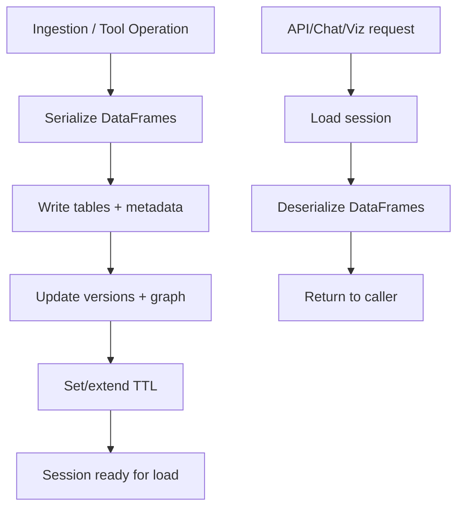

# Redis Session Store

Session persistence and versioned data storage for the Data Assistant
Platform. This module manages Redis-backed DataFrames, metadata, and
version history with TTL-based expiration.

## Responsibilities
- Serialize and store DataFrames and metadata in Upstash Redis.
- Load sessions for analysis, visualization, and chatbot workflows.
- Manage TTL extension and session lifecycle.
- Maintain version history and a graph of transformations.

## Contribution to the Main Project
- Enables persistent, multi-tab workflows across uploads, analysis,
  and visualization.
- Powers undo/redo and branch-like versioning for data operations.
- Serves as the shared storage layer for the FastAPI backend,
  Streamlit UI, MCP server, and InsightBot.

## Flow Diagram

## Key Files
- `redis_store.py`: Core Redis CRUD operations and session management.
- `serializer.py`: DataFrame serialization and deserialization.
- `constants.py`: Redis configuration constants and key patterns.
- `diagnostics.py`: Helpers for debugging and inspecting Redis state.
- `data-git.md`: Documentation of version graph concepts.

## File Details
- `redis_store.py`: Implements save/load/delete for session tables and
  metadata, manages TTL extension, and writes version and graph updates.
- `serializer.py`: Converts DataFrames to base64-encoded pickles and back,
  handling safe data transport between services.
- `constants.py`: Defines key prefixes, default TTL minutes, and any shared
  constants used across Redis operations.
- `diagnostics.py`: Provides read-only utilities to inspect sessions,
  list keys, and validate Redis configuration connectivity.
- `data-git.md`: Explains version graph terminology and example history.

## Data Model (High Level)
- Tables: `session:{session_id}:tables`
- Metadata: `session:{session_id}:meta`
- Graph: `session:{session_id}:graph`
- Versions: `session:{session_id}:versions`

