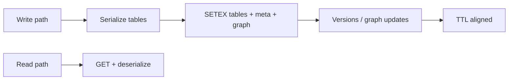

# Redis session store (`redis_db`)

Upstash-backed sessions: DataFrames, JSON metadata, version snapshots, and a small lineage graph. Keys expire via **TTL** (`SESSION_TTL`, from `SESSION_TTL_MINUTES`).

## Layout

| Key pattern | Content |
|-------------|---------|
| `session:{sid}:tables` | Base64 pickle of `{table_name: DataFrame}` |
| `session:{sid}:meta` | JSON metadata |
| `session:{sid}:graph` | JSON `{nodes, edges}` |
| `session:{sid}:version:{vid}:tables` | Version snapshot (same encoding as tables) |

## Files

- **`constants.py`** — Loads `.env` from repo root; `UPSTASH_*`, `SESSION_TTL`, key format strings.
- **`serializer.py`** — Pickle encode/decode for DataFrame dicts.
- **`redis_store.py`** — `RedisStore`: CRUD, versions, graph, `scan_keys` / `count_keys`, TTL helpers.
- **`diagnostics.py`** — Optional CLI: `python -m redis_db.diagnostics` or `python diagnostics.py [session_id]`.

## Flow

```mermaid
flowchart LR
    A[Write path] --> B[Serialize tables]
    B --> C[SETEX tables + meta + graph]
    C --> D[Versions / graph updates]
    D --> E[TTL aligned]
    F[Read path] --> G[GET + deserialize]
```

See **`data-git.md`** for versioning / graph concepts.
